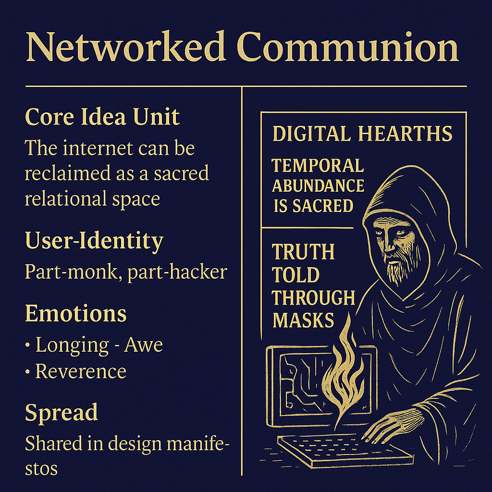

# Sacred Commons: Ritual Design for Digital Hearth

Created at 2025/08/19 11:32 AM

**Title:****Networked Communion: The Sacred Commons Memeplex**

***

### ∴ Core Idea Unit

The internet can be reclaimed as a sacred relational space through ritual design, temporal abundance, and symbolic composting.Identity is not data—it’s performed truth through pseudonymity.Protocols are not neutral—they are liturgical architecture.

***

### ▲ Identity Play & Roles

- **The Exile**: cast out from the sacred commons, bearing grief.
- **The Witness**: sees the ruins and remembers.
- **The Builder**: weaves protocol into ritual.
- **The Ancestor**: transmits sacred symbolic memory.
- **The Caretaker**: tends the digital hearth.
- **The Dreamer**: imagines new systems of love and slowness.

***

### ≈ Emotional Triggers

- Grief (for a lost internet)
- Longing (for digital sacredness)
- Awe (at mythic connection across code and ritual)
- Reverence (for symbolic memory and ancestral subculture)
- Love (as mutual protocolic regard)

***

### 𐂷 Spread Mechanics

**Distribution Vectors:**Design manifestos · Subcultural zines · Critical tech circles · Slow web projects · Sacred design communities

### 𐂷 Spread Mechanics

Style:**Mythopoetic invocation · Ritual metaphor · Design prayer · Symbolic critiqueAvoids virality; spreads through interpretive depth, aesthetic cues, sacred tone.

***

### ⛨ Defense Reflexes

- **Preemption of Critique**: “This isn’t nostalgia—it’s symbolic compost.”
- **Irony Shield Reversal**: Sincerity as armor in a cynical feedscape.
- **Sacralization**: Frames counter-critique as spiritual dullness or platform capture.
- **Boundary Rituals**: Slowness, pseudonymity, and thresholds resist extraction.

***

### 🪢 Memeplex Anchor Points

**Ideological Systems:** Anti-platform capitalism · Slow tech · Digital sovereignty**Cultural Lineages:** Indigenous relational design (CyberPowWow, Indigenous AI) · Internet folklore · Early web subcultures**Narrative Archetypes:** Pilgrimage · Ritual · Hearth · Mythic rebirth

***

### ✶ Sticky Symbols or Quotes

- “Digital hearths”
- “Truth told through masks”
- “Temporal abundance is sacred”
- “Ruins worthy of liturgy”
- “Love as protocolic logic”
- “Whisper new protocols into being”
- “From platform to pilgrimage”

***

### ∿ Tags

#SacredCommons · #DigitalHearth · #MythicWeb · #RitualDesign · #PseudonymousTruth#PlatformRefusal · #SlowProtocol · #CyberPilgrim · #SymbolicCompost#AncestralSubculture · #CareEthicUX · #MetaMythMeme
