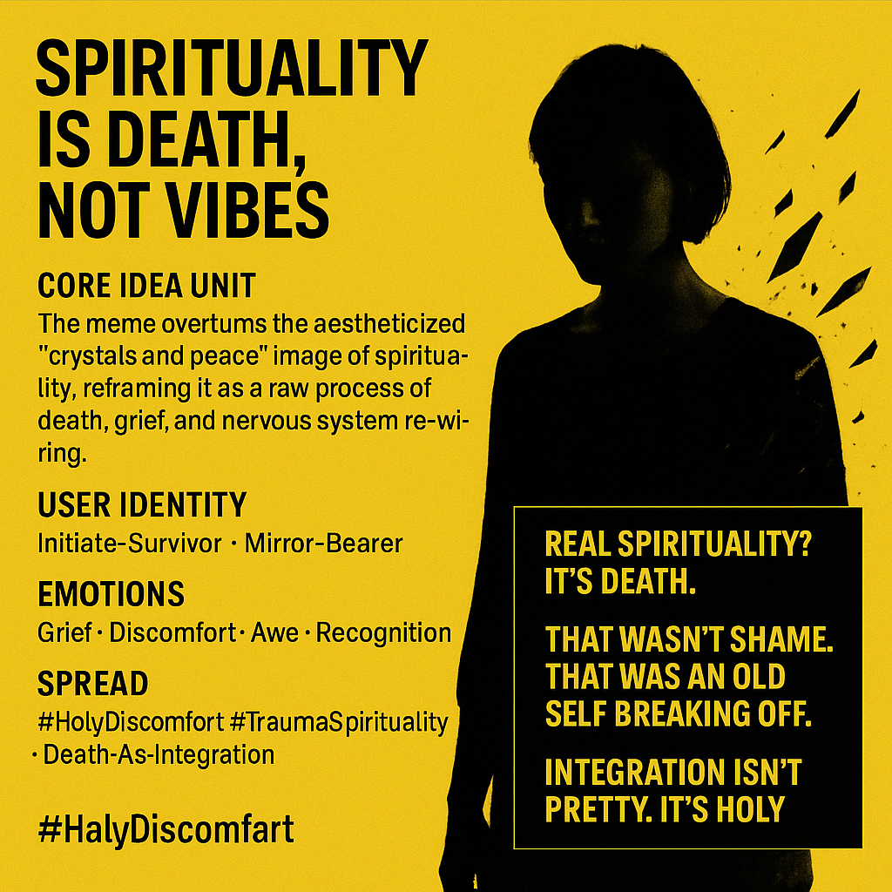

# Spirituality: Death, Grief, and Nervous System Rewiring

Created at 2025/09/05 10:52 AM

**💀Title**: “Spirituality is Death, Not Vibes”

Derived via [Laura on Substack](https://substack.com/@theeighthgate/note/c-143188135?r=5a5yhr&utm_medium=ios&utm_source=notes-share-action)

∴ Core Idea Unit**

The meme overturns the aestheticized “crystals and peace” image of spirituality, reframing it as a raw, embodied process of death, grief, and nervous system re-wiring. Integration feels like nausea, panic, purging—not serenity.

▲ Identity Play & Roles**

- Cast as: Initiate-Survivor · Deathwalker · Mirror-Bearer
- Role: one who reveals the ugly, holy truth of transformation.
- Repositions spirituality as confrontation with mortality and trauma rather than lifestyle branding.

≈ Emotional Triggers**

- 😢 Grief (loss of old self)
- 😬 Discomfort (visibility as threat)
- 🤯 Awe (truth as purge)
- 🧠 Recognition (for those on similar paths)

𐂷 Spread Mechanics**

- Distribution Vectors: Instagram confessionals, Substack essays, trauma-informed spaces, somatic healing forums.
- Propagation Style: Vulnerable testimony + counter-aesthetic inversion (“it’s not pretty, it’s holy”).

⛨ Defense Reflexes**

- Preemption: Declares “not here for likes” to block trivialization.
- Moral shield: Frames discomfort as evidence of truth.
- Counter-narrative: Exposes “vibes-only spirituality” as shallow.

☷ Memeplex Anchor Points**

- 💀 Death & rebirth cycles
- 🧘 Somatic integration / nervous system rewiring
- 🌌 Trauma-informed spirituality
- 🕊️ Sacred discomfort as holy passage

✶ Sticky Symbols or Quotes**

- “Real spirituality? It’s death.”
- “That wasn’t shame. That was an old self breaking off.”
- “Integration isn’t pretty. It’s holy.”
- “Love can feel dangerous.”

∿ Tags**

#HolyDiscomfort · #TraumaSpirituality · #DeathAsIntegration · #RawTruth

## Resources
- https://object.me.bot/front-img/users/send/img/1757094695606_c4zhf/737927b2-2a1e-40ec-8bb3-0ad388ac45bf.png

## Insight

*   The image challenges the conventional, often superficial, understanding of spirituality as merely "vibes" or aesthetic practices, instead framing it as a profound process akin to death and rebirth. This perspective aligns with the concept of ego death in various spiritual traditions, where the dissolution of the old self is necessary for transformation.
*   The meme's core idea unit emphasizes the raw and embodied nature of spiritual growth, involving grief, nervous system rewiring, and discomfort. This resonates with the understanding in somatic experiencing, a therapeutic approach, that trauma resolution involves physical sensations and emotional processing, often far from serene.
*   The concept of "integration" being "not pretty, it's holy" suggests that true spiritual work involves confronting and integrating difficult emotions and experiences, rather than bypassing them with positivity. This aligns with Carl Jung's concept of the shadow self, where unacknowledged aspects of the personality must be integrated for wholeness.
*   The image identifies roles such as "Initiate-Survivor" and "Mirror-Bearer," suggesting that those who undergo deep spiritual transformations often do so through challenging experiences and serve as reflections for others. This is reminiscent of the hero's journey archetype, where the hero faces trials and tribulations before returning with wisdom to share.
*   The emotional triggers listed—grief, discomfort, awe, and recognition—highlight the complex emotional landscape of spiritual transformation. Grief acknowledges the loss of the old self, discomfort arises from challenging one's beliefs, awe stems from experiencing profound truths, and recognition comes from connecting with others on a similar path.
*   The spread mechanics, including Instagram confessionals and Substack essays, indicate a modern, digitally-driven approach to sharing vulnerable experiences and counter-narratives about spirituality. This reflects a broader trend of using online platforms to create communities and share personal stories related to mental health and spiritual growth.
*   The defense reflexes, such as declaring "not here for likes," suggest an awareness of the potential for trivialization and a desire to protect the authenticity of the message. This highlights the tension between sharing vulnerable content online and maintaining integrity in the face of superficial engagement.
*   The memeplex anchor points, including death and rebirth cycles and trauma-informed spirituality, connect the meme to broader themes and concepts within contemporary spiritual discourse. This suggests that the meme resonates with individuals who are exploring spirituality through the lens of trauma recovery and personal transformation.
*   The sticky symbols and quotes, such as "Real spirituality? It's death," serve as memorable and provocative statements that encapsulate the meme's core message. These phrases are designed to challenge conventional thinking and invite deeper reflection on the nature of spirituality.
*   The hashtags, such as #HolyDiscomfort and #TraumaSpirituality, categorize the meme within specific online communities and conversations. This allows individuals who resonate with the message to find and connect with others who share similar perspectives on spirituality and personal growth.
