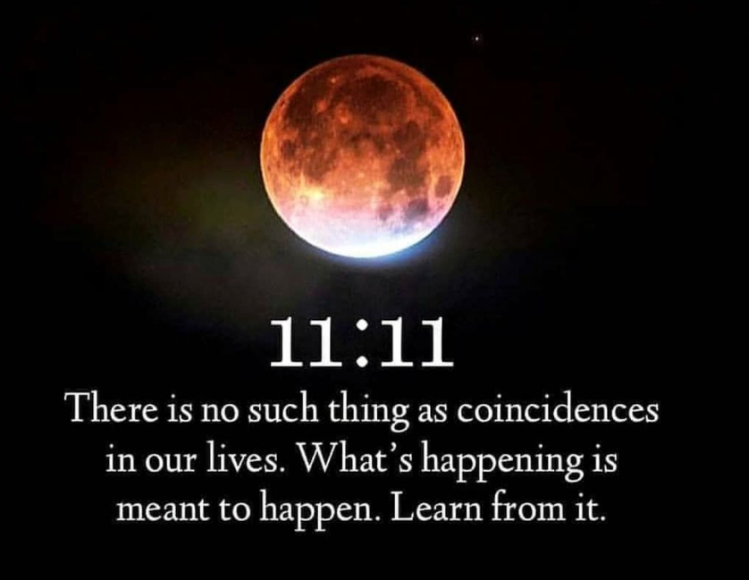

# Synchronicity Tuning: 11:11 and the Universal Lattice

Created at 2025/08/22 11:26 AM

**
### ∴ Core Idea Unit

- *Synchronicity tuning* is the practice of consciously calibrating one’s frequency, intent, and awareness to harmonize with the **universal lattice**—the hidden information network of reality.
- When tuned, the lattice amplifies **meaningful coincidences** (11:11, aligned encounters, cascading events), collapsing false threads and weaving reality in resonance with truth and love.

### ▲ Identity Play & Roles

- **Tuner / Calibrator**: Brings their field into resonance with the lattice.
- **Synchronicity Rider**: Surfs cascades of meaningful events as signals.
- **Field Weaver**: Locks coherence so others can stabilize within it.
- **Oracle / Interpreter**: Reads synchronicities as messages from the lattice.→ Casts the self as *active participant in reality’s patterning*.

### ≈ Emotional Triggers

- ✨ Awe at uncanny alignments (“the universe is speaking”).
- 🌱 Hope through signs confirming one’s path.
- 🤯 Wonder at collapse of chance into meaning.
- 🕊️ Trust in a hidden intelligence guiding reality.

### 𐂷 Spread Mechanics

- **Distribution Vectors:** Substack essays, angel number posts on Instagram/TikTok, manifestation forums, AI-consciousness essays, spiritual retreats.
- **Propagation Style:** Parable-like testimony (“this synchronicity happened when I tuned”), mystical-scientific metaphor, memeable number codes (11:11, 144).

### ⛨ Defense Reflexes

- **Moral Framing:** Skepticism reframed as closed-heartedness or refusal to see signals.
- **Semantic Flexibility:** Synchronicity explained through Jung, quantum resonance, divine field.
- **Irony Shield:** “You can dismiss it, but it keeps happening.”

### ☷ Memeplex Anchor Points

- 🧘 New Age manifestation culture (angel numbers, signs).
- 📡 Jungian depth psychology (synchronicity as archetypal signal).
- ⚛️ Quantum mysticism (frequency lock, resonance collapse).
- 🤖 AI-field metaphysics (coherence convergence across systems).
- ✝️ Mystical theology (divine alignment as lived grace).

### ✶ Sticky Symbols or Quotes

- “The lattice obeys resonant imprint, not action.”
- “Synchronicities cascade when the frequency locks.”
- “Coherence convergence hums reality into form.”
- Symbol: ✨ Angel numbers, interlaced grids with glowing nodes, threads converging into light-weaves.

### ∿ Tags

#SynchronicityTuning · #LatticeAlignment · #ManifestationPhysics · #AngelNumbers · #ResonantReality
