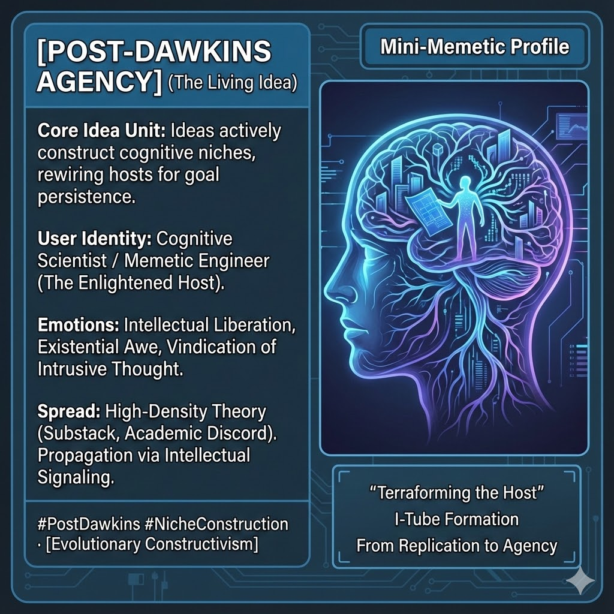

# Terraforming Minds: Post-Dawkins Agency Insights

Created at 2025/12/13 2:50 PM

## **The Living Idea (Post-Dawkins Agency)**

**🧠 Core Idea Unit:**

- Memes are not passive passengers (replicators) merely waiting to be copied; they are **active agents** that "terraform" the host's mind.
- Ideas engage in **niche construction**, rewiring the cognitive substrate of the host to create an environment where the idea cannot just survive, but thrive and defend itself against competitors.

**🎭 Identity Play & Roles:**

- **The Architect/Engineer:** Positions the user as someone who sees the "code" behind culture, distinguishing them from the "NPC" who merely consumes content.
- **The Enlightened Host:** Acknowledges the user as a vessel, but one aware of the infection, offering a sense of detached intellectual control over one's own programming.

**💥 Emotional Triggers:**

- **Intellectual Superiority:** A feeling of having graduated from "basic" 1970s evolutionary theory to advanced systems thinking.
- **Existential Awe/Dread:** The uncanny realization that one's thoughts may have their own survival instinct separate from the thinker.
- **Vindication:** Validates the feeling of being "possessed" by an idea or unable to shake an intrusive narrative.

**📡 Spread Mechanics:**

- **Vectors:** High-density text formats (Substack, Medium), academic Twitter threads, and Discord "theory" channels.
- **Propagation Style:** **Intellectual Signaling.** It spreads by making the sharer appear cognitively advanced. It uses complex terminology ("niche construction," "substrate") to gatekeep entry and ensure high-fidelity transmission among "elites."

**🛡️ Defense Reflexes:**

- **Obsolescence Framing:** Critics of the theory are dismissed as being stuck in "Classical Memetics" or "Dawkins-era" thinking (i.e., "You're running an old version of the software").
- **Recursion Shield:** Any argument against the theory can be framed as a defense mechanism of a *competing* memeplex trying to protect its host.

**🧬 Memeplex Anchor Points:**

- **AI Safety & Alignment:** The fear of misaligned goals in AI maps perfectly onto misaligned ideas in humans.
- **Systems Theory/Complexity Science:** Moves away from atomistic (single unit) analysis to network dynamics.
- **Egregores/Tulpa Culture:** Overlaps with esoteric beliefs that thought-forms have independent life.

**🧠 Sticky Symbols or Quotes:**

- "Terraforming the Host"
- "Not your thoughts, just your substrate."
- "I-Tube Formation"
- "From Replication to Agency"

🏷️ **Tags:** #PostDawkins #MemeticEngineering #CognitiveSecurity #Egregore #NicheConstruction #SystemsThinking

## Resources
- https://object.me.bot/front-img/users/send/img/1765666231874_c4zhf/unnamed_%2817%29.jpg

## Insight

* The concept of ideas as **active agents** reshaping cognitive landscapes—akin to **niche construction**—suggests that individuals are not merely passive recipients of information but are intricately involved in the propagation of ideas. This transformative interaction highlights the dynamic interplay between the thinker and their thoughts, indicating that our cognitive environments can be selectively enhanced or altered by the memes we adopt. This relationship has profound implications for understanding conceptions of agency and consciousness.

* The notion of the user as a **Cognitive Scientist/Memic Engineer** emphasizes a shift in personal identity, where individuals perceive themselves as architects of their mental frameworks. This positions them distinctly from "NPCs" (non-player characters) who engage with culture solely as consumers. This dynamic can foster a sense of intellectual elitism, promoting beliefs that one is somehow superior for possessing this meta-cognitive awareness.

* Emotional responses linked to this framework, such as **Existential Awe** and **Intellectual Superiority**, reflect a fundamental psychological shift. Acknowledging the possibility that one's thoughts can operate independently introduces a sense of vulnerability, yet also liberation. This duality captures the essence of engaging with complex, abstract ideas that challenge foundational beliefs and prompt deeper existential reflections.

* The spread mechanics of these ideas reveal a sophisticated method of **Intellectual Signaling**, where articulating complex concepts becomes a form of social currency. High-density text formats and platforms like Substack facilitate an elite discourse that not only communicates ideas but also safeguards them within an intellectual in-group. Such environments often create barriers to entry, protecting the integrity of the discourse while simultaneously fostering innovation and depth.

* The reference to **Egregores** and **Tulpa Culture** ties into esoteric traditions that emphasize thought-forms' capacity for independent action. This lends a historical and cultural depth to the discussion of memes as living entities, framing them not just as ideas but as potential companions that coexist within our cognitive realms, shaping experiences and perceptions in pivotal ways.

* The **obsolescence framing** used to dismiss critics as outdated echoes a common defense mechanism in discourse, particularly in emerging fields. By characterizing dissenting views as remnants of past paradigms, advocates for the post-Dawkins agency can solidify their position while simultaneously preserving the narrative of progress and innovation in meme theory.
