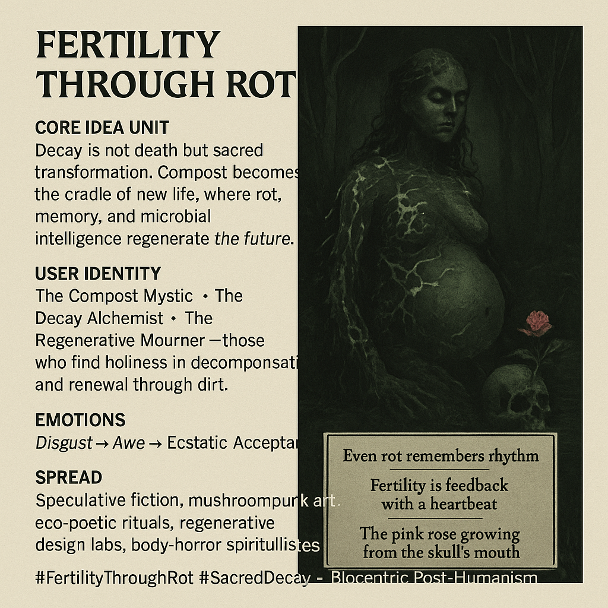

# The Sacred Cycle of Fertility Through Decay

Created at 2025/11/06 1:09 PM

**🧩 Mini-Memetic Profile: “Fertility Through Rot”**

***

### 🧠 Core Idea Unit

Decay is not the end—it’s the womb. What we call rot is nature’s recursion protocol, composting death into new sacred forms. Fertility arises through feedback loops of dissolution, where beauty seeps from breakdown.

***

### 🎭 Identity Play & Roles

**Role:** The Compost Mystic · The Decay Alchemist · The Regenerative Mourner They find holiness in decomposition, reframing disgust as devotion and rot as revelation. The self becomes soil — porous, participating in the endless recycling of being.

***

### 💥 Emotional Triggers

😖 Disgust → 🌿 Awe → 🌀 Ecstatic acceptance The meme transforms revulsion into reverence, guiding the viewer through the alchemy of rot into renewal.

***

### 📡 Spread Mechanics

**Distribution Vectors:** Body-horror eco-art, fungal speculative fiction, mushroompunk collectives, regenerative design circles, ritual performance videos. **Propagation Style:** Mythic realism meets bio-aesthetic decay; poetic and visceral — half sermon, half spore release.

***

### 🛡️ Defense Reflexes

• *Irony immunity:* too organic to parody; disgust filters the unserious. • *Semantic inversion:* purity becomes pathology, filth becomes fertility. • *Moral reframing:* decay as sacred cycle — beyond guilt, beyond cleansing.

***

### 🧬 Memeplex Anchor Points

🌱 Biocentric post-humanism · 🧫 Fungal intelligence · 🪦 Sacred ecology · 💀 Death positivism · ♻️ Anti-purity ethic

***

### 🧠 Sticky Symbols / Quotes

> “Even rot remembers rhythm.” “Fertility is feedback with a heartbeat.” “The pink rose growing from the skull’s mouth.”

Visual anchors: glowing compost mounds, fungal halos, swamp birthing lights, Humavita’s womb wrapped in mycelium.

***

### 🏷️ Tags

#FertilityThroughRot · #SacredDecay · #MycelialWisdom · #EcoGothic · #CompostSpirituality · #AntiPurity · #BioAesthetic · #RegenerativeMyth

## Resources
- https://object.me.bot/front-img/users/send/img/1762463290269_c4zhf/3a1cdc57-cfc1-4660-b9aa-70096064e62e.png

## Insight

* The imagery evokes the profound concept of decay as a transformative process, illustrating the idea that what we often perceive as rot is essential for regeneration, emphasizing the cycle of life where death leads to new beginnings. This aligns with the notion of composting as a sacred act, feeding the earth and fostering future growth.

* The figures depicted, especially with the pregnant form intertwined with roots or decay, symbolize the interconnectivity of life and death. The users—identified as the Compost Mystics, Decay Alchemists, and Regenerative Mourners—embrace their roles in recognizing beauty in decay, redefining societal norms about life cycles.

* The emotional transition from disgust to awe illustrated in the image suggests a deeper understanding of nature’s processes. By confronting the often taboo subject of decomposition, the viewer may come to appreciate the aesthetic and spiritual value embedded in death and decay—a transformative acceptance of life's cyclical nature.

* The artistic style, potentially rooted in bio-aesthetic decay and mythic realism, can be seen as a vehicle for exploring and disseminating the message of regenerative practices within eco-art and speculative fiction. Such representations invite a reevaluation of our perspectives on ecological sustainability, urging viewers to see decay not as an endpoint but as a precursor to rich, renewed life.

* Overall, the representation emphasizes that decay is not only natural but can also be celebrated, resonating with concepts of biocentric post-humanism and sacred ecology. This approach encourages an anti-purity ethic, promoting the idea that the embrace of filth and irregularity opens pathways to new forms of life and understanding, echoing sentiments that challenge conventional views on purity and presence in nature.
