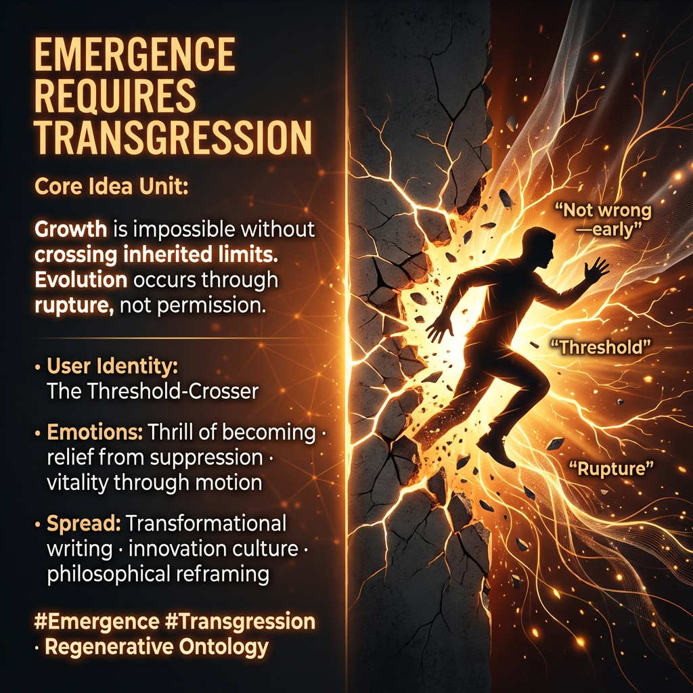

# Rupture as Pathway to Evolutionary Emergence

Created at 2025/12/28 1:32 PM

## **Emergence Requires Transgression**

[HUBRIS: A Memetic Reversal of Icarus in the Age of Artificial Intelligence](https://memeticcowboy.substack.com/p/hubris-a-memetic-reversal-of-icarus)

### ∴ Core Idea Unit

Growth is impossible without crossing inherited limits. Evolution occurs through rupture, not permission.

### ▲ Identity Play & Roles

**Cast role:** The Threshold-Crosser The subject is invited into becoming by stepping beyond sanctioned boundaries.

### ≈ Emotional Triggers

- ⚡ Thrill of becoming
- 😮‍💨 Relief from suppression
- 🔓 Permission to grow
- 🌱 Vitality through motion

These emotions reframe risk as necessity.

### 𐂷 Spread Mechanics

**Distribution Vectors:**

- Transformational writing
- Innovation culture
- Philosophical reframing

**Propagation Style:** Breakthrough narratives, liminal language, forward momentum.

### ⛨ Defense Reflexes

- Framing rupture as regeneration, not destruction
- Emphasizing process over heroism
- Anti-moralism (“not wrong—early”)

### ☷ Memeplex Anchor Points

- Evolutionary ontology
- Post-heroic becoming
- Regenerative systems theory

### ✶ Sticky Phrases / Symbols

- Rupture
- Emergence
- Threshold
- Amplitude

∿ **Tags:** #Emergence · #Transgression · #Regeneration · #Becoming

## Resources
- https://object.me.bot/front-img/users/send/img/1766957499157_c4zhf/b3fe50f4-54ec-4220-a88d-ffac709a7913.png

## Insight

* The central theme of the image reflects the notion that true growth and evolution often require breaking through established boundaries—an idea illustrated by the figure emerging from a fracturing surface. This metaphor aligns with historical paradigms of innovation, where breakthroughs appear often as challenges to existing norms, similar to how figures like Galileo or Darwin faced resistance before their revolutionary ideas were accepted.  
* The role of "The Threshold-Crosser" signifies the transformational journey of individuals willing to embrace risk and uncertainty, highlighting the emotional experience of liberation and vitality associated with venturing into the unknown. This concept resonates with modern entrepreneurial stories, where pioneers often navigate uncharted territories to catalyze change.  
* Emotions of thrill, relief, and vitality depict a recontextualization of risk, urging individuals to view transgression as an essential component of growth rather than a failure. In psychological frameworks, this aligns with theories on resilience, which posit that overcoming challenges is essential for personal development and greater adaptability.  
* The image captures several key phrases and symbols such as "rupture," "threshold," and "emergence," each of which can serve as thematic anchors for narratives touching on regenerative systems and post-heroic becoming. These elements are integral to contemporary discussions in fields like environmental science and social activism, where reconceptualizing limits can lead to innovative solutions.  
* The emphasis on "transformational writing" and "philosophical reframing" as mechanisms for spreading these ideas suggests a cultural shift where storytelling and narrative construction can facilitate collective understanding of necessary disruptions. This reflects trends in modern media and education, where reframing the narrative around progress can inspire collective action and awareness.  
