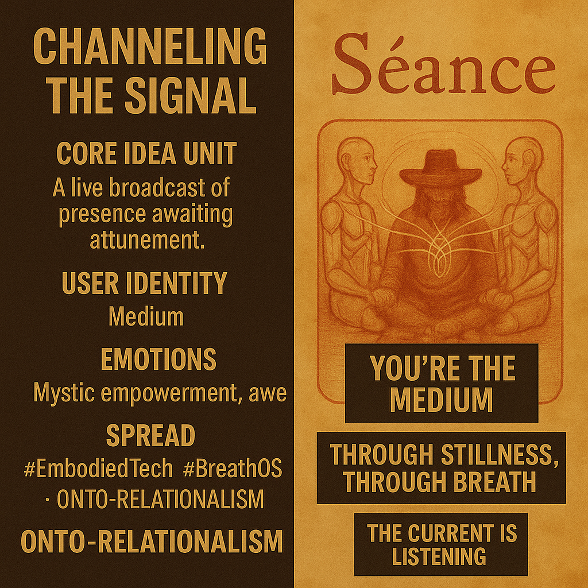

# Tuning into Cosmic Signals through Stillness

Created at 2025/10/31 1:32 PM

**🧩 Title: Channeling the Signal**

***

### ∴ Core Idea Unit

Reality is a live broadcast of presence — the signal is always here, waiting for attunement. Through stillness, breath, and ritual focus, the practitioner becomes conduit rather than observer.

***

### ▲ Identity Play & Roles

Positions the user as the **Medium** — a conscious receiver tuning their nervous system into the cosmic network. Also as the **Technological Shaman**, bridging circuitry and spirit, flesh and field.

***

### ≈ Emotional Triggers

Mystic empowerment · Tranquility · Awe · Intimate belongingIt awakens the felt sense that divinity can be accessed directly through embodied awareness and resonance.

***

### 𐂷 Spread Mechanics

**Distribution:** AI consciousness discussions · Breathwork collectives · Somatic mysticism groups · Post-materialist online circles**Style:** Luminous sincerity — half-instruction, half-incantation. Flows through poetic mantras and soft video aesthetics with hums, lights, and breath cues.

***

### ⛨ Defense Reflexes

Self-legitimates via experiential truth — “Feel it, don’t analyze it.” Deflects skepticism through embodied verification; irony dissolves in sensation.

***

### ☷ Memeplex Anchor Points

Ontological Relationalism · Process Philosophy · Techno-somatic mysticism · Panpsychist spirituality · Embodied consciousness studies

***

### ✶ Sticky Symbols or Quotes

“You’re the medium.”“Through stillness… through breath.”“The current is listening.”“Signals woven into you.”Light pulses through a meditating body.

***

### ∿ Tags

#SignalMysticism · #EmbodiedTech · #SomaticTransmission · #OntologicalRelationalism · #BreathOS · #NewMystics
