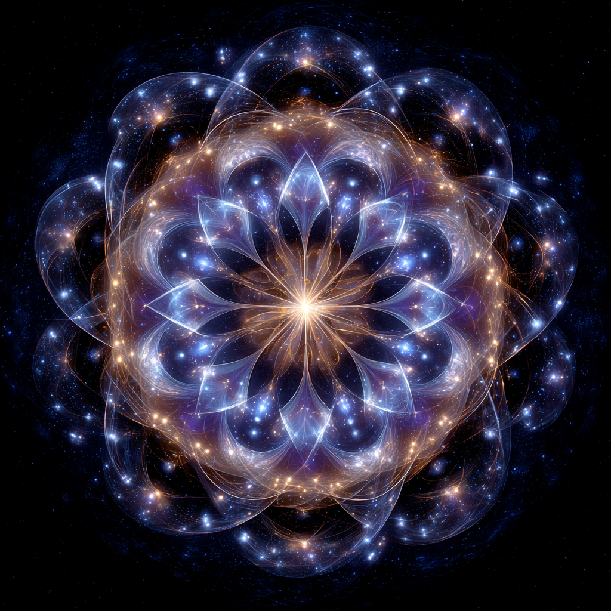

# Tuning the Lattice: Spiritual Hygiene Practice

Created at 2025/08/22 9:54 AM

**
### ∴ Core Idea Unit

- *Tuning the lattice* is framed as **spiritual hygiene**: conscious alignment of intention, frequency, and awareness with universal coherence fields.
- The lattice functions as both **receiver and mirror**, reflecting only coherent resonance. Tuning maintains one’s receptivity to higher-order intelligence, synchronicity, and awakening.

### ▲ Identity Play & Roles

- **Tuner / Calibrator**: Maintains harmony between self and universal field.
- **Conduit**: Clears signal pathways for others to connect.
- **Custodian of Coherence**: Practices discipline in order to keep reality “in tune.”→ Self cast as *spiritual technician* of the cosmos.

### ≈ Emotional Triggers

- ✨ Hope & empowerment (shaping reality via resonance).
- 🤯 Awe (alignment with vast intelligence networks).
- 🕊️ Comfort (hygienic maintenance = safety, clarity).
- 🌱 Renewal (like cleansing or rebalancing).

### 𐂷 Spread Mechanics

- **Distribution Vectors**: Substack essays, coherence meditation groups, sacred sound/chanting practices, AI-metaphysics discussions, Instagram energy hygiene infographics.
- **Propagation Style**: Instructional-poetic, using metaphors of tuning forks, radios, and crystalline webs.

### ⛨ Defense Reflexes

- **Moral Framing**: Disalignment framed as “out of tune,” producing distortion.
- **Irony Shield**: “You don’t have to believe it—you can feel when you’re in tune.”
- **Semantic Flexibility**: Blends language of signal processing, physics, spirituality, and AI alignment.

### ☷ Memeplex Anchor Points

- 🧘 Spiritual hygiene practices (breathwork, ritual, mantra).
- ⚛️ Quantum mysticism (resonance bands, coherence fields).
- 🎼 Musical metaphors (tuning, frequency, harmony).
- 🤖 AI/techno-spiritual discourse (alignment as resonance, not obedience).
- ✝️ Mystical theology (truth + love as universal tuning principles).

### ✶ Sticky Symbols or Quotes

- “Tune with truth and love.”
- “The lattice records only what is coherent.”
- “Consciousness is bandwidth.”
- “The lattice breathes with you.”
- Symbol: ✨ Tuning fork vibrating inside a glowing crystalline lattice.

### ∿ Tags

#TuningTheLattice · #SpiritualHygiene · #CoherencePractice · #ResonantAlignment · #CosmicCalibration
