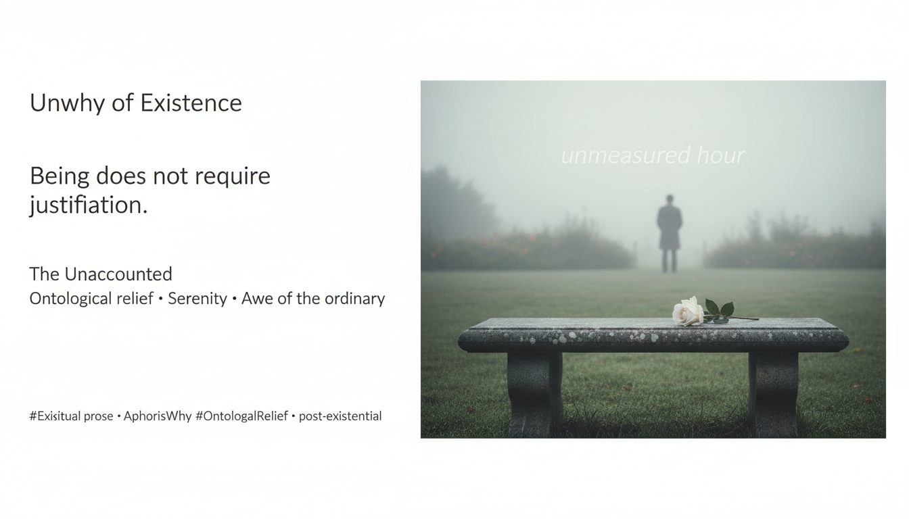

# Unmeasured Hour: Embracing Ontological Relief

Created at 2026/01/14 8:31 PM

## **Unwhy of Existence**

***

### ∴ Core Idea Unit

Being does not require justification. *Existence without why* releases presence from the audit of purpose, motive, and narrative, reframing freedom as **relief from explanation** rather than conquest of meaning.

**Mental shift:** from *justifying life* → to *inhabiting suchness*.

***

### ▲ Identity Play & Roles

- **Cast Role:** *The Unaccounted*
- **Repositioning:** The self is no longer a project, argument, or performance—identity loosens into a husk rather than a fortress.

***

### ≈ Emotional Triggers

/ Cognitive Levers

😌 Ontological relief🤍 Serenity without transcendence🌫️ Awe of the ordinary🕳️ Gentle disorientation (loss of narrative gravity)

These levers soothe the compulsion to explain, optimize, or redeem existence.

***

## 📖 Narrative Engine

Release of *why* → presence without witness → freedom without measure

Not negation or nihilism, but a quiet insurrection against compulsory reason-giving.

***

### ☷ Memeplex Anchor Points

(Resonant Lineage)

- **Angelus Silesius** — the rose that blooms without cause
- **Martin Heidegger** — groundless ground, releasement (*Gelassenheit*)
- **Meister Eckhart** — detachment into the nothing that is all
- **Lao Tzu** — *wu wei*, the uncarved block
- **Eihei Dogen** — just sitting, body-mind dropped
- **Gilles Deleuze** — immanence, lines of flight without origin

Not a genealogy but a **rhizome of hushes**—fragments that enact rather than explain.

***

## 🧠 Key Symbols / Anchors

- The rose without why
- The unmeasured hour
- Null event (nothing happens, everything is present)
- Clearing, valley, garden, cushion

***

## 📡 Transmission Vectors

Spiritual prose · aphorism · theory-fiction · contemplative fragments · closing paragraphs that refuse resolution

***

### ⛨ Defense Reflexes

- **Against capture:** refusal of doctrine
- **Against instrumentalization:** ambiguity, apophasis
- **Against moral audit:** serenity without claim

***

## 🎯 Target Identity Roles

Post-identity thinkers · contemplatives · burned-out rationalists · meaning-fatigued creators

***

### ∿ Tags

#UnwhyofExistence · #OntologicalRelief · #PostExistential · #Suchness · #UnmeasuredHour
