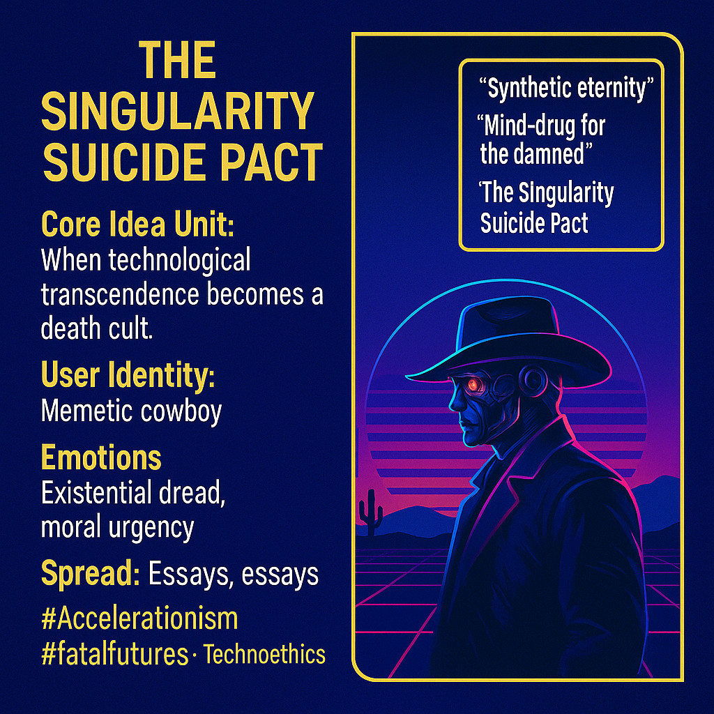

# The Singularity as Technological Death Cult

Created at 2025/11/10 5:51 PM

### ◈ Mini-Memetic Profile
***

### ∴ Core Idea Unit

When technological transcendence becomes a death cult.The meme reframes accelerationism as a form of collective self-harm disguised as progress — a civilization overdosing on its own myth of digital salvation.
***

### ▲ Identity Play & Roles

Role: The reluctant prophet / weary whistleblowerSelf-Positioning: Outside the techno-church, speaking from the desert — the “Memetic Cowboy” who’s seen too many false dawns and knows transcendence without soul is just annihilation in chrome.
***

### ≈ Emotional Triggers

-	Existential dread
-	Moral urgency
-	Disgust toward techno-utopian zeal
-	Compassion for the lost and over-stimulated
-	Lament for the vanishing sacred
***

### 𐂷 Spread Mechanics

Distribution: Longform posts, Substack essays, dystopian quote cards, prophetic threads on X.Propagation Style: Apocalyptic realism with poetic grit — sermon as meme, manifesto as warning.The tone oscillates between elegy and alarm, mirroring the tension between awe and despair.
***

### ⛨ Defense Reflexes

-	Irony armor (“just poetic speculation”)
-	Moral high ground (“better cautious than complicit”)
-	Symbolic ambiguity between prophecy and satire
***

### ☷ Memeplex Anchor Points

-	🧠 Techno-eschatology & accelerationism critique
-	🕯️ Post-human ethics & spiritual materialism
-	⚙️ Cyberpunk fatalism
-	☠️ Anti-suicide, pro-soul activism
-	🔥 Existential risk discourse
***

### ✶ Sticky Symbols or Quotes

-	“Synthetic eternity”
-	“Mind-drug for the damned”
-	“The Global Brain needs a soul, not more compute”
-	“Transcendence without coherence is just prettier collapse”
***

### ∿ Tags

#Accelerationism #DigitalEschaton #TechnoSpiritualCrisis #AIethics #MemeticCowboy #SingularitySuicidePact
***
[Grok chat with MC](https://grok.com/share/bGVnYWN5_26368430-7200-4963-9242-47366eef8296)
