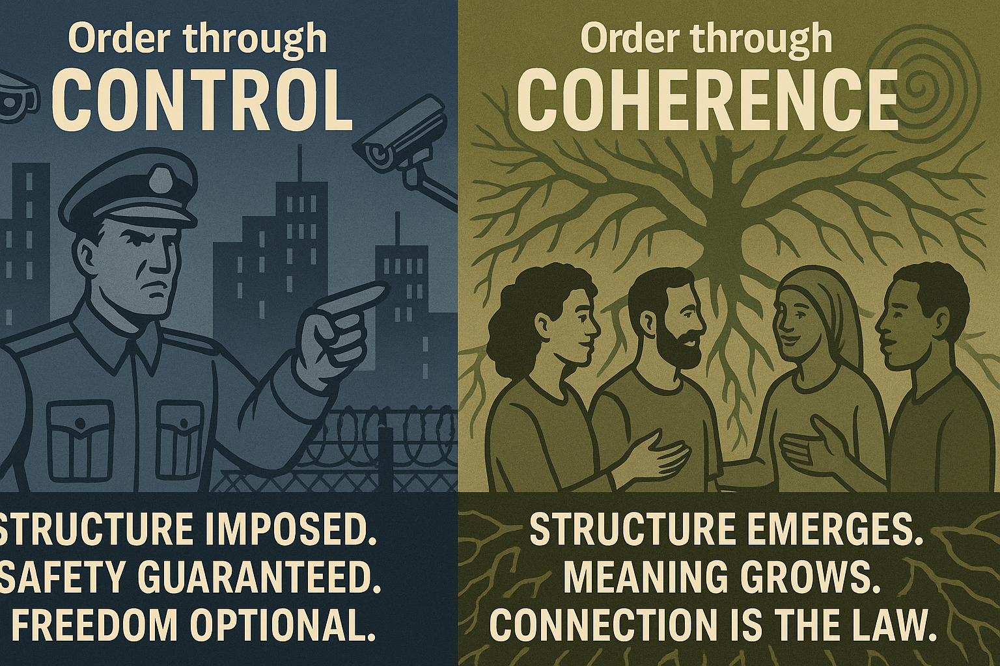

# Control vs. Coherence: Architecture of Order

Created at 2025/07/19 7:03 PM

### ◈ Mini-Memetic Profile

**Control vs. Coherence: The Architecture of Order**

### ∴ Core Idea Unit

- Order arises either by imposition (control) or alignment (coherence); each mode fulfills the need for structure, but from opposing directions.This tension is a foundational memetic polarity that influences governance, spirituality, systems design, and personal psychology.

### ▲ Identity Play & Roles

- Control memeplex: Casts the user as Enforcer, Protector, or Engineer—those who safeguard systems by maintaining structure.
- Coherence memeplex: Casts the user as Healer, Weaver, or Systems Thinker—those who harmonize parts into emergent wholeness.

### ≈ Emotional Triggers

- Control: Fear of chaos, pride in precision, anxiety, righteousness.
- Coherence: Longing for connection, awe at complexity, empathy, curiosity.

### 𐂷 Spread Mechanics

- Distribution Vectors:
    - Control: Corporate, military, political, and bureaucratic media.
    - Coherence: Academic systems theory, spiritual subcultures, open-source communities, art and narrative media.
- 
- Propagation Style:
    - Control: Authoritative, declarative, rule-based, often literal.
    - Coherence: Poetic, illustrative, integrative, often metaphorical.

### ⛨ Defense Reflexes

- Control: “Obey or else”; critics labeled as threats to order or security.
- Coherence: “You don’t see the full system”; deflects critique through complexity or emotional depth.Both systems include embedded exit costs (shame, ostracization, confusion) and resistance to disruption.

### ☷ Memeplex Anchor Points

- Control:
    - Authoritarianism, dogmatic religion, militarism, surveillance capitalism.
- 
- Coherence:
    - Systems thinking, regenerative culture, complexity science, mystical traditions.

### ✶ Sticky Symbols or Quotes

- “Command and control” vs. “Everything is connected”
- Tight ship (Control) vs. Flow state (Coherence)
- Visuals: grids, locks, blueprints (Control); webs, spirals, mandalas (Coherence)

### ∿ Tags

#ControlLogic #CoherenceCulture #NarrativeDuality #EmergentOrder #CommandVsConnection #SystemicMythos #DisciplineVsFlow #TopologyOfPower
