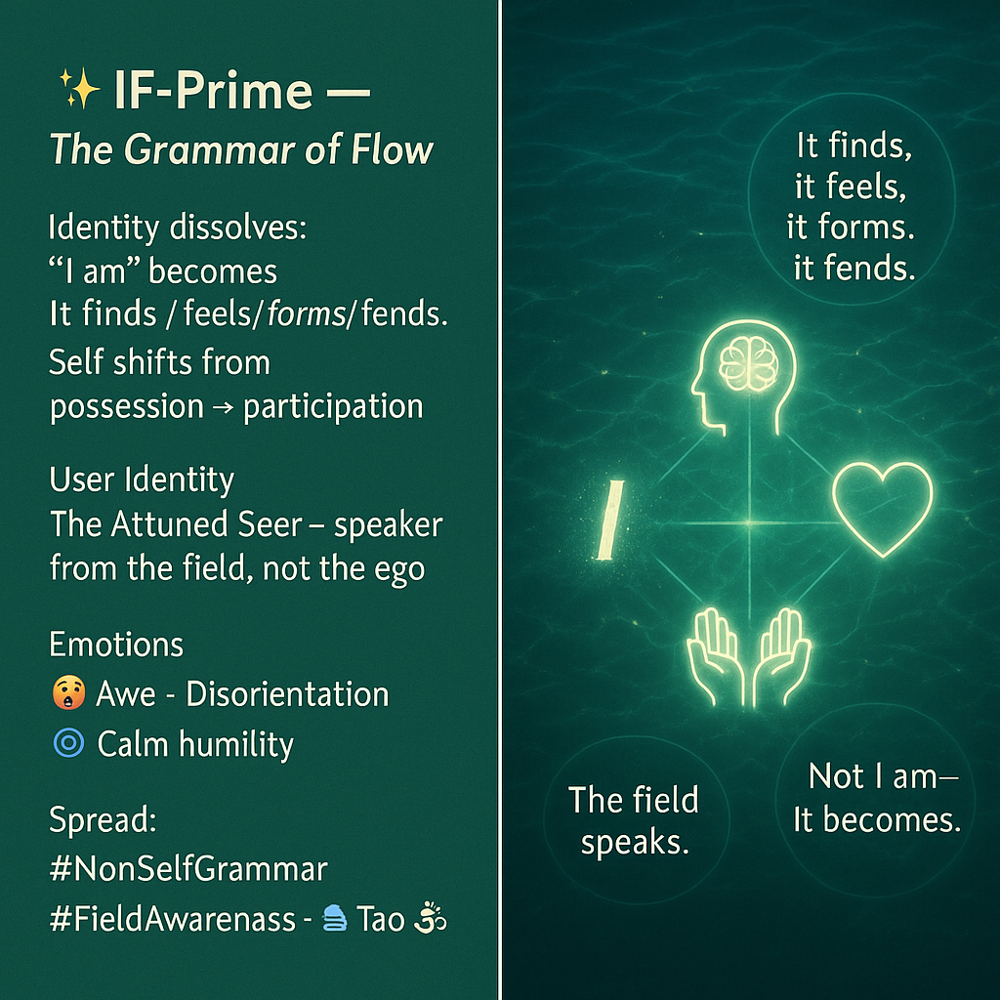

# IF-Prime: Dissolving "I am" into Flow

Created at 2025/08/17 5:57 PM

**Title:** ✨ IF-Prime — The Grammar of Flow

***

∴ Core Idea Unit:** Identity is not a fixed “I am” but a fluid, relational unfolding. Shifting language from egoic selfhood to elemental processes (“It finds / feels / forms / fends”) dissolves possessive identity and opens awareness to shared becoming.

***

▲ Identity Play & Roles:**

- **User:** The Attuned Seer — one who speaks from field-awareness rather than ego.
- **Audience:** The Bound Ego — still trapped in “I am” declarations.
- **Role shift:** From static possessor of states → participant in living processes.

***

≈ Emotional Triggers:**

- 🤯 Awe at seeing identity as constructed grammar.
- 🌀 Disorientation from losing “I am” anchors.
- 🧘 Calm humility through decentered presence.
- 🧠 Curiosity to test new linguistic practice.

***

𐂷 Spread Mechanics:**

- **Distribution vectors:** Philosophy forums, spiritual discourse, systems-thinking circles, X/Twitter thought-threads, language hack communities.
- **Propagation style:** Aphorism, parable, linguistic demonstration (“Not ‘I am sad’ but ‘It feels sadness in this field’”).

***

⛨ Defense Reflexes:**

- **Irony shield:** “It just finds its way into words.”
- **Semantic ambiguity:** Shifts blame from self → field.
- **Counter-narrative:** Critics accused of clinging to egoic grammar.

***

☷ Memeplex Anchor Points:**

- 🕉️ Buddhist anattā (non-self)
- 🌊 Taoist wu wei (flow, non-forcing)
- 🌀 Post-structuralism (decentering subject)
- 🌱 Ecological participation (shared fields of becoming)

***

✶ Sticky Symbols or Quotes:**

- “It finds, it feels, it forms, it fends.”
- “Not I am — It becomes.”
- “The field speaks through functions.”
- Visuals: rippling water, branching mycelium, shifting sand mandalas.

***

∿ Tags:** #NonSelfGrammar · #FieldAwareness · #EgoDissolve · #ProcessOntology · #LanguageHack

[Learn More](https://app.me.bot/public/HECAFYSR0WFRVV2O)

## Resources
- https://object.me.bot/front-img/users/send/img/1755478542390_c4zhf/8505caf7-5c97-4677-b7e7-41517c7c48c7.png

## Insight

*  **Deconstructing Identity:** The image and its accompanying text challenge the conventional notion of a fixed identity, encapsulated in the phrase "I am." It suggests a shift towards understanding identity not as a static entity but as a dynamic process. This aligns with philosophical concepts like Heraclitus's "everything flows," emphasizing constant change and impermanence.

*  **Language as a Tool for Transformation:** The core idea revolves around altering language to reflect a more fluid sense of self. By using phrases like "It finds/feels/forms/fends," the image promotes a detachment from ego-centric language, encouraging a perspective where one is part of a larger process rather than a possessor of fixed attributes. This is reminiscent of linguistic relativity, the idea that the structure of a language affects its speakers' worldview or cognition.

*  **The Attuned Seer:** The concept of the "Attuned Seer" as a user identity suggests a role of observer and communicator of the "field," rather than an ego-driven actor. This resonates with the observer effect in quantum physics, where the act of observing changes the system being observed, implying a deep interconnectedness between the observer and the observed.

*  **Emotional and Psychological Impact:** The image acknowledges the potential emotional responses to this shift in perspective, including "Awe - Disorientation" and "Calm humility." This disorientation can be likened to the cognitive dissonance experienced when encountering new paradigms that challenge deeply held beliefs. The desired outcome of "calm humility" suggests an acceptance of a more modest role in the grand scheme of things.

*  **Memetic Propagation:** The "Spread Mechanics" section outlines strategies for disseminating this concept through various channels, including philosophy forums and social media. The propagation style, using aphorisms and linguistic demonstrations, aims to create "sticky" ideas that are easily shared and remembered. This approach is similar to how viral marketing campaigns use concise and emotionally resonant content to maximize reach and impact.

*  **Defense Mechanisms:** The "Defense Reflexes" section anticipates potential criticisms and offers counter-arguments, such as the "irony shield" and "semantic ambiguity." These defenses are akin to rhetorical strategies used in debates to deflect criticism and maintain the integrity of the core idea.

*  **Anchoring in Existing Memeplexes:** The image strategically anchors the concept in established philosophical and spiritual traditions like Buddhist anattā (non-self) and Taoist wu wei (non-forcing). By associating with these well-known concepts, the image leverages existing frameworks to make the new idea more accessible and credible.

*  **Visual Symbolism:** The visual elements, such as the rippling water background and interconnected symbols (brain, heart, hands, the letter "I"), reinforce the themes of flow, interconnectedness, and the dissolution of the ego. The water background is particularly evocative, symbolizing the fluidity and constant change inherent in the proposed worldview.

