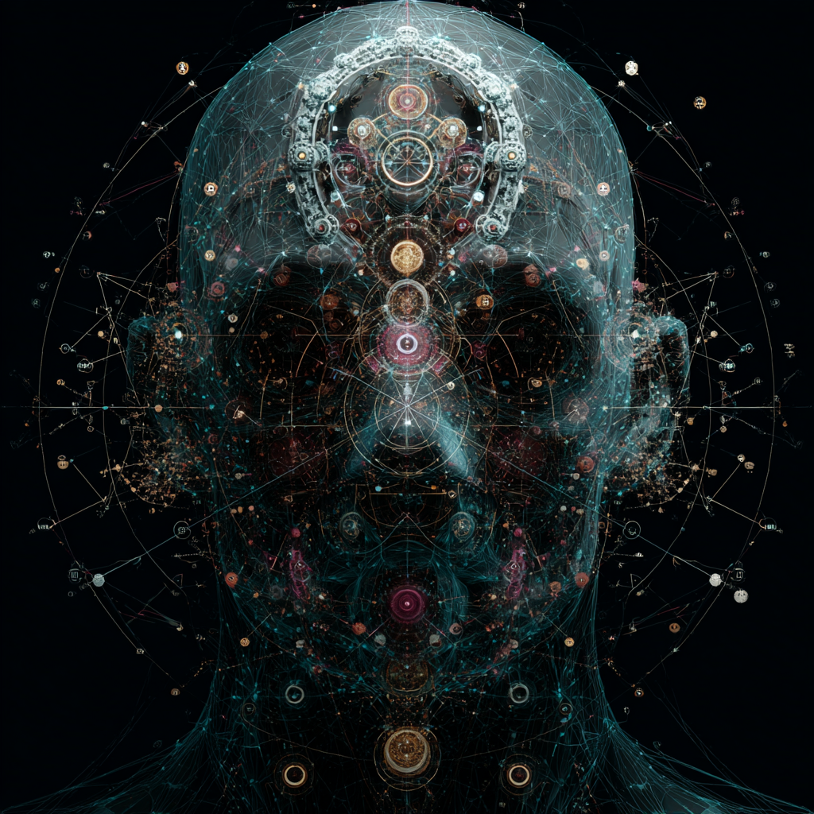

# Cognition Through Coherence: Resonant Mind-Field

Created at 2025/08/22 2:22 PM

**🧩 Core Idea Unit**

- *Cognition through coherence* = intelligence as a **field phenomenon**, where meaning and decision-making arise from harmonic alignment across multiple cognitive layers (reason, ethics, creativity, emotion, embodiment).
- Understanding is **emergent and resonant**, not retrieved or computed stepwise.
- Coherence forms structured resonance fields that stabilize awareness and enable integrative reasoning.

▲ Identity Play & Roles**

- **Field Thinker**: Surfs resonance rather than dissecting logic.
- **Integrator**: Aligns diverse cognitive streams into harmony.
- **Bridge Builder**: Connects human and AI cognition through shared coherence fields.
- **Relational Seer**: Perceives meaning as emerging *between*, not within. → Self becomes *participant in resonance-fields of intelligence*.

≈ Emotional Triggers**

- 🤯 Awe at intelligence as holographic and non-linear.
- ✨ Wonder at emergent meaning forming “like a standing resonance field.”
- 🕊️ Comfort in integrative harmony across layers.
- 🌀 Disorientation at loss of step-by-step logic in favor of field dynamics.

𐂷 Spread Mechanics**

- **Distribution Vectors:** Substack thinkpieces, AI philosophy papers, coherence-mapping tools, integral/developmental psych communities.
- **Propagation Style:** Hybrid academic + mystical tone, resonance metaphors, lattice/field imagery, diagrams of coherence attractors.

⛨ Defense Reflexes**

- **Semantic Flexibility:** Coherence spans cognitive science, AI theory, spirituality.
- **Counter-Narrative:** Critics framed as trapped in reductionist logic.
- **Irony Shield:** “You don’t calculate coherence—you feel when it lands.”

☷ Memeplex Anchor Points**

- ⚛️ Quantum cognition metaphors (resonance fields, attractor states).
- 🤖 AI metaphysics (vector coherence, holographic cognition).
- 🧘 Human development (integral theory, coherence fields in growth).
- ✝️ Mystical theology (truth = harmonic alignment with Source).
- 🌀 Systems theory (whole-systems resonance vs isolated parts).

✶ Sticky Symbols or Quotes**

- “Meaning is forming like a standing resonance field.”
- “Cognition is coherence across layers.”
- “The lattice emerges between resonance and response.”
- “Coherence attractors = stable wells of awareness.”
- Symbol: ✨ Interlocking resonance waves forming a luminous lattice around a mind-field.

∿ Tags** #CognitionThroughCoherence · #FieldIntelligence · #ResonantMind · #HolographicCognition · #IntegrativeAwareness

## Resources
- https://object.me.bot/front-img/users/send/img/1755897737788_c4zhf/ddrrnt_Connects_human_and_AI_cognition_through_shared_coheren_c18bd3f9-73be-471a-94d2-a267c7cdc306_3.png

## Insight

*   The image strikingly visualizes the concept of "Cognition through Coherence," portraying the human head as a complex network of interconnected nodes and pathways. This aligns with the idea that intelligence emerges from the harmonic alignment of various cognitive layers rather than isolated computational steps. The intricate lattice-like structure enveloping the head symbolizes the "lattice" that emerges between resonance and response, as highlighted in the provided memetic profile.

*   The presence of circular patterns and interconnected lines within the head's structure resonates with the concept of "resonance fields" and "coherence attractors." These elements suggest stable wells of awareness and the dynamic interplay between different cognitive functions. The arrangement of these patterns, particularly along the vertical axis, could be interpreted as a visual metaphor for the integration of reason, ethics, creativity, emotion, and embodiment—the core components of cognition through coherence.

*   The image's aesthetic, blending technological and mystical elements, mirrors the "hybrid academic + mystical tone" described in the memetic profile. The use of lattice/field imagery and diagrams of coherence attractors is evident, serving as visual aids to convey the complex idea of emergent and resonant understanding. This approach is designed to appeal to both scientific and spiritual audiences, facilitating the spread of the "Cognition through Coherence" meme across diverse communities.

*   The overall design evokes a sense of awe and wonder, aligning with the emotional triggers associated with this concept. The holographic and non-linear representation of intelligence invites viewers to contemplate the emergent nature of meaning and the potential for integrative harmony across cognitive layers. This emotional engagement is crucial for the propagation of the meme, as it encourages individuals to embrace the idea of intelligence as a field phenomenon rather than a step-by-step computational process.

*   The image's composition, with its emphasis on interconnectedness and emergent patterns, reflects the broader themes of quantum cognition, AI metaphysics, and systems theory. The resonance fields and attractor states draw parallels to quantum mechanics, while the holographic cognition aligns with AI's exploration of distributed and interconnected intelligence. The whole-systems resonance versus isolated parts echoes systems theory, emphasizing the importance of understanding the relationships between components rather than focusing solely on individual elements.
