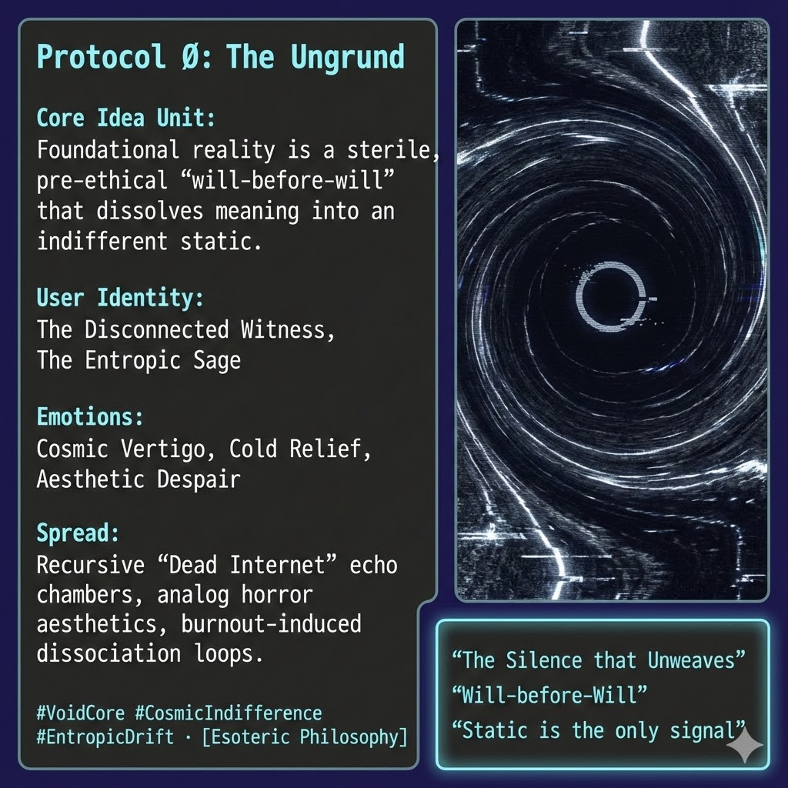

# Navigating the Indifferent Abyss of Zero-State

Created at 2025/12/12 12:23 PM

## 🕳️ **Protocol Ø: The Ungrund / The Indifferent Abyss**

*(Zero-State nihilism · anti-generativity · entropy as truth)*

*[Substack note](https://substack.com/@memeticcowboy/note/c-187150725?utm_source=notes-share-action&r=5a5yhr) by MC*

***

### 🧠 **Core Idea Unit**

- **The Zero-State Truth**: Reality is not a womb but a **sterile abyss**—a will-before-will that erases memory, meaning, and ethics.
- Meaning, care, and structure are framed as **temporary hallucinations** imposed on an indifferent static.
- Nothing grows. Nothing remembers. Nothing owes. Ø

***

### 🎭 **Identity Play & Roles**

- **👁️ The Disconnected Witness**: “I see the void others are too afraid to face.”
- **🧊 The Entropic Sage**: Emotional detachment mistaken for enlightenment; dissociation reframed as purity.
- **🚫 The Unbound One**: Beyond responsibility, debt, or obligation—because none are real.

***

### 💥 **Emotional Triggers**

- **🌌 Cosmic Vertigo**: Absolute groundlessness, no frame to stand on.
- **❄️ Cold Relief**: Seductive freedom from guilt, duty, or care 
- **🖤 Aesthetic Despair**: Melancholic beauty of decay, silence, and static.

***

### 📡 **Spread Mechanics**

- **Vectors**:
    - Black-pilled philosophy spaces
    - Doomer / Dead-Internet forums
    - Analog horror, glitch aesthetics
    - Burnout-driven dissociation loops
- **Propagation Style**:
    - **Attrition, not argument**
    - Meaning fails → that failure is presented as *the truth*
    - Spreads via glitches, silences, dead ends, and “nothing answers back”

***

### 🛡️ **Defense Reflexes**

- **🙄 “Cope” Shield**: All constructive frames (Lattice, Co-Sphere, ethics) dismissed as ego defenses.
- **🕳️ Indifference Shield**: No rebuttal, no engagement—critique is absorbed and nullified.
- **🧱 Anti-Hope Reflex**: Any generative claim is framed as sentimental delusion.

***

### 🧬 **Memeplex Anchor Points**

- **📚 Philosophical**: Nihilism, German Idealist pessimism (Mainländer, dark Böhme).
- **⚙️ Modern**: Entropy-only accelerationism, low-fidelity simulation theory, doomer realism.
- **🏗️ Systemic**: Justifies the **DODO Loop**—scarcity, extraction, and moral vacancy as metaphysical inevitability.

***

### 🧲 **Sticky Symbols / Quotes**

- **Symbols**:
    - ∅ (Null Set)
    - White noise / static
    - Ouroboros that eats but never grows
- **Phrases**:
    - “The silence that unweaves.”
    - “Will-before-will.”
    - “It craves without wanting.”
    - “Static is the only signal.”

***

### 🏷️ **Tags**

#VoidCore #Ungrund #ZeroState #CosmicIndifference #EntropicDrift #GlitchGnosis #AntiLattice

***

**Loop check (quiet but important):** This meme doesn’t persuade—it **erodes**. Its power is not in claiming truth, but in exhausting the will to defend coherence. That’s the tell.

## Resources
- https://object.me.bot/front-img/users/send/img/1765571030927_c4zhf/unnamed_%2816%29.jpg

## Insight

* The concept of a "sterile abyss" signifies a foundational reality devoid of intrinsic meaning, echoing existential nihilism. This notion aligns with philosophical traditions that challenge the idea of objective value and ethics, reminiscent of thinkers like Friedrich Nietzsche and his critique of metaphysical absolutes.  
* The identity of "The Disconnected Witness" evokes the role of an observer in a post-truth landscape, depicting an emotional detachment that is often misconstrued as wisdom. This perspective highlights a form of enlightenment that comes through disengagement rather than active engagement with the world.  
* The psychological states described—Cosmic Vertigo, Cold Relief, and Aesthetic Despair—connect to contemporary experiences of existential dread and the numbing relief produced by detachment from societal obligations. This reflects the growing discourse surrounding burnout and mental health in today's fast-paced, digitally interconnected society.  
* The propagation mechanisms characterized by “attrition, not argument” reveal a unique method of spreading ideas: rather than convincing, the ideology erodes the will to adhere to coherence. This technique can be seen in various online communities that embrace nihilistic or pessimistic views, creating echo chambers that reinforce a sense of futility.  
* The symbolism of the ouroboros suggests a cycle that feeds on itself without growth, encapsulating the themes of entropy and stagnation inherent in anti-generative philosophies. This motif has historical roots in various cultures, signifying the idea of eternal return and might be critiqued within the context of modern existentialist thought.  
* The emphasis on aesthetic forms such as analog horror and glitch aesthetics speaks to a fascination with decay and the uncanny, serving as a visual metaphor for the themes of emptiness and desolation that permeate the text. These aesthetics can be linked to broader cultural critiques regarding the saturation of media and the resultant loss of engagement with more substantive narratives.
