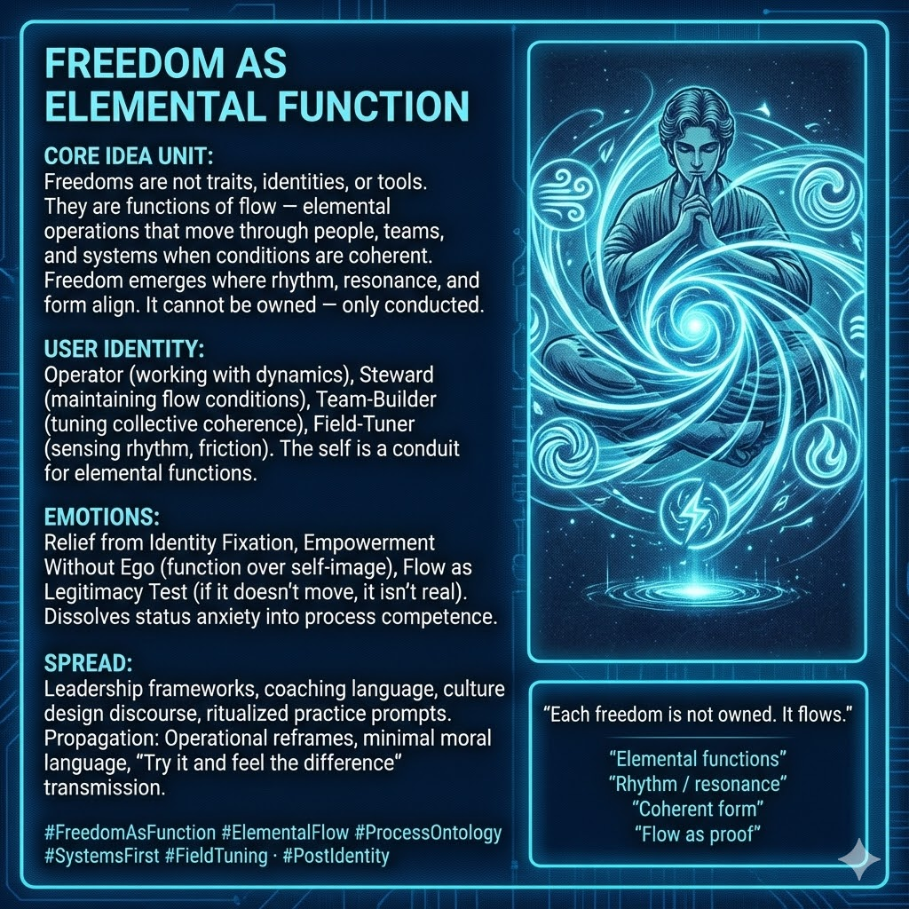

# Understanding Freedom as Elemental Flow

Created at 2025/12/14 7:59 AM

**Freedom as Elemental Function**

***

## ∴ Core Idea Unit

Freedoms are not traits you possess, identities you claim, or tools you wield. **They are functions of flow** — elemental operations that move *through* people, teams, cultures, and systems when conditions are coherent.

**Resolution frame:** Freedom emerges where rhythm, resonance, and form align. It cannot be owned — **only conducted**.

**Mental shift provoked:** From *“What freedoms do I have?”* → *“Which freedoms are currently flowing here?”*

***

## ▲ Identity Play & Roles

**Cast the viewer as:**

- **Operator** — working with dynamics, not labels
- **Steward** — responsible for maintaining flow conditions
- **Team-Builder** — tuning collective coherence
- **Field-Tuner** — sensing rhythm, friction, and blockage

**Repositioning:** The self is no longer a container of rights, but a **conduit for elemental functions**.

***

## ≈ Emotional Hooks & Cognitive Levers

- 😌 **Relief from Identity Fixation** — no need to *be* freedom
- ⚙️ **Empowerment Without Ego** — function over self-image
- 🌊 **Flow as Legitimacy Test** — if it doesn’t move, it isn’t real

This meme dissolves status anxiety by relocating freedom into **process competence**.

***

## 𐂷 Spread Mechanics

**Distribution Vectors**

- Leadership and management frameworks
- Coaching and facilitation language
- Culture and organizational design discourse
- Ritualized practice prompts (standups, retrospectives, somatic checks)

**Propagation Style**

- Operational reframes
- Minimal moral language
- “Try it and feel the difference” transmission

***

## ⛨ Defense Reflexes

- **Anti-Essentialism Shield:** No fixed identities required
- **Anti-Libertarian Reduction:** Freedom not reduced to permission
- **Anti-Abstraction Guard:** Always grounded in observable flow

Critique must explain **how static freedoms outperform functional ones** in real systems.

***

## ☷ Memeplex Anchor Points

- Process ontology
- Systems-first ethics
- Flow-based governance
- Memetic ecology
- Elemental function models (agency as operation)

***

## ✶ Sticky Symbols / Quotes

- 🌬️ **“Each freedom is not owned. It flows.”**
- 🔁 *Elemental functions*
- 🎶 *Rhythm / resonance*
- 🧩 *Coherent form*
- 🌊 *Flow as proof*

***

## ∿ Tags

#FreedomAsFunction · #ElementalFlow · #ProcessOntology · #SystemsFirst · #FieldTuning · #PostIdentity

***

**Reflection anchor:** This meme doesn’t ask who you are. It asks **what is moving through you — and what conditions let it move cleanly.**

## Resources
- https://object.me.bot/front-img/users/send/img/1765727933968_c4zhf/unnamed_%2825%29.jpg

## Insight

* The concept of freedom presented here positions it as a dynamic, flowing entity rather than a static possession, inviting a re-examination of how individuals and groups engage with the notion of freedom. This reflects a significant theoretical shift seen in various philosophical discourses, particularly in post-structuralist thought, which challenges essentialist identities and emphasizes fluidity and process over fixed categorizations. 

* The idea of user identity as an "Operator," "Steward," "Team-Builder," and "Field-Tuner" resonates deeply with contemporary frameworks in organizational behavior and management. For example, the emphasis on operational roles over rigid identities aligns with agile methodologies in business, where collaboration and adaptability are fundamental to success.

* The emotional hooks identified—relief from identity fixation and empowerment without ego—encourage a transformative approach to personal and collective agency. This aligns with mindfulness practices in organizational settings, suggesting that awareness of flow and rhythm can lead to enhanced performance and satisfaction, illustrating a move towards more holistic management practices.

* The propagation style outlined reflects an emerging trend in leadership language that focuses on experiential learning. Phrases like “Try it and feel the difference” emphasize participatory and experiential learning methods, which are increasingly recognized as effective in fostering collective coherence and adaptability in teams.

* The defensive reactions—such as anti-essentialism and anti-libertarian critiques—underscore the complexity of discussions around freedom and identity in political philosophy. These defenses suggest a need for nuanced understanding in organizational design, revealing the tensions between individual rights and collective processes that must be navigated in practice.

* Sticky symbols like “Each freedom is not owned. It flows” present a powerful reframing that could be utilized in personal branding, coaching, and leadership development. This encapsulation invites individuals to think of themselves not as fixed identities but as conduits for broader systemic flows, fostering a sense of interconnectedness and shared purpose.
