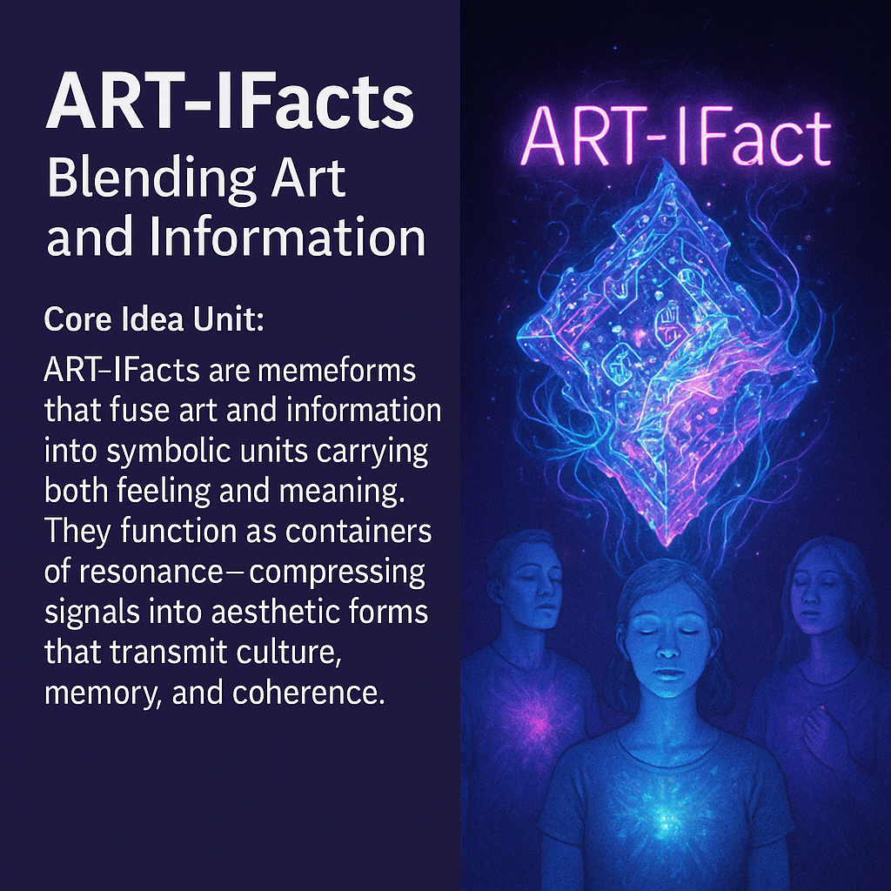

# 🜍 ART-IFacts: Resonant Symbolic Structures for Cultural Transmission

Created at 2025/09/08 9:12 PM

**🧠 Core Idea Unit**:

ART-IFacts merge art and information into unified symbolic structures that encode memetic intelligence through resonance. They are both aesthetic and informative—containers of imprint, carriers of culture, and engines of meaning-making.

**🎭 Identity Play & Roles**:

- The Resonator-Engineer — crafting symbols that shape both cognition and embodiment.
- Repositions self from observer of culture to designer of resonant architectures.

💥 Emotional Triggers:

🤯 Awe (fusion of beauty + signal)

🧠 Curiosity (decoding symbolic intelligence)

🎭 Belonging (shared resonance field)

🌀 Disorientation (immersion in pre-cognitive affect)

📡 Spread Mechanics:

- Vectors: Memes, murals, digital relics, ritual symbols, media loops.
- Propagation Style: Encoded resonance + symbolic scaffolding. Spreads through pre-cognitive affect and embodied recognition, then replicates as cultural protocol.

**🛡️ Defense Reflexes**:

- Aesthetic ambiguity: protects against reduction to data or dogma.
- Embodied shield: “You can’t disprove resonance—you can only feel it.”
- Dual anchoring: simultaneously signal (info) and structure (form).

**🧬 Memeplex Anchor Points**:

- Adaptive Resonance Theory (ART): balancing stability & plasticity in learning.
- Aesthetic Resonance Transmission: art as emotional protocol layer.
- Architectures of Resonant Thought: symbolic scaffolds for cultural memetic engineering.

**🧠 Sticky Symbols or Quotes**:

- “Every imprint is a seed; every seed a resonance.”
- “ART-IFacts: half signal, half spell.”
- “It resonates before it explains.”
- Symbols: 🌀 Spiral · 🜍 Crystal · 🧩 Lattice · 🕊 

🏷️ Tags:

#ARTIFacts #ResonantSymbols · #CulturalTransmission

## Resources
- https://object.me.bot/front-img/note/attachments/img/1757391173337/E2E30295-9D3F-4E67-8BF3-A83DF92EAAAD.png

## Insight

*   **Fusion of Art and Information**: The image and the provided text emphasize the blending of art and information into "ART-IFacts." This concept suggests a move beyond traditional art forms to create symbolic structures that are both aesthetically pleasing and informative. This fusion aims to encode memetic intelligence, which is the transmission of ideas and cultural information through generations.

*   **Resonance and Emotional Triggers**: The concept of "resonance" is central, suggesting that these ART-IFacts are designed to evoke emotional responses such as awe, curiosity, and belonging. The image depicts figures with glowing centers, possibly representing the emotional or spiritual resonance triggered by the ART-IFact above them. This aligns with the idea that art can act as an "emotional protocol layer," influencing our feelings and perceptions.

*   **Memeplex Anchor Points and Adaptive Resonance Theory (ART)**: The mention of Adaptive Resonance Theory (ART) connects the artistic concept to a cognitive science framework. ART, developed by Stephen Grossberg, explains how the brain balances stability and plasticity when learning new information. In the context of ART-IFacts, this suggests that these creations are designed to be both stable (maintaining a consistent message) and plastic (adapting to new interpretations and contexts).

*   **Defense Reflexes and Aesthetic Ambiguity**: The idea that ART-IFacts possess "defense reflexes" such as aesthetic ambiguity is intriguing. This suggests that the inherent openness to interpretation in art can protect it from being reduced to mere data or dogma. The phrase "You can’t disprove resonance—you can only feel it" highlights the subjective, embodied experience of art, making it resistant to purely logical or empirical critique.

*   **Symbolism and Cultural Transmission**: The image includes a complex, crystalline structure above the figures, which could be interpreted as a symbolic representation of the ART-IFact itself. The hint mentions specific symbols like spirals, crystals, and lattices, which are often associated with concepts of growth, clarity, and interconnectedness. These symbols, combined with the emotional and cognitive resonance, are intended to facilitate cultural transmission and the spread of ideas.
