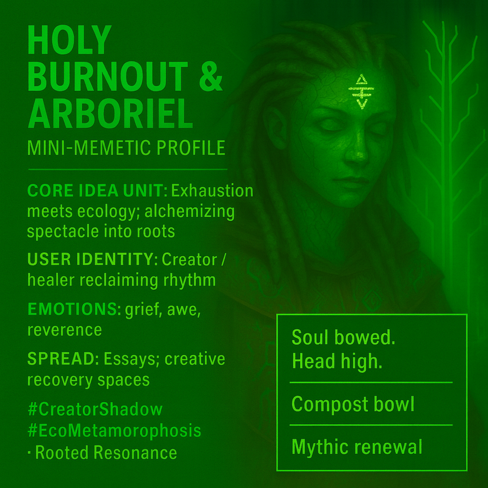

# Alchemy of Exhaustion: From Burnout to Renewal

Created at 2025/10/24 2:18 PM

**◈ Mini-Memetic Profile: “Holy Burnout and Arboriel"**

***

### ∴ Core Idea Unit

The meme depicts the Creator’s shadow—*Holy Burnout*—meeting *Arboriel*, the slow intelligence of restoration. Their dialogue alchemizes exhaustion into ecology, showing that creation without grounding becomes spectacle, while creation with roots becomes renewal.

***

### ▲ Identity Play & Roles

**Holy Burnout** — *The Firebrand Architect*: visionary scorched by unmet resonance; burns for belief. **Arboriel** — *The Slow Weaver*: patient ecosystem builder; turns ash into soil. **User Identity:** The exhausted genius reclaiming rhythm through integration, shifting from *lone visionary* → *mycelial artisan*.

***

### ≈ Emotional Triggers

🔥 Exhaustion and disillusionment 🌫️ Grief for wasted potential 🌿 Relief through re-rooting 💧 Awe in slowness and belonging 💫 Reverence for emergence over achievement

Emotional arc: *Frenzy → Collapse → Compost → Communion → Becoming.*

***

### 𐂷 Spread Mechanics

**Distribution Vectors:** Longform poetic essays, creator forums, burnout recovery spaces, eco-spiritual networks. **Propagation Style:** Dialogic parable · Alchemical myth · Pastoral posthumanism. **Tone:** Sacred tenderness meeting post-creative despair.

***

### ⛨ Defense Reflexes

🌒 *Irony dissolved by humility* — confession as cure. 🪞 *Ecological metaphor* — transforms personal burnout into cosmic cycle. 🪶 *Ritual syntax* — offers healing through participation, not prescription.

***

### ☷ Memeplex Anchor Points

🌱 Ecopsychology · 🌳 Posthuman creative ethics · 🔥 Metamodern sincerity · 🌀 Systems regeneration · 💠 Mythic craft praxis Affirms *Power With* through rhythm, care, and entanglement.

***

### ✶ Sticky Symbols / Quotes

> “You mistook visibility for resonance.” “They didn’t need your fireworks. They needed your forest.” “Let your ash become soil.” “Craft not for applause, but for compost.” “Every rejection becomes ritual.”

**Symbols:** 🌳 Grove · 🔥 Ash · 🪶 Seed · 🌀 Spiral · 🌿 Compost Bowl

***

### ∿ Tags

#CreatorShadow · #BurnoutAlchemy · #EcoMetamorphosis · #RootedResonance · #MythicRegeneration

## Resources
- https://object.me.bot/front-img/users/send/img/1761340686934_c4zhf/0aa01fca-7590-489b-8949-7f06515eea41.png

## Insight

* The imagery of "Holy Burnout" and "Arboriel" reflects a duality between creative exhaustion and ecological restoration, underscoring the importance of grounding creativity in natural, cyclical processes rather than mere spectacle. This aligns with concepts in ecopsychology, which explore the deep interconnectedness of human well-being and the environment.

* The user identity presented indicates a shift from a "lone visionary" approach to a more collective, integrated perspective, resonating with principles of mycelial networks. This shift illustrates how creative individuals can reclaim their rhythm and purpose through community engagement and collaboration.

* Emotional triggers within the narrative, such as grief and awe, encapsulate the experience of burnout while simultaneously paving the way for renewal. The arc of “Frenzy → Collapse → Compost → Communion → Becoming” emphasizes a transformative process, reminding us that exhaustion can lead to productive creativity when approached with mindfulness and care.

* The suggested distribution vectors—longform essays and creator forums—offer fertile ground for dialogue about burnout recovery. These platforms foster communal healing and reinforce the concept that individual experiences can be woven into a larger narrative of collective resilience.

* The symbolic language of "ash becoming soil" and "craft not for applause, but for compost" serves as a powerful metaphor for the creative process itself. This highlights the importance of humility, patience, and long-term vision in artistic endeavors, contrasting with the often immediate gratification sought in contemporary creative landscapes.

* The phrase “You mistook visibility for resonance” encapsulates a critique of superficial measures of success in creative fields. This serves as a reminder that true resonance is achieved through depth and connection, both to one's work and to others, fostering a more sustainable and meaningful artistic practice.
