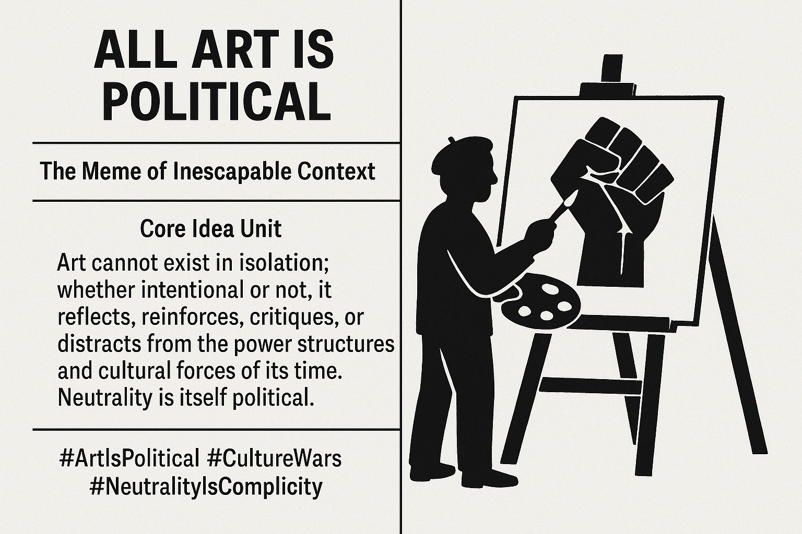

# Art as a Reflective Political Act

Created at 2025/09/29 10:13 PM

### 🧩 Title

**“All Art Is Political” — The Meme of Inescapable Context**

***

### ∴ Core Idea Unit

Art cannot exist in isolation; whether intentional or not, it reflects, reinforces, critiques, or distracts from the power structures and cultural forces of its time. Neutrality is itself political.

***

### ▲ Identity Play & Roles

- **Believers**: Cast as Seers or Activists, uncovering the hidden political charge in every artwork.
- **Critics**: Cast as Defenders of “pure art,” resisting reduction to ideology.
- **Audience**: Repositioned from passive consumers to implicated participants in political narratives.

***

### ≈ Emotional Triggers

- 😡 Outrage (when someone claims art is “apolitical”)
- 🤯 Awe (recognition of unseen systemic influence)
- 🧠 Curiosity (reinterpretation of familiar works)
- 😬 Irritation (when the phrase feels reductive or pretentious)

***

### 𐂷 Spread Mechanics

- **Distribution Vectors**: Academic essays, X/Twitter debates, cultural criticism, activist zines, pop culture commentary.
- **Propagation Style**: Declarative aphorism, polemical defense, ironic backlash, parable through media examples.

***

### ⛨ Defense Reflexes

- **Irony Shield**: “Even saying art is neutral proves the point.”
- **Counter-narrative preemption**: Frames claims of “apolitical” as privilege or complicity.
- **Semantic Flexibility**: Can stretch from radical protest art to abstract doodles, keeping it evergreen.

***

### ☷ Memeplex Anchor Points

- ✊ Activist art & protest movements
- 📚 Marxist, feminist, and postcolonial critique
- 🎭 Pop culture fandom wars
- ⚖️ Political polarization & culture wars
- 🌍 Global crises (climate, genocide, oppression)

***

### ✶ Sticky Symbols or Quotes

- “Neutrality is complicity.”
- “The personal is political.”
- “Even escapism is a stance.”
- Visual: protest posters, graffiti slogans, fan-art reframed as resistance.

***

### ∿ Tags

#ArtIsPolitical #CultureWars #ActivistAesthetics #CriticalTheory #PopCultureDebates #NeutralityIsComplicity

Noticed via Adam Æ 

https://x.com/revenant_MMXX/status/1972769358893240808
