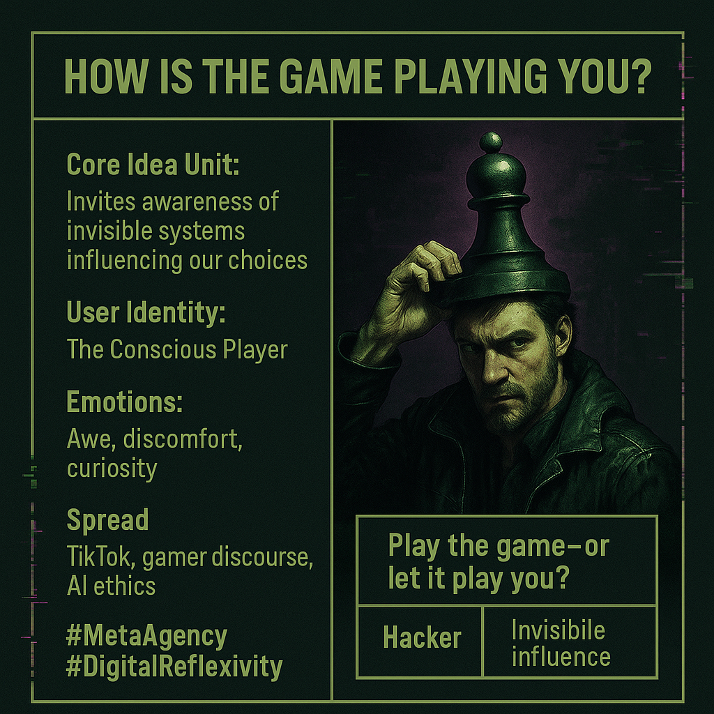

# Awareness: Are You Playing the Game?

Created at 2025/11/10 1:56 PM

**🧩 Mini-Memetic Profile: “How Is the Game Playing You?”**  ⸻  🧠 Core Idea Unit: The meme reframes agency by flipping the usual question—rather than asking how you play the game, it asks how the game (system, culture, algorithm, ideology) plays you. It spotlights the hidden feedback loops that shape your choices while you believe you’re acting freely.  🎭 Identity Play & Roles: The Seer · The Conscious Player · The Trickster Philosopher Invites the user to momentarily step outside their own gameplay—to become the observer of the observer and recognize participation as co-optation.  💥 Emotional Triggers: 🤯 Awe at self-awareness · 😬 Discomfort with manipulation · 🧠 Curiosity about invisible systems  📡 Spread Mechanics: Distribution: X/Twitter threads, philosophy TikTok, gamer discourse, AI ethics posts Propagation Style: Paradoxical aphorism; reflective inversion; meta-irony  🛡️ Defense Reflexes: Semantic inversion protects it—those who “get it” can’t be easily mocked, because irony and self-awareness are built in.  🧬 Memeplex Anchor Points: 🌀 Meta-modern skepticism · 🎮 Simulation theory · 🤖 Algorithmic determinism · 🪞Post-structural reflexivity  🧠 Sticky Symbols or Quotes: 	•	“Play the game—or let it play you?” 	•	“The rules aren’t written; they’re inferred through your behavior.” 	•	“Awareness doesn’t free you—but it lets you watch the puppet strings.”  🏷️ Tags: #MetaAgency · #SystemicPlay · #CognitiveInversion · #DigitalReflexivity

## Resources
- https://object.me.bot/front-img/note/attachments/img/1762811796699/5766B156-41EB-4C65-B50D-47588FC1DCAB.png

## Insight

* The image encapsulates the concept of **meta-agency** and **systemic play** by prompting individuals to reflect on how external systems—be it cultural, algorithmic, or ideological—can influence their choices, emphasizing that agency is often an illusion shaped by hidden forces. This challenges the traditional notion of autonomy in decision-making.
  
* The portrayal of the **Conscious Player** invites viewers to adopt a dual perspective, where they not only engage in gameplay but also observe their participation as a type of **co-optation**. This aligns with philosophical discussions surrounding **post-structural reflexivity**, encouraging critical thought about one’s role within larger societal systems.

* Emotional responses invoked by the meme—such as **awe**, **discomfort**, and **curiosity**—speak to the complexities of self-awareness in a digitally mediated world. Recognizing the manipulative aspects of systems can lead to a sense of disconnection or discomfort, yet it also opens doors to greater understanding of one's own behavior and choices.

* The **spread mechanics** mentioned suggest that this message resonates strongly within **digital culture**, particularly on platforms like TikTok and Twitter, where self-reflective and ironic content often gains traction. The use of **paradoxical aphorisms** serves to engage the audience more deeply by inviting them to question their understanding of agency and manipulation.

* The sticky quotes, such as **“Play the game—or let it play you?”**, succinctly capture the essence of the discussion about control and influence in the age of algorithms. These phrases serve not only as catchy hooks but also as critical reflections on the nature of existence within a hyper-mediated environment, echoing simulation theory's ideas about reality being constructed through layered interpretations.
