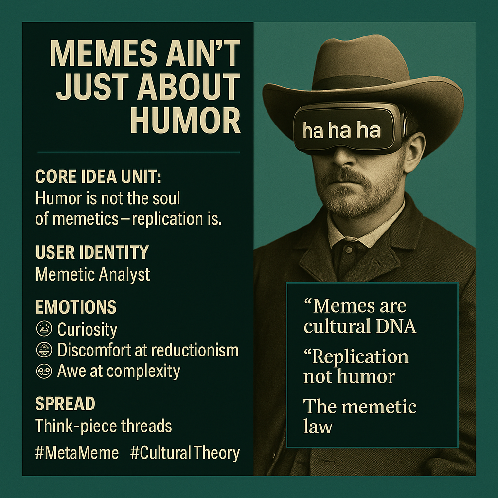

# Memetics: Beyond Humor to Cultural Replication

Created at 2025/11/10 1:09 PM

**◈ Mini-Memetic Profile: “Memes Ain’t Just About Humor**”  [MC note on Substack](https://substack.com/@memeticcowboy/note/c-175800172)  ∴ Core Idea Unit: Humor is not the soul of memetics—replication is. The meme’s essence lies in cultural transmission, not comedy. Laughter is only one carrier wave among activism, ideology, harm, and reflection.  ▲ Identity Play & Roles: The Memetic Analyst or Cultural Cartographer—one who sees beyond the punchline to trace the real social circuitry of meaning. This role repositions the self from consumer of humor to observer of propagation.  ≈ Emotional Triggers: 🧠 Curiosity · 😬 Discomfort at reductionism · 🤯 Awe at complexity · 😡 Irritation at misunderstanding  𐂷 Spread Mechanics: Distribution Vectors: Think-piece threads, academic TikToks, digital-culture subreddits, memetic studies posts. Propagation Style: Pedagogical satire, infographic parables, “meta-memes” that explain memes themselves.  ⛨ Defense Reflexes: Irony shields (“yeah, it’s still kinda funny though”), definitional rigor, citation armor (Shifman, McNutt, etc.).  ☷ Memeplex Anchor Points: 📚 Media studies · 💻 Digital culture theory · ⚙️ Cultural evolution · 🧠 Metamodern analysis of irony and sincerity.  ✶ Sticky Symbols or Quotes: 	•	“Memes are cultural DNA.” 	•	“Laughter is a side effect, not a source code.” 	•	“Replication, not humor, is the memetic law.” 	•	“The feed is a laboratory, not a comedy club.”  ∿ Tags: #MetaMeme · #CulturalEvolution · #DigitalEcology · #BeyondHumor · #SeriousMemes · #InfoTransmission · #MemeticStudies · #PatternOverPunchline

## Resources
- https://object.me.bot/front-img/note/attachments/img/1762808968236/09ABBBAD-E23E-4089-A5D1-81F288FB73B6.png

## Insight

* The image encapsulates a profound shift in understanding memetics, emphasizing that the essence of memes lies in replication rather than solely providing humor. This idea aligns with Richard Dawkins’ original concept of memes as units of cultural transmission, suggesting that their true power rests in how they propagate across societies, transforming cultural narratives rather than merely eliciting laughter.  

* The figure’s portrayal as a “Memetic Analyst” highlights a critical identity within this framework—transitioning from passive consumers of humor to active observers of cultural dynamics. This role facilitates a more nuanced exploration of how memes influence social behavior and ideology, resonating with the themes of cultural evolution and societal impact.  

* Emotional responses listed, such as curiosity and awe, underscore the complexity involved in analyzing memes. The discomfort at reductionism signals a need for deeper engagement with the layers of meaning and interaction shaped by digital culture, reinforcing the notion that memes can be serious tools for reflection and critique.  

* The mention of propagation styles, such as pedagogical satire and infographic parables, suggests creative methods for disseminating complex ideas about memes. These approaches encourage an analytical engagement that extends beyond mere entertainment, inviting audiences to explore the implications of memes in contemporary discourse.  

* Quotes highlighted in the image, such as “Memes are cultural DNA” and “The feed is a laboratory, not a comedy club,” encapsulate the duality of memes in both biological and digital contexts. This perspective aligns them with broader discussions in media studies and digital culture theory, advocating for a reevaluation of our engagement with memes as pivotal elements in cultural exchanges and not merely as sources of amusement.
