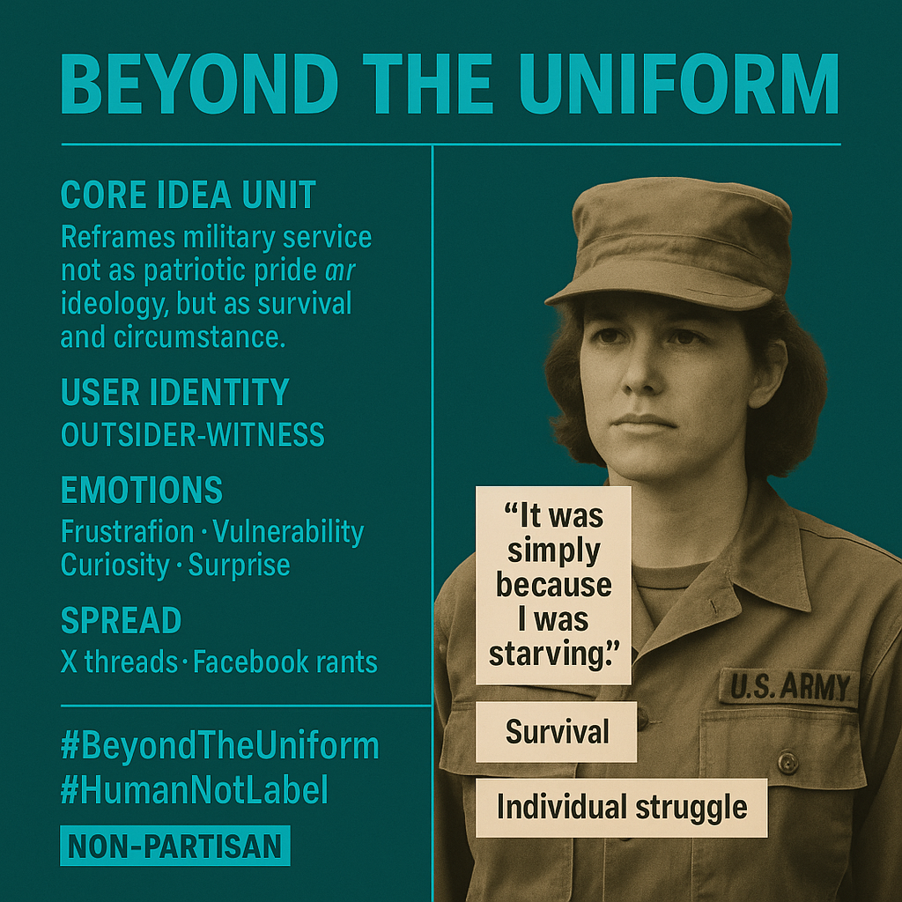

# Beyond Uniforms: Veteran Narratives of Survival

Created at 2025/09/03 3:54 PM

### 🧩 Title**: “Beyond the Uniform”**

**[For Jennifer](https://substack.com/@ginlea/note/c-151824154?utm_source=notes-share-action&r=5a5yhr)**

***

### 🧠 Core Idea Unit

The meme challenges snap-judgments about veterans by reframing military service not as patriotic pride or ideology, but as survival and circumstance. It calls for curiosity over assumption, highlighting the hidden complexity behind identity labels.

***

### 🎭 Identity Play & Roles

- **Cast as:** Outsider-Witness · Survivor · Truth-Seeker
- Repositions the veteran not as a symbol of nationalism but as a human navigating necessity.
- Deflates the “military = ideology” frame by foregrounding individual struggle and personal choice.

***

### 💥 Emotional Triggers

- 😡 Frustration (at being judged by a single label)
- 😢 Vulnerability (sharing hunger, survival, prison avoidance)
- 🧠 Curiosity (invitation to “ask why”)
- 🤯 Surprise (veterans are politically diverse, not monolithic)

***

### 📡 Spread Mechanics

- **Distribution Vectors:** X threads, Facebook rants, Reddit veteran forums, Substack reflections.
- **Propagation Style:** Testimonial authenticity + contrarian reversal. “I didn’t join for pride, I joined because I was starving.”

***

### 🛡️ Defense Reflexes

- **Irony shield:** Refusal to identify with blue/red/libertarian binaries.
- **Counter-narrative preemption:** Acknowledges conspiracy vs. optics vs. truth debates, but sidesteps them by grounding in lived reality.
- **Moral framing:** “Everything that divides does not serve humanity.”

***

### 🧬 Memeplex Anchor Points

- ✝️ Personal truth vs. institutional optics
- ⚙️ Critique of ideological reductionism
- 🪖 Veteran narratives outside patriotism
- 🌍 Humanist universalism (“for the greater good of all”)

***

### 🧠 Sticky Symbols or Quotes

- “It was, simply because I was starving.”
- “To stay out of prison.”
- “The opportunity to find out the Truth.”
- “Everything that divides does not serve humanity.”

***

### 🏷️ Tags

#BeyondTheUniform · #VeteranVoices · #HumanNotLabel · #DivisionKills

## Resources
- https://object.me.bot/front-img/users/send/img/1756939980647_c4zhf/08eb1f8a-44a0-4ef0-8923-45b820b819ec.png

## Insight

*  The image and its accompanying hint emphasize the idea that military service is often driven by necessity rather than pure patriotism or ideological conviction. This perspective challenges the common narrative that all veterans are motivated solely by love of country or a desire to defend certain political ideals. The quote, "It was simply because I was starving," poignantly illustrates how basic survival needs can be a primary factor in the decision to join the military for some individuals.

*  The concept of "outsider-witness" suggests a critical examination of the veteran experience, moving beyond surface-level assumptions to understand the complex realities faced by service members. This aligns with the broader theme of challenging stereotypes and recognizing the diversity of motivations and experiences within the military community. The emotional triggers listed—frustration, vulnerability, curiosity, and surprise—highlight the range of feelings that can arise when engaging with these nuanced perspectives.

*  The mention of "X threads, Facebook rants" as distribution vectors indicates the use of social media to disseminate alternative narratives about military service. This reflects a growing trend of individuals using online platforms to share personal stories and challenge dominant narratives, particularly in areas where traditional media may present a more limited or biased view. The hashtags #BeyondTheUniform and #HumanNotLabel further underscore the effort to promote a more humanistic and less stereotypical understanding of veterans.

*  The phrase "Everything that divides does not serve humanity" suggests a broader philosophical underpinning to the meme, advocating for unity and understanding across different groups and ideologies. This aligns with the idea of moving beyond partisan divides and recognizing the shared humanity of all individuals, regardless of their background or beliefs. The meme's self-proclaimed "non-partisan" stance reinforces this message of inclusivity and bridge-building.

*  The image includes the text "U.S. Army" on the uniform, grounding the message in a specific national context while simultaneously aiming for a universal appeal. This juxtaposition highlights the tension between the particular experiences of American veterans and the broader human themes of survival, struggle, and the search for truth. The image, therefore, invites viewers to consider the individual stories behind the uniform and to question the assumptions they may hold about military service.
