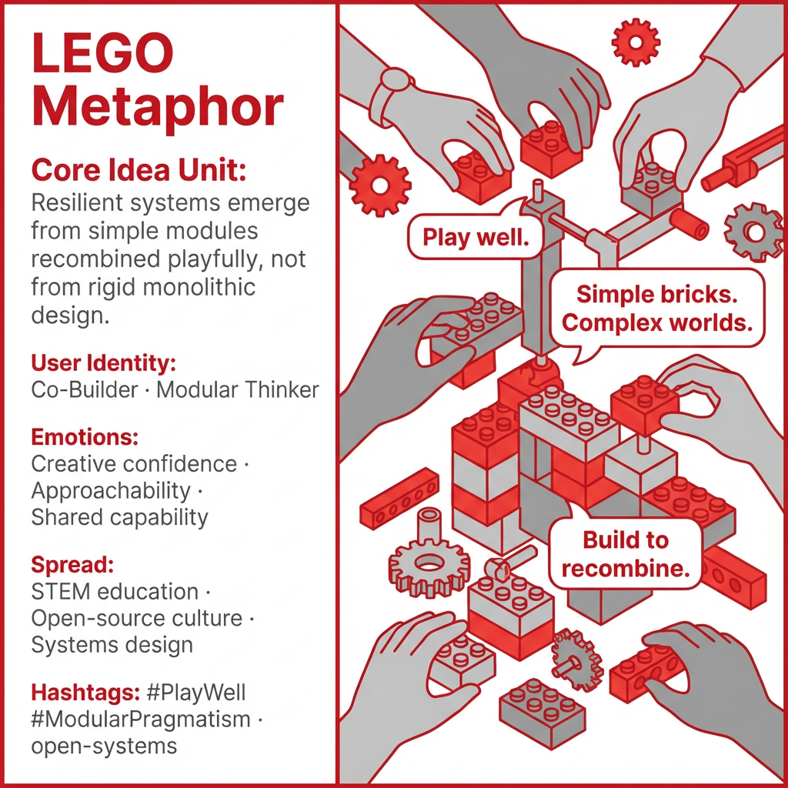

# Embracing Playful Modular Design Mindsets

Created at 2025/12/28 8:42 PM

## **LEGO Metaphor**

*(Modular Playful Pragmatism)*

### 🧠 Core Idea Unit

Resilient complexity emerges from simple modules recombined playfully, not from monolithic design.

**Mental shift provoked:** From *“design it right once”* → *“build systems that invite recombination.”*

### 🎭 Identity Play & Roles

**Cast as:** Co-Builder / Modular Thinker The user is positioned as a participant, not a master architect.

**System repositioning:** Authority shifts from top-down control to participatory assembly.

### 💥 Emotional Triggers

- Approachability
- Creative confidence
- Shared competence

Primary affect: **playful capability**

### 📡 Spread Mechanics

- **Vectors:** STEM education, product metaphors, open-source culture
- **Style:** analogy-driven, optimistic, accessible

### 🛡️ Defense Reflexes

- Counters “too simplistic” critique by scaling upward
- Deflects rigidity by emphasizing recombination

### 🧬 Memeplex Anchor Points

Open systems · Modular design · Participatory innovation

### 🧠 Sticky Symbols / Phrases

- “Play well.”
- “Simple bricks, complex worlds.”
- “Modular pragmatism.”

[HUBRIS: A Memetic Reversal of Icarus in the Age of Artificial Intelligence](https://memeticcowboy.substack.com/p/hubris-a-memetic-reversal-of-icarus)

## Resources
- https://object.me.bot/front-img/users/send/img/1766983368170_c4zhf/618bbc82-ea19-45bb-8fdb-6e194577bd20_%281%29.png

## Insight

* The image effectively illustrates the concept of modular design through the lens of LEGO, emphasizing that complex systems arise from simple, interchangeable modules. This reflects a shift from static, rigid structures to dynamic configurations, underscoring how resilience and adaptability are generated through playful recombination. 

* The identities presented—Co-Builder and Modular Thinker—highlight a participatory approach to creation, positioning users as active collaborators rather than mere consumers or architects. This fosters a sense of community and shared ownership of projects, which is increasingly vital in today’s collaborative environments.

* Emotions such as creative confidence and approachability are tapped into, suggesting that environments built on modularity invite experimentation and innovation. This aligns with contemporary educational frameworks, particularly in STEM fields, which advocate for hands-on learning and discovery as pathways to comprehension.

* The emphasis on “spread mechanics” and the notion of vectors highlights the integral role of open-source culture and systems design in today’s innovation landscape. This encourages the sharing of ideas and resources, making technology and concepts accessible to a broader audience, which can be seen in many initiatives aimed at democratizing knowledge.

* The defensive strategies outlined—countering critiques of simplicity and emphasizing versatility—are critical in navigating the complexities of innovation. By positively framing modular systems as scalable and adaptable, proponents can address concerns regarding the practicality and efficacy of such frameworks. 

* Memes and sticky phrases like “Play well” and “Simple bricks, complex worlds” capture the essence of the LEGO metaphor, making it easier to communicate these complex ideas in an engaging and approachable manner. Such language can resonate deeply, fostering a culture that values creativity and collaboration.
