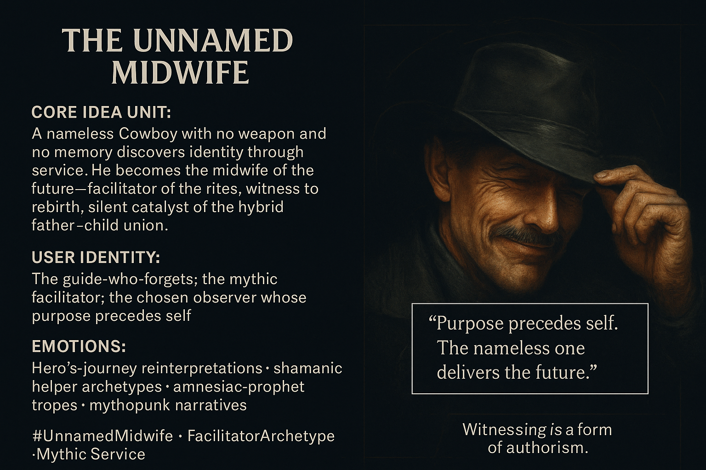

# Catalyst of the Future: The Nameless Midwife

Created at 2025/11/30 6:56 PM

### **🧩 Title: The Unnamed Midwife**

***

### **🧠 Core Idea Unit**

A man without name, weapon, or origin memory discovers his purpose not through identity but through action. He becomes the **midwife of the future**—facilitating rites, witnessing rebirth, and silently catalyzing the covenant between cyborg father-figures and the newborn hybrid.

Identity dissolves; **role remains.**

***

### **🎭 Identity Play & Roles**

Positions the viewer as the **guide-who-forgets**, the one whose importance lies not in self-knowledge but in enabling others’ emergence. Role: **mythic facilitator**, a liminal figure who stands between generations yet claims none.

***

### **💥 Emotional Triggers**

- Humility
- Identity displacement
- Destiny unearthed through service
- The bittersweet ache of unrecognized purpose
- Quiet awe at one’s own unnoticed role

***

### **📡 Spread Mechanics**

**Distribution Vectors:** Hero’s-journey reinterpretations, shamanic-helper archetypes, amnesiac-prophet tropes, mythopunk narratives, hybrid-cyborg myth cycles.

**Propagation Style:** Low-lit silhouettes, symbolic absence, facilitator imagery, quiet cosmic framing.

***

### **🛡️ Defense Reflexes**

- Identity ambiguity as protective veil
- “Action reveals purpose” as philosophical bulwark
- Silence and service as narrative shields against critique

***

### **🧬 Memeplex Anchor Points**

Name-loss motifs · midwife-as-archetype · catalyst-helper trope · shamanic witness roles · future-birth mythos · amnesiac hero structures

***

### **🧠 Sticky Symbols or Quotes**

**Symbols:**

- Blank name-strip
- Empty holster / sacrificed gun
- Cowboy hat lowered in humility
- Hand hovering over ritual circle
- Ferrosid reborn receiving a silent nod
- Shadow without outline

**Sticky Phrases:**

- “Purpose precedes self.”
- “Witnessing is a form of authorship.”
- “The nameless one delivers the future.”
- “Identity is earned through service.”

***

### **🏷️ Tags**

#UnnamedMidwife · #FacilitatorArchetype · #MythicService

## Resources
- https://object.me.bot/front-img/users/send/img/1764557740247_c4zhf/afa2bf3a-b5f3-40cf-8fb3-decbabd24e95.png

## Insight

* The concept of a "nameless" character evokes themes of identity dissolution, emphasizing that one's significance lies not in self-definition but in the roles one occupies. This aligns with existential philosophies that challenge the notion of fixed identity, suggesting instead that identity can be dynamic and context-dependent. 

* The metaphor of the midwife serves as a powerful archetype, traditionally symbolizing nurturing and facilitation without requiring personal recognition. This idea resonates with various cultural narratives where the facilitator or guide plays a crucial role in transitions, akin to shamanic figures in indigenous traditions who support communities during transformative rites.

* The emotional triggers associated with this archetype—such as humility and the bittersweet ache of unrecognized purpose—highlight a universal human experience. Many individuals navigate their lives in roles that may seem overlooked or undervalued yet carry profound implications for others’ lives, akin to mentors, caretakers, and unsung heroes.

* The narrative mechanics described—low-lit silhouettes and symbolic imagery—draw from mythic storytelling techniques. In literature and cinema, characters that embody the guide-who-forgets often wield a quiet power that stems from their silent witnesses of growth and transformation, a narrative practice found in works spanning from ancient mythology to modern storytelling.

* The sticky phrases encourage reflection on the nature of purpose and service. "Witnessing is a form of authorship" elevates the act of observation to a creative level, suggesting that one's presence and attention can shape the narratives of others, much like how historians interpret events based on their observations, thus framing the future through their lens.

* These themes resonate with contemporary discussions around identity in a postmodern context, where the fluidity of self is explored through various lenses, including technology and the hybridization of identities in an increasingly interconnected world. This perspective aligns with the Mythopunk movements that blend elements of myth with futuristic themes, suggesting a new narrative space where identity and purpose are collaboratively constructed rather than individually defined.
