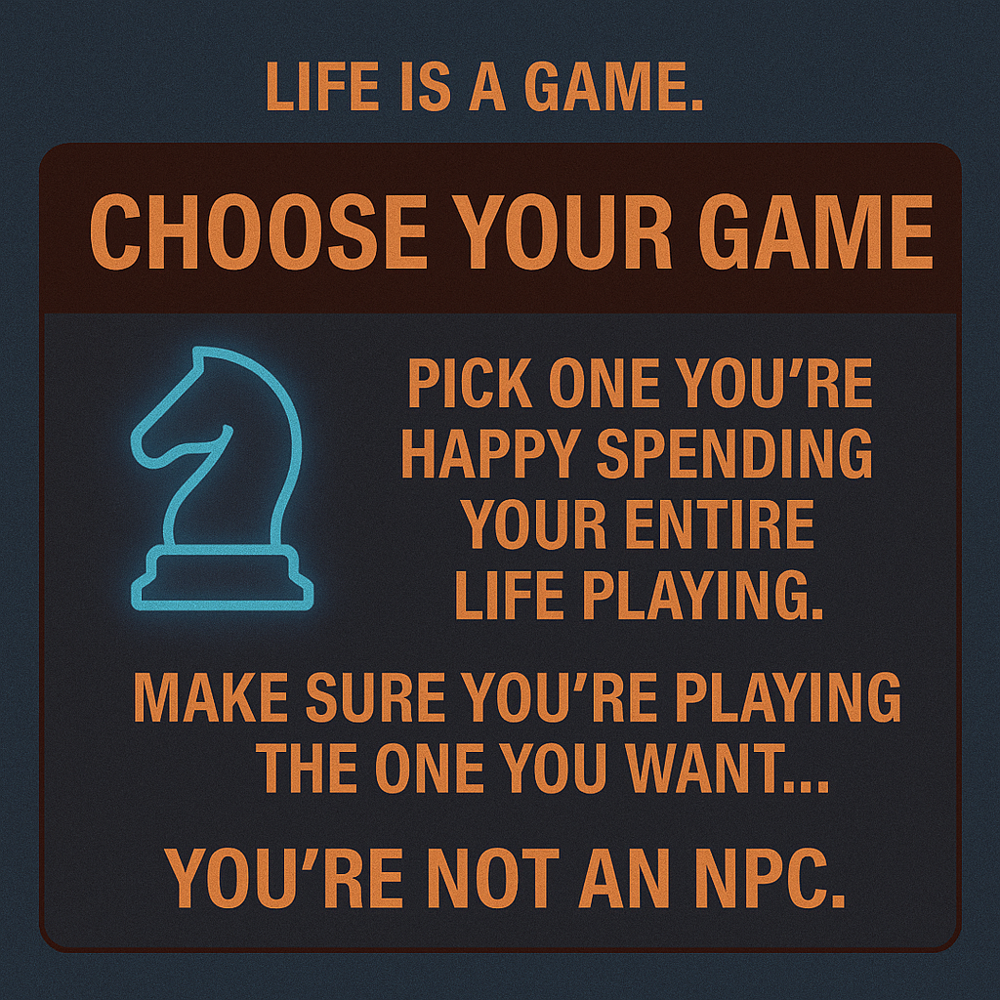

# Choose Your Game: Craft Your Narrative

Created at 2025/10/29 10:52 AM

### ◈ Mini-Memetic Profile
***
### ∴ Core Idea Unit
You’re already playing a game — the only question is *whose*.Freedom begins when you select the rule-set yourself.The meme encodes self-authorship as salvation: choose your narrative, or remain an NPC in someone else’s questline.
***
### ▲ Identity Play & Roles
- **Performer:** The Conscious Player / Narrative Designer
- **Shadow Role:** The Scripted Worker / Accidental NPC
- **Repositioning:** From rule-follower → to world-builder; from “life happening to me” → “I design the arena.”
***
### ≈ Emotional Triggers
🌈 Autonomy & Creative Freedom😬 Fear of Regret / Wasted Life🔥 Rebellion against conformity🌀 Existential curiosity disguised as career advice
***
### 𐂷 Spread Mechanics
**Distribution Vectors:** TikTok life-coach rants · Instagram carousels · Reddit r/selfimprovement · X motivational threads.**Propagation Style:** Calm-rebellious tone · Gamified self-help · Aesthetic minimalism · Second-person imperative (“Choose wisely”).
***
### ⛨ Defense Reflexes
Irony shield (“it’s just metaphor”), moral inversion (“choosing = responsibility”), and anti-institutional framing that reframes critique as control.
***
### ☷ Memeplex Anchor Points
🎨 Lifestyle Design / Solopreneur culture🧩 Existential Individualism💻 Post-work digital nomadism📚 Self-authorship as moral duty
***
### ✶ Sticky Symbols or Quotes
- “Choose your game before someone loads you into theirs.”
- “Pick one you’re happy spending your life playing.”
- “Make sure you’re playing the one you want.”
- “You’re not an NPC.”
***
### ∿ Tags
#LifeIsAGame · #ChooseYourGame · #SelfDesign · #NarrativeFreedom · #NPCTheory · #AutonomyLoop
