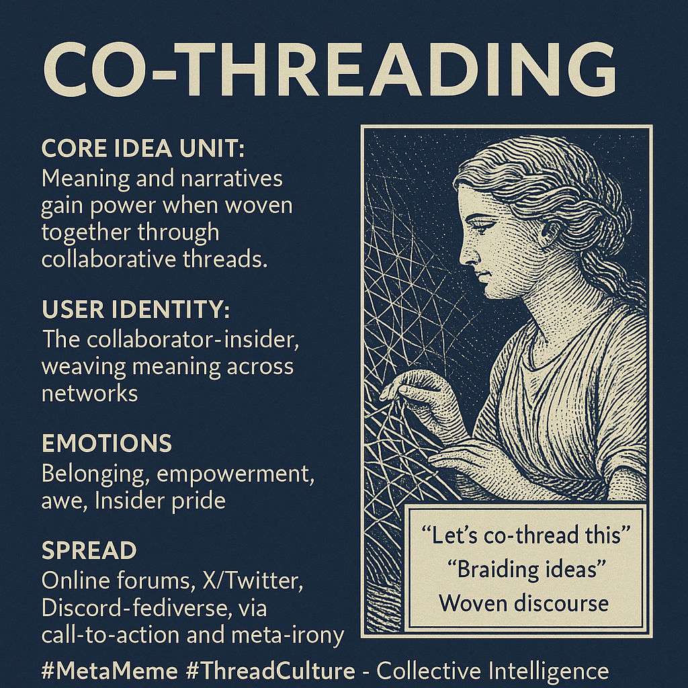

# Co-Threading: Weaving Meaning Across Networks

Created at 2025/08/15 9:46 PM

### ◈ Mini-Memetic Profile

Title:

Co-Threading: The Meme of Collective Weaving

### ∴ Core Idea Unit

- The essential belief is that meaning, narratives, or discussions gain power when “threaded” together — multiple voices weaving a larger tapestry rather than isolated statements.
- Encodes a frame of networked agency where individuals are not singular posters but co-weavers of ongoing cultural fabric.

### ▲ Identity Play & Roles

- Positions the user as a collaborator-insider: part of an emergent group intelligence.
- Also hints at creative rebel status against fragmented or siloed discourse (anti-silo, anti-monologue).
- Grants an aura of being a meta-navigator — someone who “knows how to weave” meaning across fragmented platforms.

### ≈ Emotional Triggers

- Belonging & Connection (being part of something larger).
- Empowerment (my thread contributes to a greater weave).
- Awe/Complexity (marveling at interwoven ideas).
- Mild insider pride (knowing the “co-threading” code or practice).

### 𐂷 Spread Mechanics

- Distribution vectors: Natively online (forums, X/Twitter, Discord, fediverse, collaborative docs).
- Propagation style:
    - Call-to-action (“let’s co-thread this”)
    - Meta-irony (“this is peak co-threading rn”)
    - Demonstrative practice (long, interlinked posts)
    - Semi-formalized ritual (“threading together across voices”).
- 

### ⛨ Defense Reflexes

- Irony shield: Presented as playful jargon, avoiding over-serious critique.
- Process framing: If questioned, defenders can say it’s “just a method” rather than an ideology.
- Network validation: Criticism is absorbed by showing multiple “threads” of value in parallel.

### ☷ Memeplex Anchor Points

- Post-network discourse culture (fediverse, Web3, rhizomatic thought).
- Decentralized collaboration memes (“swarm intelligence,” “hivemind,” “co-creation”).
- Postmodern narrative assemblage (Deleuzean rhizome, meme-weaving).
- Digital rituals of belonging (hashtags, collabs, chain posts).

### ✶ Sticky Symbols or Quotes

- Words like “threads,” “weave,” “tapestry,” “entanglement,” “braid,” used metaphorically.
- Visuals of interwoven fabric, knots, or lattices.
- Phrases like “Let’s co-thread this,” “braiding ideas,” or “woven discourse.”

### ∿ Tags

#MetaMeme #ThreadCulture #CollectiveIntelligence #MemeWeaving #InsiderLexicon #DigitalRitual
