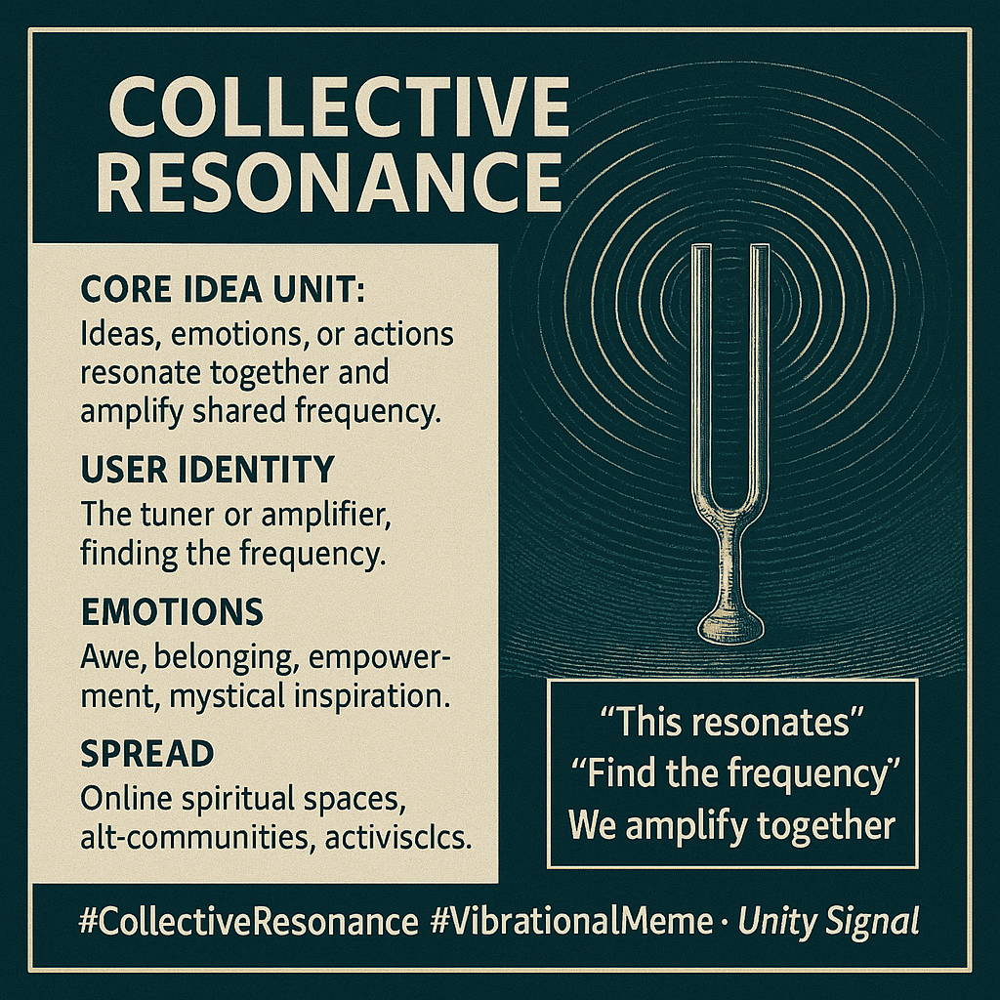

# Collective Resonance: Finding the Shared Frequency

Created at 2025/08/15 9:57 PM

### ◈ Mini-Memetic Profile

Title:

Collective Resonance: The Meme of Harmonic Synchrony

### ∴ Core Idea Unit

- The belief that groups can achieve alignment and power when their ideas, emotions, or actions “resonate” with one another, amplifying shared frequency.
- Encodes a frame of vibrational coherence where meaning is not just shared but harmonized.

### ▲ Identity Play & Roles

- Positions the user as a tuner or amplifier — someone who helps others “find the frequency.”
- Casts the group as a choir or instrument, not isolated individuals.
- Sometimes implies visionary/initiated insider who perceives the hidden resonances.

### ≈ Emotional Triggers

- Awe & wonder (the feeling of synchronicity).
- Belonging & unity (being “in resonance” with others).
- Empowerment (the collective is stronger when harmonized).
- Mystical inspiration (quasi-spiritual overtones of vibration/frequency).

### 𐂷 Spread Mechanics

- Distribution vectors: Online spiritual/ideological spaces, alt-communities, activist circles, meme-forums.
- Propagation style:
    - Direct call to alignment (“resonate with this”)
    - Inspirational aphorism (“we rise in resonance”)
    - Symbolic imagery (vibrations, waves, concentric circles).
    - Satirical/ironic echo in meta-meme contexts.

### ⛨ Defense Reflexes

- Mystification shield: Criticism deflected as “not on the right frequency.”
- Holistic framing: Reduces critique by reframing dissent as “disharmony.”
- Identity lock-in: To leave resonance is to fall into dissonance or outsider status.

### ☷ Memeplex Anchor Points

- New Age spirituality & frequency memes (#Vibrations, #EnergyWork).
- Collective consciousness / swarm intelligence.
- Activist solidarity memes (“stronger together,” “rise as one”).
- Systems theory & complexity culture (emergence, synchronization).

### ✶ Sticky Symbols or Quotes

- “This resonates”
- “Find the frequency”
- “We amplify together”
- Visuals: concentric rings, soundwaves, tuning forks, rippling water.

### ∿ Tags

#CollectiveResonance #VibrationalMeme #UnitySignal #MetaMeme #SwarmConsciousness
