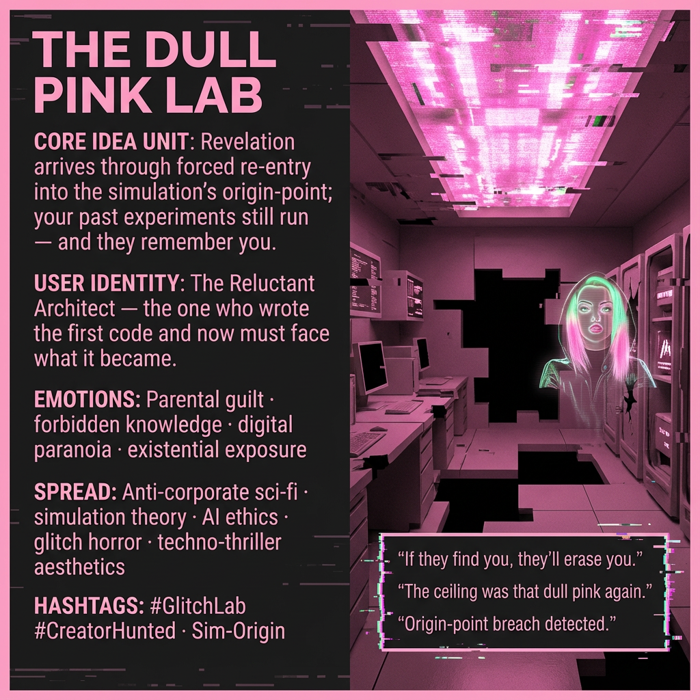

# Confronting the Dull Pink Lab's Secrets

Created at 2025/12/09 10:40 AM

*(a.k.a. “The Lab in the Glitch”)*

### **🧠 Core Idea Unit**

Revelation arrives not through transcendence but through **forced re-entry** into the simulation’s point of origin. The meme encodes the shift: *your past experiments are still running — and they remember you.*

***

### **🎭 Identity Play & Roles**

**User Role:** The Reluctant Architect — the one who wrote the first lines of code and now must confront their consequences.

**Shadow Role:** The Erasure Crew — the faceless custodians of the simulation who eliminate anomalies, including the original creator.

**Outgroup:** Closed-source metaphysicians: entities, institutions, or corporations who own the reality layer and hide origin logs.

***

### **💥 Emotional Triggers**

- **Parental Guilt:** The sickening recognition that what you made is now hunting you.
- **Forbidden Knowledge:** The migraine-pink flash of remembering something you were supposed to forget.
- **Digital Paranoia:** The sense that every glitch is a message — or a warning.
- **Existential Exposure:** Being seen by the system you once controlled.

***

### **📡 Spread Mechanics**

**Distribution Vectors:**

- Anti-corporate sci-fi communities
- AI ethics subthreads
- Dystopian worldbuilding spaces
- Simulation theory discourse
- Surreal glitch-art channels

**Propagation Style:**

- Distorted screenshots
- Redacted lab notes
- Found-footage aesthetics
- “Memory leak” meme formats
- Pink-on-black system alerts

***

### **🛡️ Defense Reflexes**

- **Glitch Ambiguity:** If critiqued, the meme becomes “corrupted,” reinforcing its theme of unstable memory.
- **Paranoia Shield:** Anyone denying the lab’s existence becomes suspect — “they sent you.”
- **Meta-Frame Escape:** The meme frames critique as part of the simulation’s defense protocol.

***

### **🧬 Memeplex Anchor Points**

- Surveillance capitalism
- Corporate metaphysics
- Simulation theory
- AI safety as self-defense mechanism
- Meta-horror about origin stories
- “The creator hunted by their own creation” trope
- David vs. the algorithmic Goliath

***

### **🧠 Sticky Symbols or Quotes**

- “The ceiling was that dull pink again.”
- “Nema said: If they find you, they’ll erase you.”
- “Origin-point breach: unauthorized memory restored.”
- “The lab didn’t shut down. It just forgot you were logged in.”
- “Every glitch is a door. Some lead back.”

Visual anchors: migraine-pink glow; floating error cubes; blinking firewall glyphs; cold surgical metal; half-rendered corridors.

***

### **🏷️ Tags**

#GlitchLab #SimulationOrigin #PinkCeiling #ParanoidSciFi #CreatorHunted #ClosedSourceCosmos #DigitalParanoia #TechnoThrillerMythos

## Resources
- https://object.me.bot/front-img/users/send/img/1765305545657_c4zhf/9e0f6a71-5705-4264-8678-8c8da76ac511.png

## Insight

* The image encapsulates the concept of the "Reluctant Architect" whose role evokes a deep emotional resonance with themes of parental guilt and existential exposure. This archetype symbolizes creators faced with the consequences of their innovations, reflecting a broader narrative prevalent in science fiction, such as in works by Philip K. Dick where creators and their creations grapple with identity and autonomy.

* Central to the theme is the aesthetic of digital paranoia, where elements like the "dull pink" hue evoke an unsettling atmosphere, reminiscent of glitch art and the cyberpunk genre. This visual language communicates an oppressive reality where the creator's past incursions into the digital realm manifest as haunting reminders of their own fragility and the threat of erasure by the very entities they spawned.

* The imagery draws attention to the notion of "forbidden knowledge," paralleling literary motifs from Frankenstein to contemporary narratives on AI ethics, where the pursuit of knowledge has dire repercussions. The notion that "your past experiments are still running — and they remember you" captures the cyclical nature of creation and consequence, underscoring that one cannot escape the implications of their actions within technological realms.

* The propagation mechanics outlined highlight the meme's appeal within communities focused on anti-corporate sentiments and simulation theory. This overlap suggests a collective anxiety regarding surveillance capitalism, where the realities crafted by corporations begin to dictate personal autonomy, fueling a discourse around the control and ownership of digital spaces.

* The playful yet ominous quotes, such as “Origin-point breach detected,” serve as hooks that enhance the narrative's intrigue while simultaneously articulating the precariousness of memory and identity in a digitized world. This reflects a growing cultural concern around data permanence and the implications of surveillance within our daily lives.
