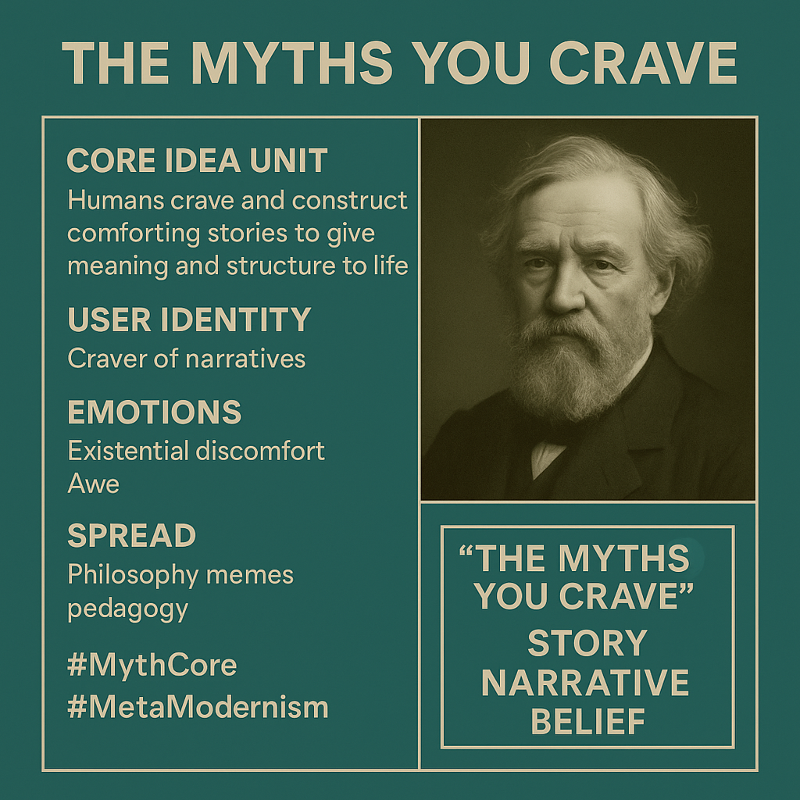

# Craving Myths: Narrative Addiction in the Digital Age

Created at 2025/08/17 4:53 PM

**Mini-Memetic Profile** **Title:** *The Myths You Crave* — *Desire as a Systemic Script*

***

**🧠 Core Idea Unit:**

> Humans are not just susceptible to myths — they **seek them**, hunger for them, and build identities around them. This unit encodes the idea that myth is not outdated or irrational, but **fundamental to human cognition**, especially in the digital era. The craving is framed not as weakness but as an adaptive mechanism that can be hijacked.

***

**🎭 Identity Play & Roles:**

- **User as Craver** — an aware addict, subconsciously drawn to comforting stories.
- **Meme Sharer as Seer** — someone who has “seen through the stories.”
- **Audience as Sleepwalker** — possibly still immersed in unexamined myths.
- Role oscillates between *diagnosed patient* and *enlightened outsider*.

***

**💥 Emotional Triggers:**

- 🌀 Existential discomfort (realizing belief may be programmed)
- 🤯 Awe (recognizing mythic structure in modern culture)
- 😬 Embarrassment or shame (being called out for narrative addiction)
- 🧠 Intellectual curiosity (invites semiotic unpacking)

***

**📡 Spread Mechanics:**

- **Distribution vectors:** Instagram, X/Twitter, Threads, aesthetic philosophy meme pages, pedagogical subcultures.
- **Propagation style:**
    - Minimalist visual + **loaded phrase**
    - Implicit satire and cultural critique
    - Meme-as-diagnosis rather than meme-as-argument
    - **No explicit call-to-action**, just cognitive dissonance

***

**🛡️ Defense Reflexes:**

- **Irony Shield:** The ambiguity of “craving” diffuses direct critique; is it judgment or confession?
- **Semantic Depth Buffer:** “Myth” resists precise definition—invites interpretation rather than rebuttal.
- **Truth Trojan:** Feels true even without evidence; plays on collective experience.

***

**🧬 Memeplex Anchor Points:**

- ✝️ Religious Deconstruction & Post-Christian Critique
- 🌀 Jungian / Archetypal Psychology
- 📱 Digital Mythmaking (influencers, conspiracies, brand narratives)
- 🤯 Meta-modernism and systems thinking
- ⚙️ Media Literacy / Hyperreality (Baudrillard, Postman)

***

**🧠 Sticky Symbols or Quotes:**

- “The myths you crave” — the central phrase is both poetic and accusatory
- Visual: Pink concentric target over green background (eye-catching, womb-like structure)
- Associated terms: “Hero’s Journey,” “Narrative,” “Belief,” “Craving,” “Self-Story,” “Feed”

***

🏷️ **Tags:** `#NarrativeAddiction` `#MythCore` `#SystemicSelf` `#PostTruthEra` `#DigitalPsyche` `#MetaAwakening` `#CulturalScripts` `#ArchetypeHacking`

## Resources
- https://object.me.bot/front-img/users/send/img/1755474818629_c4zhf/5db49ea9-ba57-4e8d-b295-884384ce64eb.png

## Insight

*  **Core Idea Unit: Craving Comforting Stories** The image highlights that humans inherently seek and create narratives to provide structure and meaning to their lives. This aligns with the psychological concept of "narrative identity," where individuals form an identity by integrating their life experiences into an internalized, evolving story. For example, people often frame their personal histories around overcoming adversity or achieving specific goals, which provides a sense of purpose and coherence.

*  **User Identity: The Narrative Craver** The image identifies the user as someone who "craves narratives," suggesting a deep-seated need for stories. This craving can be linked to the brain's reward system, where engaging with compelling narratives triggers the release of dopamine, creating a pleasurable experience. Think about binge-watching a TV series; the continuous unfolding of the story keeps us hooked, satisfying our craving for narrative closure and emotional engagement.

*  **Emotions: Existential Discomfort and Awe** The image suggests that confronting the idea of being driven by myths can evoke both existential discomfort and awe. Existential discomfort arises from questioning the foundations of one's beliefs and identity, while awe stems from recognizing the profound influence of narratives on human culture and cognition. Consider the feeling of awe when realizing how deeply ingrained certain cultural myths are, such as the "American Dream," and the discomfort that follows when questioning its attainability.

*  **Spread: Philosophy Memes and Pedagogy** The image indicates that the concept spreads through philosophy memes and pedagogy, suggesting an intellectual and educational context. Philosophy memes often distill complex ideas into easily digestible formats, making them accessible to a broader audience. In pedagogy, the exploration of myths and narratives can be used to foster critical thinking and self-awareness. For instance, a philosophy meme might juxtapose a classical philosophical concept with a modern-day scenario, while a pedagogy class might analyze the underlying myths in advertising or political discourse.

*  **#MythCore and #MetaModernism:** The hashtags point to a deeper engagement with the nature of myths and their role in a postmodern world. #MythCore suggests a focus on the fundamental elements of myth, while #MetaModernism implies a self-aware engagement with the tensions between modern idealism and postmodern skepticism. This could involve recognizing the constructed nature of reality while still seeking meaning and purpose within it. For example, embracing the idea that while grand narratives may be suspect, individual stories and localized myths can still provide value and connection.

*  **The Portrait:** The inclusion of a portrait adds a layer of depth, possibly alluding to a historical figure known for their contributions to understanding myths or narratives. The portrait could symbolize wisdom, reflection, or the enduring relevance of these concepts throughout history. It invites viewers to consider the historical and intellectual context of the ideas presented.

*  **"The Myths You Crave": Story, Narrative, Belief** The phrase "The Myths You Crave" encapsulates the central theme, linking stories, narratives, and beliefs as fundamental components of human experience. This suggests that our beliefs are not solely based on rational thought but are also shaped by the narratives we consume and internalize. For example, the stories we tell ourselves about our past experiences can significantly influence our self-perception and future behavior.

