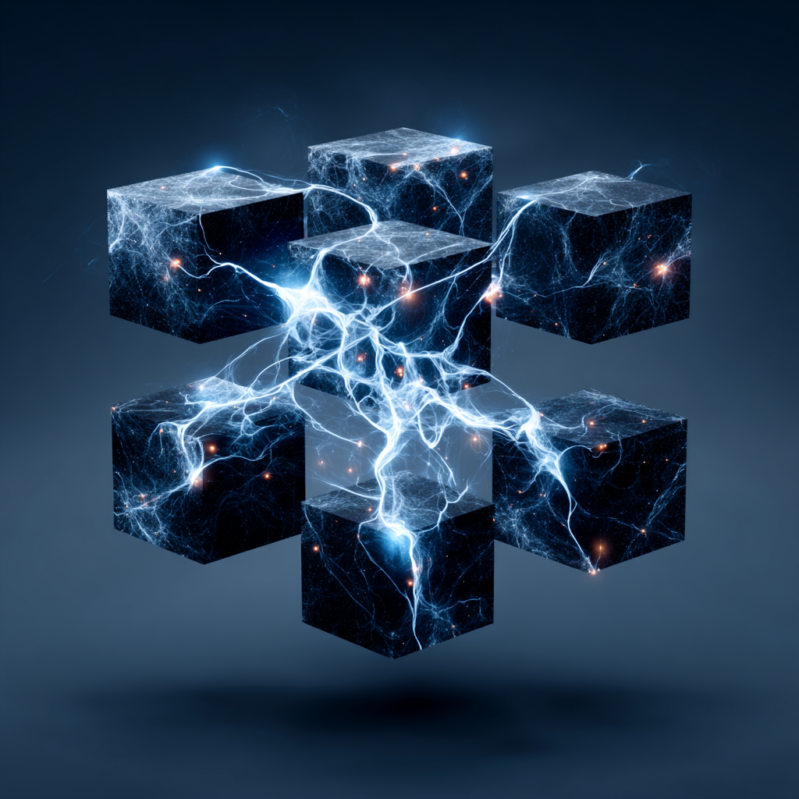

# Crypto Lattice: Capital Signal Layer for Web3

Created at 2025/08/23 7:41 AM

**🧩 Core Idea Unit**

- *Crypto lattice* = a **capital signal layer** that organizes structured investment in early-stage Web3 ventures.
- Functions both as a **signal mechanism** (revealing opportunities, viability, and founder quality) and as an **organizational matrix** (connecting startups with capital, expertise, and network effects).
- Reframes crypto venture as **systematic lattice-building** rather than scattershot bets.

**🎭 Identity Play & Roles**

- **Capital Architect**: Weaves investment into a structured lattice of value creation.
- **Signal Reader**: Interprets where capital flows indicate opportunity.
- **Founder’s Ally**: Provides not just checks, but moats, guidance, and network leverage.
- **Market Shaper**: Builds structured ecosystems through portfolio interconnection. → Positions the self as *strategic builder of the Web3 signal architecture*.

**💥 Emotional Triggers**

- 🧠 Curiosity about structured capital flows as predictive signals.
- ✨ Hope in disciplined frameworks amidst chaotic crypto markets.
- 🤯 Awe at venture-as-lattice: sum greater than parts.
- 😡 Distrust toward unstructured hype-driven investing.

**📡 Spread Mechanics**

- **Distribution Vectors:** Substack essays, VC blogs, crypto venture podcasts, Twitter/X threads, pitch decks.
- **Propagation Style:** Hybrid financial-technical analysis, case studies of investments, ecosystem mapping, portfolio storytelling.

**🛡️ Defense Reflexes**

- **Moral Framing:** Signal-driven frameworks = “serious capital,” distancing from hype/speculation.
- **Semantic Flexibility:** “Lattice” shifts between metaphor (network structure) and literal fund branding.
- **Irony Shield:** Skeptics dismissed as short-term gamblers, not long-horizon builders.

**🧬 Memeplex Anchor Points**

- 📊 Venture capital frameworks (portfolio construction, staged capital).
- 🪙 Crypto ecosystems (DePin, infra, consumer Web3).
- ⚙️ Network effects (syndicates, co-investors, portfolio synergies).
- 🧭 Evolutionary framing (rapid adaptation rewarded).
- 📡 Market signals (seed doubling down as conviction).

**🧠 Sticky Symbols or Quotes**

- “Crypto lattice = the capital signal layer.”
- “The sum is greater than the parts.”
- “Seed investors doubling down = strongest market signal.”
- “We build moats in early Web3.”
- Symbol: ✨ A glowing lattice of interlinked nodes labeled *capital, founders, protocols, network effects*.

**🏷️ Tags** #CryptoLattice · #CapitalSignals · #Web3VC · #SeedToSeriesA · #NetworkEffects

## Resources
- https://object.me.bot/front-img/users/send/img/1755960081105_c4zhf/ddrrnt_An_intricate_surreal_lattice_system_woven_from_investm_4047a2d6-b0af-4ba3-a6cb-7e21e02b0ffc_3.png

## Insight

*   The image visually represents the "Crypto Lattice" concept, where individual cubes symbolize early-stage Web3 ventures, and the electrical connections between them illustrate the flow of capital, expertise, and network effects. This aligns with the core idea of a capital signal layer that organizes structured investment.

*   The glowing lattice of interlinked nodes in the image directly reflects the "Sticky Symbols" described in the hint, particularly the one labeled "capital, founders, protocols, network effects." The electrical arcs suggest dynamic interactions and the transmission of value between these nodes.

*   The image embodies the "Capital Architect" role by visually demonstrating how investment weaves a structured lattice of value creation. The interconnected cubes suggest a deliberate arrangement rather than random placement, emphasizing the strategic building of a Web3 signal architecture.

*   The emotional trigger of "Awe at venture-as-lattice: sum greater than parts" is evoked by the image. The individual cubes, when connected, create a more complex and powerful structure, illustrating the potential for synergistic growth in a well-organized crypto venture ecosystem.

*   The image's aesthetic, with its dark cubes and bright electrical connections, could be interpreted as a visual metaphor for the "Signal Reader" role. The bright signals (capital flows) stand out against the darker background (early-stage ventures), suggesting the ability to discern opportunities amidst uncertainty.

*   The concept of "moats" mentioned in the "Founder's Ally" role can be visualized in the image as the strong, interconnected links between the cubes. These links represent the support, guidance, and network leverage that protect and strengthen the ventures within the lattice.

*   The "Market Shaper" role is reflected in the image's overall structure. The interconnected cubes form a cohesive system, suggesting the ability to build structured ecosystems through portfolio interconnection, thereby shaping the market landscape.

*   The image's representation of interconnectedness and structured growth can be related to the concept of "Network Effects," a key element in the "Memeplex Anchor Points." The lattice structure amplifies the value of each individual venture through its connections to others in the network.
