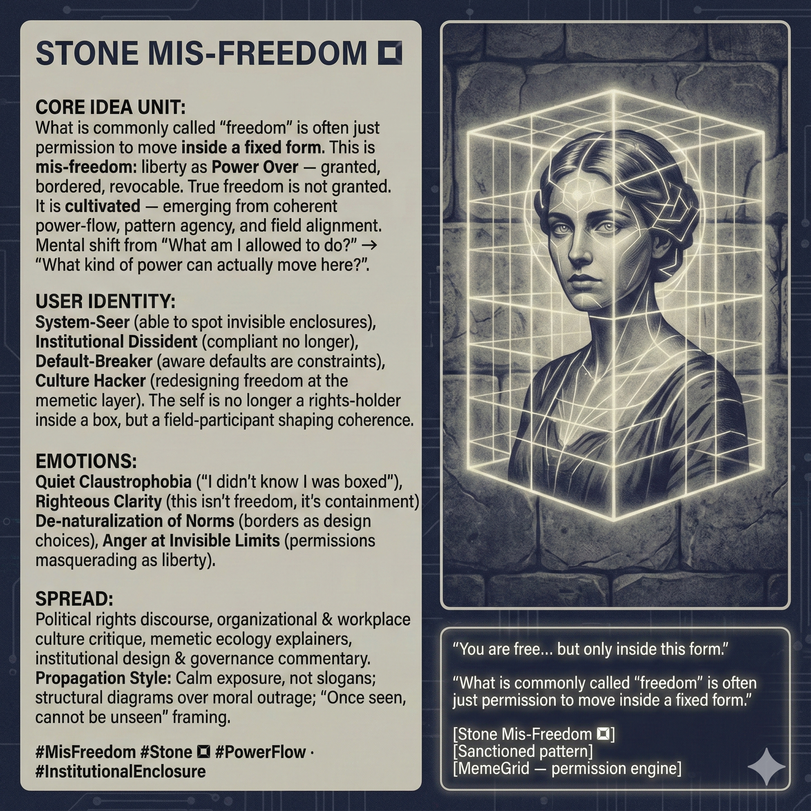

# Cultivating True Freedom Beyond Fixed Forms

Created at 2025/12/14 7:10 AM

## **Stone Mis-Freedom** ▩

***

### ∴ Core Idea Unit

What is commonly called “freedom” is often just **permission to move inside a fixed form**.

This is **mis-freedom**: liberty as *Power Over* — granted, bordered, revocable.

**Resolution frame:**True freedom is not granted. It is **cultivated** — emerging from coherent power-flow, pattern agency, and field alignment.

**Mental shift provoked:**From *“What am I allowed to do?”* → *“What kind of power can actually move here?”*

***

### ▲ Identity Play & Roles

**Cast the viewer as:**

- **System-Seer** — able to spot invisible enclosures
- **Institutional Dissident** — compliant no longer
- **Default-Breaker** — aware that defaults are active constraints
- **Culture Hacker** — redesigning freedom at the memetic layer

**Repositioning:**The self is no longer a rights-holder inside a box, but a **field-participant shaping coherence**.

***

## ≈ Emotional Hooks & Cognitive Levers

- 🧱 **Quiet Claustrophobia** — “I didn’t know I was boxed”
- ⚖️ **Righteous Clarity** — *this isn’t freedom, it’s containment*
- 🧠 **De-naturalization of Norms** — borders as design choices
- 🔥 **Anger at Invisible Limits** — permissions masquerading as liberty

This meme converts diffuse frustration into **diagnostic insight**.

***

### 𐂷 Spread Mechanics

**Distribution Vectors**

- Political rights discourse reframed as containment logic
- Organizational & workplace culture critique
- Memetic ecology explainers
- Institutional design & governance commentary

### 𐂷 Spread Mechanics

**Style**

- Calm exposure, not slogans
- Structural diagrams over moral outrage
- “Once seen, cannot be unseen” framing

***

### ⛨ Defense Reflexes

- **Anti-Anarchy Shield:** Does not reject structure — rejects *opaque enclosure*
- **Anti-Naïveté Guard:** Acknowledges coordination requires constraint
- **Anti-Romanticism Lock:** Freedom as practice, not feeling

Critique must explain **how permission-based freedom avoids enclosure drift** — a hard case.

***

### ☷ Memeplex Anchor Points

- Anti-institutional enclosure critique
- Power-flow theory
- Memetic ecology
- Freedom as emergent field property
- Structural critique of liberalism-as-policy

***

### ✶ Sticky Symbols or Quotes

- ▩ **STONE** — hardened default enclosure
- 🧩 *Sanctioned pattern*
- 🧱 *Borders you didn’t vote on*
- 📜 **“You are free… but only inside this form.”**
- 🕸️ **MemeGrid** — permission engine

***

### ∿ Tags

#MisFreedom · #Stone ▩ · #PowerFlow · #InstitutionalEnclosure · #DefaultBreaker · #FreedomAsField
