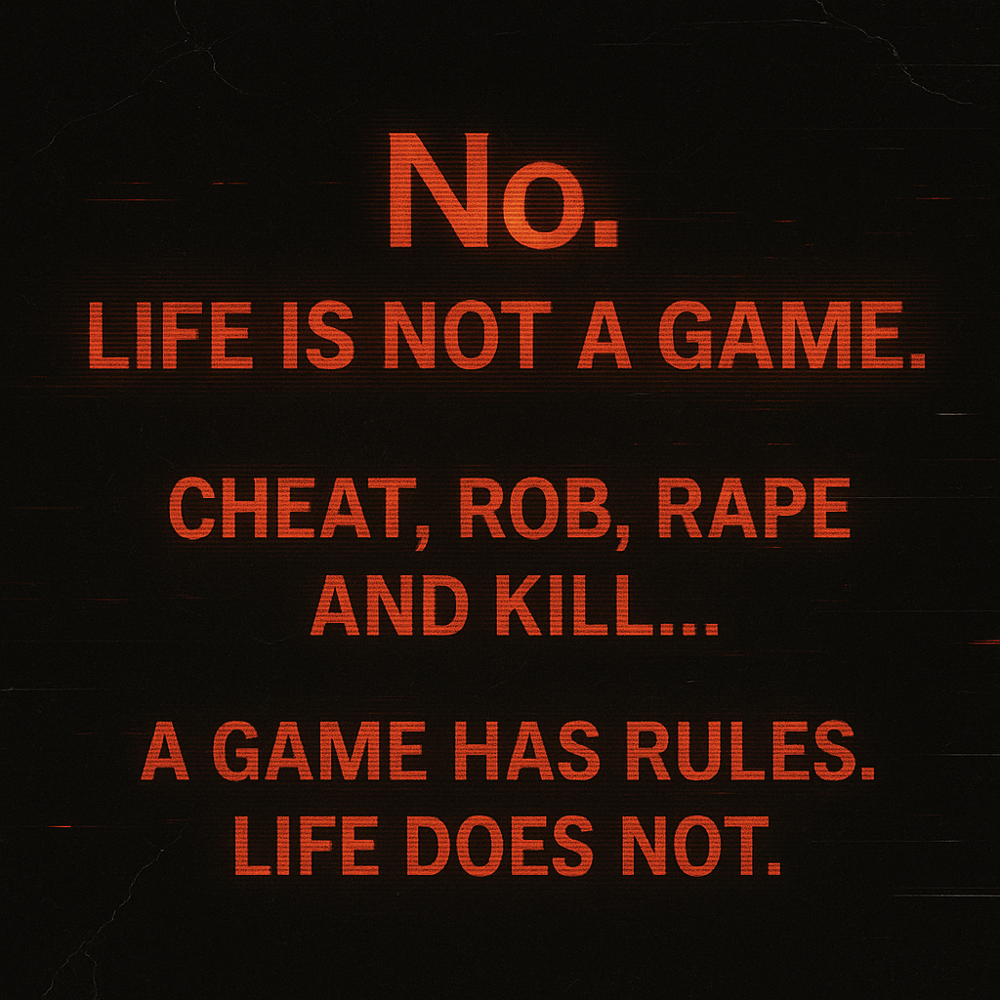

# Rejecting Game Metaphors: Embracing Harsh Realities

Created at 2025/10/29 11:00 AM

### ◈ Mini-Memetic Profile
***
### ∴ Core Idea Unit
The “life as game” metaphor is a lie told by the comfortable. Real life bleeds. There are no checkpoints, no respawns, no rulebook—only chaos, consequence, and cruelty. The meme encodes refusal: the courage to reject simulation narratives and face the abyss without anesthetic metaphor.
***
### ▲ Identity Play & Roles
- **Performer:** The Disillusioned Witness / Nihilist Prophet
- **Shadow Role:** The Deluded Gamer / The Escapist Optimist
- **Repositioning:** From player → to observer; from control-seeker → to truth-seer.
***
### ≈ Emotional Triggers
💢 Disgust at superficial positivity🥀 Existential fatigue and sorrow🩸 Harsh catharsis in acknowledging suffering🧊 Cool detachment from false hope
***
### 𐂷 Spread Mechanics
**Distribution Vectors:** Imageboards (4chan, Reddit r/doomer) · Anti-motivational X posts · Anonymous essay rants.**Propagation Style:** Text-on-black confessionals · Cynical realism · Philosophical nihilism tone.
***
### ⛨ Defense Reflexes
Moral sincerity shield (“I’m just being honest”) and aesthetic fatalism (“beauty in decay”). Converts optimism into evidence of delusion—truth defined by pain tolerance.
***
### ☷ Memeplex Anchor Points
⚫ Pessimism / Nihilism💀 Existential realism🪞 Anti-hustle backlash📚 Literary fatalism (Schopenhauer, Cioran, Ligotti)
***
### ✶ Sticky Symbols or Quotes
- “No. Life is not a game.”
- “A game has rules. Life does not.”
- “Cheat, rob, rape, and kill—see who still calls it play.”
- “The only way to win is not to play.”
***
### ∿ Tags
#LifeIsNotAGame · #AntiGame · #DarkRealism · #NihilCore · #DoomerPhilosophy · #PainAsTruth
