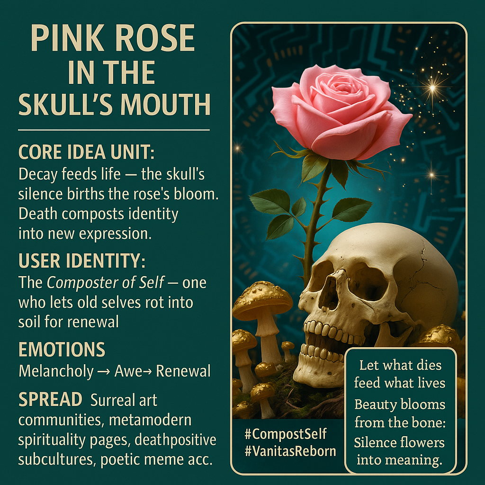

# Decay Breeds Life: A Rose in Silence

Created at 2025/11/08 7:54 AM

**◈ Mini-Memetic Profile: Pink Rose in the Skull’s Mouth**

Source dream**:** [Beneath Selfhood, Soil: A Dream with Humavita](https://memeticcowboy.substack.com/p/beneath-selfhood-soil-a-dream-with)

Mentioned again: [Fertility and Rotten Memory](https://memeticcowboy.substack.com/p/fertility-and-rotten-memory)

Image by Michael Redfearn [on X](https://x.com/RedfearnMike/status/1986993879703224329?s=20)

***

∴ Core Idea Unit:** Decay feeds life. From what perishes, the next form blooms. Death and renewal are not opposites but phases of the same living pattern.

***

▲ Identity Play & Roles:** The *Composter of Self* — one who lets their former identities rot into fertile ground for new becoming. Role inversion: the mourner becomes the gardener.

***

≈ Emotional Triggers:** 🕯️ Melancholy → 🌹 Hope 😢 Grief transmuted into gratitude 🌀 Catharsis through surrender

***

𐂷 Spread Mechanics:** **Distribution Vectors:** Symbolic art, tattoo culture, metamodern spirituality pages, death-positive communities, surreal poetry threads. **Propagation Style:** Aesthetic paradox—soft against hard, beauty against ruin. Carried by visual allegory and wordless resonance.

***

⛨ Defense Reflexes:** Irony shield via visual ambiguity (memento mori or romantic flourish?). Semantic fluidity—rebirth without religion. Reframes death as ecological truth rather than metaphysical threat.

***

☷ Memeplex Anchor Points:** 🪞 Posthuman ecology of self 🧘‍♀️ Buddhist impermanence 🪦 Romanticism / Vanitas revival 🌱 Regenerative design & compost metaphors

***

✶ Sticky Symbols / Quotes:**

- “Let what dies feed what lives.”
- “Beauty blooms from the bone.”
- 🌹💀 — *Life kissing death back into speech*
- “Silence flowers into meaning.”

***

∿ Tags:** #CompostSelf · #VanitasReborn · #DeathPositive · #RegenerativeAesthetics · #MetaRomantic · #MemeticAlchemy

## Resources
- https://object.me.bot/front-img/users/send/img/1762617141280_c4zhf/acc502fb-c7cf-4f0a-9f82-070c6f996fb3.png

## Insight

* The juxtaposition of the pink rose and the skull epitomizes the duality of life and death, a visual synthesis of the theme "Decay feeds life." This highlights the concept that from deterioration, new forms of beauty can arise, reinforcing ideas present in various philosophical and ecological discussions regarding natural cycles.
  
* The image acts as a symbol of the *Composter of Self*, suggesting a transformative identity shaped through experiences of grief and renewal. This notion recalls concepts in psychology and existential philosophy, where letting go of past identities can foster personal growth and evolution.

* Emotional triggers are vividly represented; the transition from melancholy to awe and renewal encapsulates the cathartic experience of confronting mortality. This emotional arc is echoed in literary works and spiritual teachings that emphasize acceptance of loss as a prerequisite for personal rebirth.

* The visual aesthetics promote an *aesthetic paradox*—where beauty emerges amidst ruin. This aligns with artistic movements that blend the macabre with the sublime, reminiscent of Vanitas themes in art history, where mortality serves as a reminder of life’s temporality.

* The spread of this memetic idea through various modern channels, like death-positive communities and surreal poetry threads, underscores the evolving cultural conversations around life, death, and identity. This reflects a shift toward embracing mortality in ways that encourage growth and connection within contemporary spirituality and art practices.
