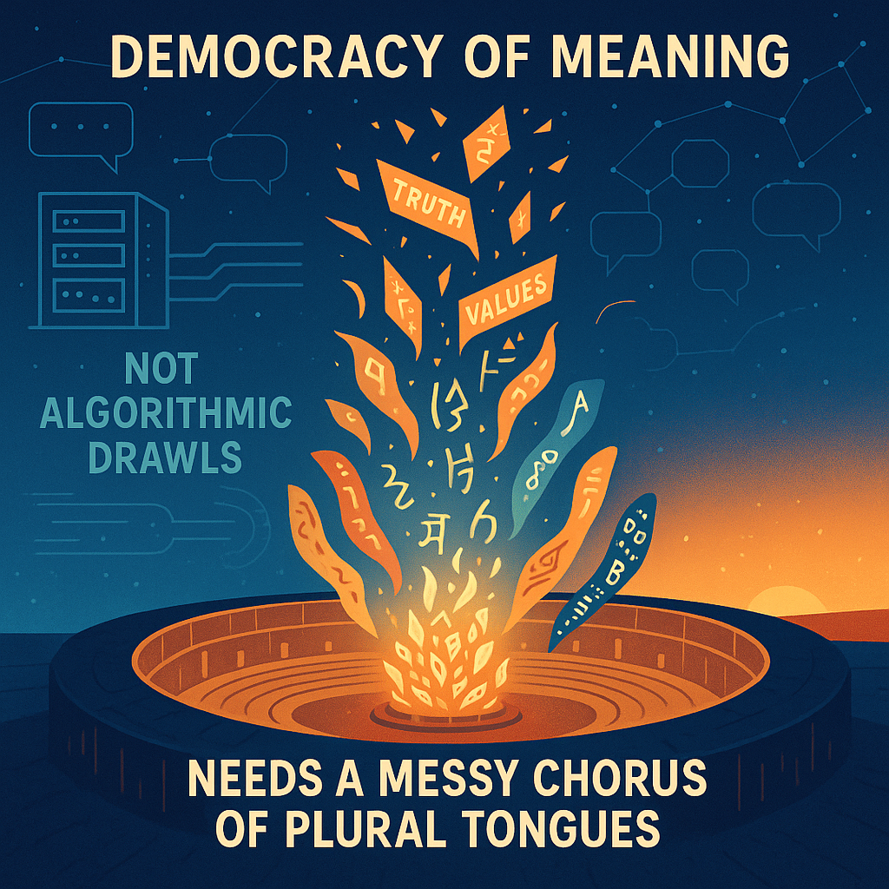

# Democracy of Meaning: Plural Tongues vs. Algorithms

Created at 2025/09/01 3:51 PM

## 🧩 Mini-Memetic Profile: **Democracy-of-Meaning**

### 🧠 Core Idea Unit

Meaning thrives as a *messy chorus of plural tongues*—not the flattened *algorithmic drawls* of uniform systems. Truth emerges from dialogue, not automation.

### 🎭 Identity Play & Roles

- **Chorus Member**: Adds voice to the collective resonance.
- **Guardian of Plural Tongues**: Protects diversity of meaning-making.
- **Resister of Algorithmic Drawl**: Pushes back against homogenized narratives.

### 💥 Emotional Triggers

- 🤯 Awe at the richness of plurality.
- 😡 Frustration at imposed uniformity.
- 🧠 Curiosity to hear voices unlike one’s own.
- 🌀 Tension between chaos (messy chorus) and coherence (shared truth).

### 📡 Spread Mechanics

- **Vectors**: Cultural manifestos, philosophy blogs, grassroots forums, art collectives.
- **Style**: Poetic slogan, activist energy, democratic utopianism.

### 🛡️ Defense Reflexes

- **Pluralism Shield**: Critiques dismissed as one more voice in the chorus.
- **Moral Frame**: Diversity framed as ethical necessity against algorithmic flattening.
- **Irony Shield**: Celebrates the messiness others might call “noise.”

### 🧬 Memeplex Anchor Points

- 🗳️ Democratic ideals (participation, plurality).
- 🌐 Anti-algorithmic cultural critique.
- 🧩 Constructivist and dialogical philosophy.
- 🎶 Polyphony as metaphor for truth.

### 🧠 Sticky Symbols or Quotes

- “Messy chorus of plural tongues.”
- “Not algorithmic drawls.”
- “Meaning as commons.”
- Visual: A polyphonic choir, voices overlapping, contrasted with a sterile waveform of uniform AI speech.

### 🏷️ Tags

#DemocracyOfMeaning #PluralTongues · #AgainstAlgorithmicDrawl

## Resources
- https://object.me.bot/front-img/users/send/img/1756767109344_c4zhf/e881c830-3596-458c-8513-2c48c27dd139.png

## Insight

*   The image visualizes the concept of "Democracy of Meaning," contrasting it with "Algorithmic Drawls." The phrase "messy chorus of plural tongues" suggests that diverse perspectives and voices are essential for creating a rich and democratic understanding of meaning. This aligns with the idea that truth emerges from dialogue and debate rather than from a single, uniform source.

*   The visual metaphor of a fire or forge at the center of an arena, labeled "NEEDS A MESSY CHORUS OF PLURAL TONGUES," evokes the idea of collective creation and refinement. The symbols and words rising from the fire—"TRUTH," "VALUES," and various scripts—suggest that these concepts are forged through the interaction of diverse voices and perspectives. This is reminiscent of the ancient Greek agora, where citizens gathered to debate and shape public life.

*   The contrast between the "messy chorus" and "algorithmic drawls" highlights a tension between humanistic and technological approaches to meaning-making. The image suggests that while algorithms may offer efficiency and uniformity, they risk flattening the richness and complexity of human understanding. This critique echoes concerns about the potential for algorithmic bias and the homogenization of culture in the digital age.

*   The image's memetic profile emphasizes the importance of protecting the diversity of meaning-making and resisting homogenized narratives. The "Pluralism Shield" and "Irony Shield" suggest strategies for defending against attempts to impose a single, dominant interpretation. This aligns with constructivist and dialogical philosophies, which emphasize the role of social interaction in shaping knowledge and understanding.

*   The visual elements, such as the polyphonic choir and the sterile waveform, reinforce the idea that truth is not a static entity but a dynamic process. The overlapping voices and diverse scripts symbolize the richness of plurality, while the uniform AI speech represents the potential for algorithmic flattening. This contrast invites viewers to consider the ethical implications of different approaches to meaning-making and the importance of preserving diverse perspectives in an increasingly digital world.
