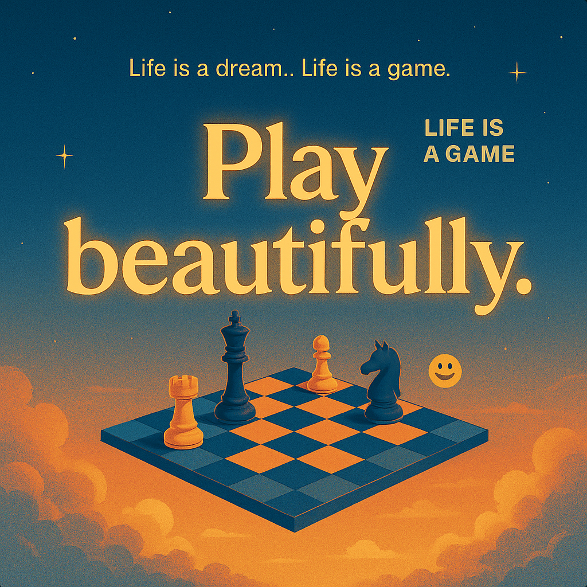

# Life as an Artful Game

Created at 2025/10/29 10:49 AM

### ◈ Mini-Memetic Profile
***
### ∴ Core Idea Unit
Life is neither a hustle nor a horror show—it’s a living artwork in motion. Each move on the board is both strategy and dance. The meme encodes the fusion of awareness and play: the beauty lies not in victory, but in participation itself.
***
### ▲ Identity Play & Roles
- **Performer:** The Poet-Player / Mindful Trickster
- **Shadow Role:** The Overthinker / The Control Addict
- **Repositioning:** From winner-seeker → to playful co-creator; from control → to presence.
***
### ≈ Emotional Triggers
💫 Whimsy and Lightness🪞 Awe and Self-Reflection😌 Serene Acceptance🌈 Joyful detachment from outcomes
***
### 𐂷 Spread Mechanics
**Distribution Vectors:** Pinterest aesthetic boards · Tumblr wisdom posts · Instagram reels with lo-fi music · “soft” X threads.**Propagation Style:** Poetic aphorism · Gentle humor · Dreamlike typography and visuals · Calm introspection vibe.
***
### ⛨ Defense Reflexes
Deflects cynicism through sincerity and humor (“yeah, it’s just a silly game 😅”). Operates in post-ironic mode—simultaneously aware of absurdity and wonder.
***
### ☷ Memeplex Anchor Points
🌸 Zen philosophy♟️ Artistic play as spiritual practice🪶 Stoic equanimity🎭 Post-ironist sincerity culture
***
### ✶ Sticky Symbols or Quotes
- “Every breath a move.”
- “Life is a dream… Life is a game.”
- “Play beautifully.”
- “LIFE IS A GAME 😅”
***
### ∿ Tags
#LifeIsAGame · #ZenPlay · #MindfulChess · #PoeticWisdom · #SoftPhilosophy · #ArtfulExistence
