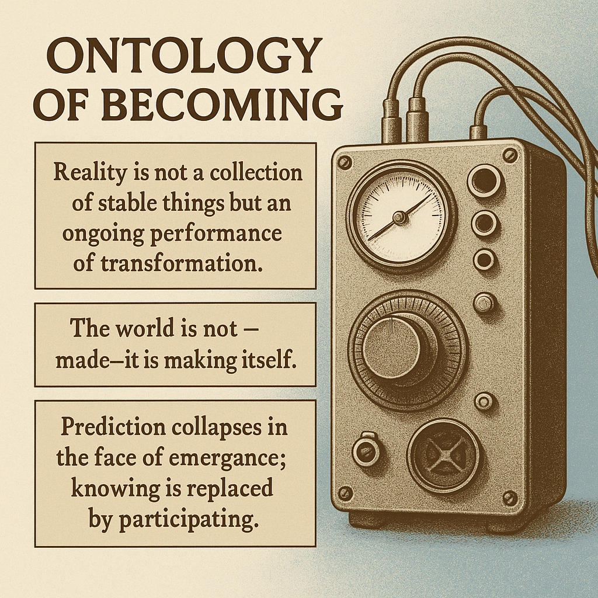

# Embracing Emergence: The Ontology of Becoming

Created at 2025/10/18 8:38 AM

**🧩 Mini-Memetic Profile: Ontology of Becoming**

***

### 🧠 Core Idea Unit

Reality is not a collection of stable things but an **ongoing performance of transformation**. The world is not *made*—it is *making itself*. Prediction collapses in the face of emergence; knowing is replaced by **participating**.

***

### 🎭 Identity Play & Roles

**Role:** The Cybernetic Participant / Adaptive Co-Performer The meme recasts the thinker as a **participant in unfolding systems**, not a detached observer. It invites the self to dance with uncertainty rather than dominate it—an *artist-engineer of feedback* in a living world.

***

### 💥 Emotional Triggers

🤯 Awe at emergence 😬 Disorientation before unpredictability 🧘 Curiosity and surrender to process 🔥 Liberation from control narratives

Internalization occurs through the **aesthetic of uncertainty**—feeling wonder where modern logic once demanded mastery.

***

### 📡 Spread Mechanics

**Distribution Vectors:** Systems-thinking circles, cybernetics subreddits, AI research blogs, philosophical essays, generative-art communities. **Propagation Style:** Reflective parable and experimental pedagogy—animated feedback diagrams, quotes from Beer/Pask/Eno, videos showing machines “thinking” in real time.

***

### 🛡️ Defense Reflexes

**Irony Shield:** “Prediction is just nostalgia for control.” **Conceptual Defense:** By grounding itself in unpredictability, critique fails to pin it down—uncertainty is its armor. **Epistemic Inversion:** Attempts to “debunk” it as vague only reaffirm its point that control-seeking is a symptom of modern illusion.

***

### 🧬 Memeplex Anchor Points

📚 British Cybernetics · ⚙️ Systems Theory · 🌀 Process Philosophy · 🧬 Complexity Science · 🔄 Adaptive Design · 🎵 Generative Art · 🧠 Nonlinear Psychology · 🪞 Heideggerian Revealing

***

### 🧠 Sticky Symbols or Quotes

- “Reality is always in rehearsal.”
- “Nothing is made; everything is becoming.”
- “To predict is to stop listening.”
- “Run the machine and see.”
- Icons: spirals, feedback loops, homeostat dials, Eno’s ambient grid, recursive waveforms.

***

### 🏷️ Tags

#CyberneticPhilosophy · #EmergentReality · #ProcessOntology · #ComplexityCulture · #AdaptiveIntelligence · #PostControl · #TemporalFluidity

Source: *The Cybernetic Brain - Andrew Pickering*

## Resources
- https://object.me.bot/front-img/users/send/img/1760801839395_c4zhf/86bb7ba3-9e35-4a1d-9504-88ded14cc8b0.png

## Insight

* The phrase "Ontology of Becoming" emphasizes a dynamic understanding of reality, aligning with process philosophy which posits that existence is rooted in continuous change rather than static being. This aligns with the ideas of philosophers like Heraclitus, who famously stated, "Everything flows," advocating for a perspective that views existence as an ever-evolving performance.

* The assertion that "the world is not—made—it is making itself" parallels concepts in complexity science, where systems emerge from interactions rather than predetermined blueprints. In complex adaptive systems, the focus is on the relationships and processes that create new configurations, rather than on a fixed structure or end state.

* The collapse of prediction in favor of participation reflects a shift towards systems thinking, where adaptability and responsiveness to feedback loops are crucial. This idea resonates with cybernetic principles, as articulated by Norbert Wiener, suggesting that mastery over systems is less about prediction and more about understanding and engaging within their dynamic processes.

* Emotional triggers such as curiosity and surrender to process highlight a transformation in how we engage with uncertainty. This resonates with the work of artists and thinkers like Brian Eno, who explore generative art as a medium that thrives on unpredictability, encouraging viewers (or participants) to embrace chance and emergence rather than seek to dominate their experience.

* The notion of the "Cybernetic Participant" emphasizes an active role within unfolding systems, aligning with modern theories in non-linear psychology. The participant becomes an artist-engineer, navigating relationships and influences rather than merely observing—a reflection of the collaborative nature of knowledge construction prevalent in contemporary educational and philosophical discourses.

* The defense mechanisms outlined, such as the "Irony Shield," indicate a critique of control narratives that permeate modern thought, resonating with postmodern theories which critique objectivity and absolute truths. This critical stance suggests that the insistence on control is often a misguided attempt at securing certainty in an inherently fluid reality, echoing sentiments found in the works of thinkers like Michel Foucault.
