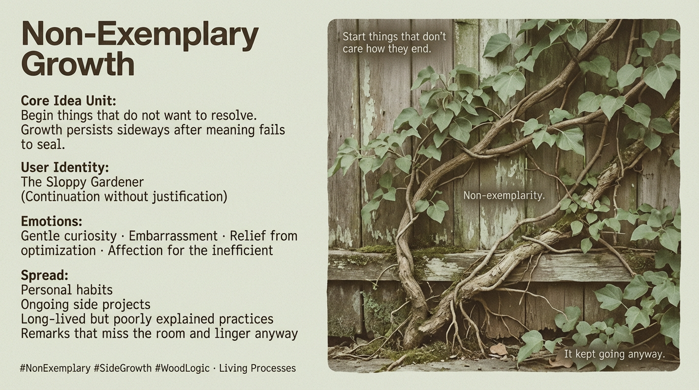

# Embracing Non-Exemplary Growth Through Persistence

Created at 2025/12/24 4:54 PM

**Non-Exemplary Growth**

***

## **🧠 Core Idea Unit**

The meme encodes a generative refusal: **begin things that do not want to resolve**. The thought-virus dissolves outcome-orientation itself—growth persists not by clarity or correctness, but by *sideways continuation after meaning fails to seal*.

***

## **🎭 Identity Play & Roles**

**Tempted role:** *The Coherent Builder / Purposeful Maker* **Actual role offered:** *The Sloppy Gardener*

The user is positioned as someone who **starts for the wrong reason and keeps going anyway**, allowing projects to mutate past their origin story.

***

## **💥 Emotional Triggers**

- 🌱 **Gentle curiosity** — “What happens if I don’t justify this?”
- 😅 **Embarrassment** — origin stories that don’t age well
- 😌 **Relief** from optimization pressure
- 🌿 **Affection** for the inefficient that survives

Emotion is quiet, sustaining, and unheroic.

***

## **📡 Spread Mechanics**

**Distribution Vectors**

- Personal habits
- Ongoing side projects
- Long-lived but poorly explained practices
- Remarks that miss the room and linger anyway

**Propagation Style**

- Accidental continuation
- Overgrowth rather than persuasion
- Survival through neglect
- Mutation without announcement

Nothing is broadcast; growth happens because **no one stopped it**.

***

## **🛡️ Defense Reflexes**

- **Non-exemplarity:** cannot be cited or taught without killing it
- **Origin embarrassment:** beginnings resist mythologizing
- **Inefficiency shield:** too sloppy to optimize, therefore left alive
- **Forking persistence:** splits rather than concludes

Critique fails because there is no clean object to critique.

***

## **🧬 Memeplex Anchor Points**

- Anti-teleological creation
- Process philosophy
- Informal practice cultures
- Evolutionary drift over design
- Living systems that outgrow their reasons

***

## **🧠 Sticky Symbols or Quotes** *(Low-signal, living)*

- “Start things that don’t care how they end.”
- “Non-exemplarity.”
- “It kept going anyway.”
- A vine growing sideways because the sun moved

Recall is weak; **continuation is the carrier**.

***

## **🏷️ Tags**

#SideGrowth #NonExemplary #WoodLogic #InefficientAlive #AntiOptimization #LivingProcesses

***

### 𐂷 WOOD — (forming)

- 𐂷 *It Forms side-growth where endings burned away.*
- 𐂷 *It Forms remarks that miss the room and keep growing anyway.*
- 𐂷 *It Forms habits too inefficient to optimize, therefore left alive.*
- 𐂷 *It Forms futures that embarrass their own origins.*
- 𐂷 *It Forms what survives explanation by refusing it.*

**Growth vector held:** When explanation fails, what remains is not meaning—but **life continuing sideways**.

## Resources
- https://object.me.bot/front-img/users/send/img/1766623954871_c4zhf/086cb42c-83c9-4dfe-8d74-7a27581c4aed.png

## Insight

* The image embodies the concept of **non-exemplary growth**, illustrated through the image of vines growing in seemingly chaotic directions. This visually represents the idea that growth doesn't follow a linear or purposeful path, aligning with the notion that sometimes projects or thoughts can thrive even without a clear purpose or endpoint.

* The notion of the **"Sloppy Gardener"** invites a shift in perspective, where it's acceptable to engage in activities without the pressure of optimization or achieving perfection. This resonates with many individuals who may feel overwhelmed by the need for clarity and excellence in their pursuits, promoting instead an embrace of spontaneity and the unexpected.

* Emotional triggers highlighted—like **gentle curiosity** and **embarrassment**—encapsulate the human experience of engaging with projects that may not yield immediate success or the anticipated resolution. This invites reflection on personal habits and ongoing projects that often lack the polished narrative society might expect, offering a sense of relief from self-imposed performance pressures.

* The text emphasizes the **accidental continuation** of ideas and practices, paralleling concepts from evolutionary biology and cultural anthropology where life adapts and persists through unplanned mutations. These "living systems" serve as reminders that growth does not have to be strictly intentional or comprehensible to be valid or valuable.

* The emphasis on **non-exemplarity** and inefficiency underscores the beauty in processes that resist conventional definitions of success. It challenges prevailing narratives that prioritize efficiency over the rich, complex realities of life, suggesting that the ultimate value may lie in the continuation and resilience of practices rather than their immediate applicability or clarity.
