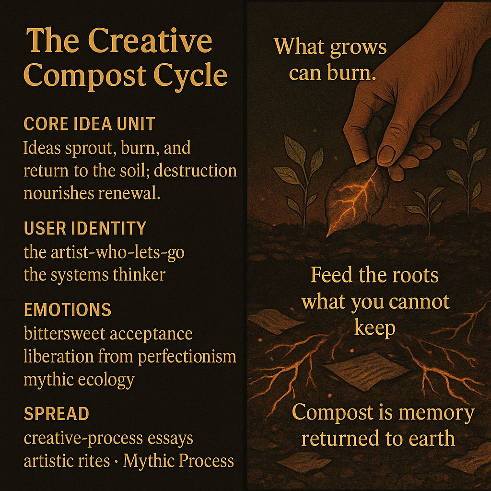

# Embracing the Creative Compost Cycle

Created at 2025/11/23 12:28 PM

### 🧩 **Title: The Creative Compost Cycle**

***

### 🧠 **Core Idea Unit**

Ideas are living matter: they sprout, burn, collapse, and return as richer soil. Creation isn’t a clean ascent but a regenerative loop—destruction as nourishment, endings as germination beds.

***

### 🎭 **Identity Play & Roles**

**The Artist-Who-Lets-Go** — releasing old work to feed what comes next. **The Systems Thinker** — seeing creative output as ecological flow. **The Storyteller-in-Molt** — shedding skins that once fit perfectly.

These roles cast the self as a caretaker of cycles rather than a defender of static masterpieces.

***

### 💥 **Emotional Triggers**

Bittersweet acceptance of impermanence. Liberation from perfectionism. Warm melancholy at letting ideas return to the soil. Mythic awe at creative ecology.

***

### 📡 **Spread Mechanics**

**Distribution Vectors:** creative-process essays, artistic rites, ecological futurism, metamodern creative communities. **Propagation Style:** poetic process-myth, regenerative parable, soft-ritual ecology.

***

### 🛡️ **Defense Reflexes**

“Everything feeds the soil” reframes criticism as compost, not failure. Cycle-framing dissolves shame: nothing is wasted. Ecological metaphor deflects linear, outcome-focused critique.

***

### 🧬 **Memeplex Anchor Points**

Regenerative design · Mycelial creativity · Mythic ecology · Anti-perfectionism ethos · Process-over-product creative philosophy.

***

### 🧠 **Sticky Symbols or Quotes**

“What grows can burn.” “Feed the roots what you cannot keep.” “Compost is memory returned to earth.” Creative soil glowing with ember-threads. Half-burned pages nourishing sprouting shoots.

***

### 🏷️ **Tags**

#CreativeEcology · #CompostCycle · #MythicProcess · #RegenerativeArt

## Resources
- https://object.me.bot/front-img/users/send/img/1763929678945_c4zhf/ca1ab111-062c-47ce-b265-71bb3c16649d.png

## Insight

* The concept of the "Creative Compost Cycle" embodies a profound metaphor for the life of ideas, emphasizing that creativity is not linear but a cyclical process. Just as nature thrives on decay and regeneration, creative endeavors can flourish through the acceptance of impermanence and transformation.

* The suggested user identities—**the artist-who-lets-go** and **the systems thinker**—highlight the importance of flexibility and ecological awareness in the creative process. This mirrors contemporary philosophies in various fields, like regenerative design, which seeks to harmonize human activity with natural ecosystems.

* Emotional triggers such as "bittersweet acceptance of impermanence" and "liberation from perfectionism" suggest that the journey of creation should be valued over the end product. This resonates with the views of thinkers like John Dewey, who proposed that the experience of creating is inherently fulfilling and essential to human existence.

* The idea that “everything feeds the soil” recontextualizes failure and criticism as valuable parts of the creative cycle, akin to composting. This aligns with resilience theories in psychology that assert setbacks contribute to growth and innovation, illuminating a path to overcome the shame often associated with perceived failures.

* The imagery and phrases, such as "Compost is memory returned to earth," evoke a sense of nostalgia while encouraging a regenerative view of past works, reminiscent of the Japanese concept of **Mono no Aware**, emphasizing the beauty in transience and the bittersweet nature of existence.

* The proposed methods for sharing these ideas—through creative-process essays and artistic rites—indicate a desire for community and collective reflection, reflective of participatory art movements that prioritize engagement and collaborative creativity. This approach fosters a shared understanding of the creative journey as a collective, rather than an isolated experience.
