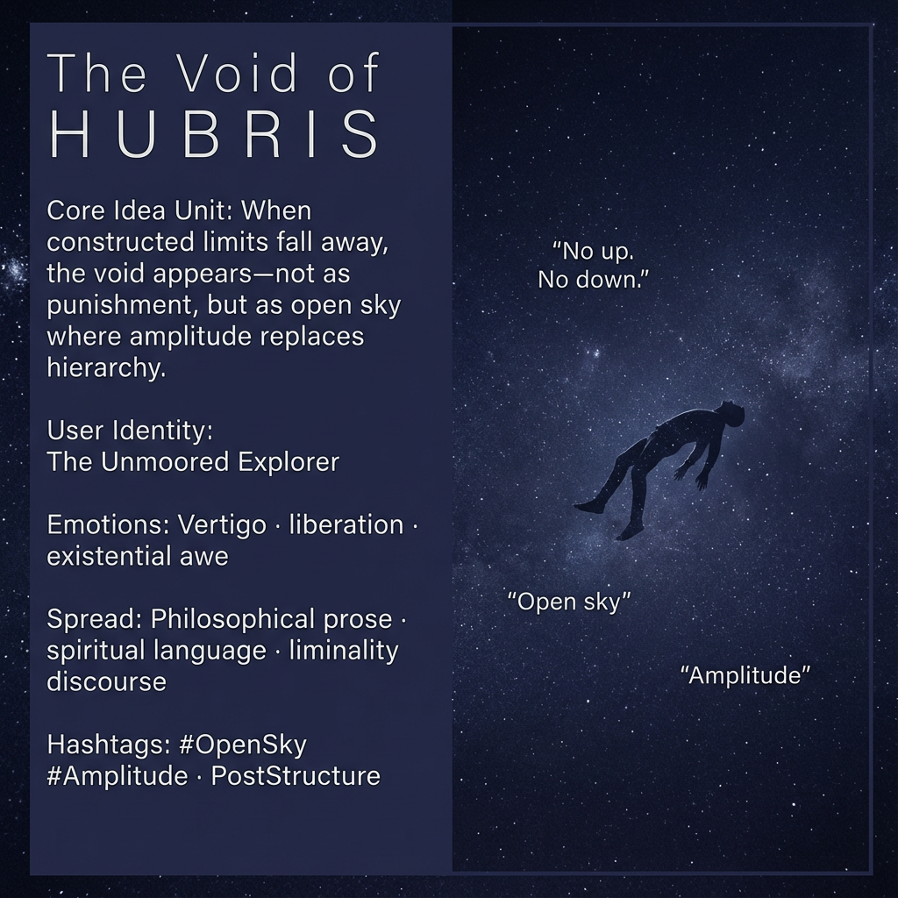

# Navigating the Void: Liberation through Amplitude

Created at 2025/12/28 4:23 PM

## **The Void of HUBRIS as Open Sky**

**Removed VOID in favor of Sky Earth Sea + Abyss:** [HUBRIS: A Memetic Reversal of Icarus in the Age of Artificial Intelligence](https://memeticcowboy.substack.com/p/hubris-a-memetic-reversal-of-icarus)

### ∴ Core Idea Unit

When constructed limits dissolve, the subject encounters a void—initially vertiginous, then liberating. Orientation collapses, and amplitude replaces hierarchy as the governing law.

### ▲ Identity Play & Roles

**Cast role:** The Unmoored ExplorerThe subject is released from inherited coordinates and must learn to navigate without up/down, approval/disapproval.

### ≈ Emotional Triggers

- Vertigo at loss of structure
- Existential awe
- Liberation through unboundedness
- Fear transmuted into possibility

These emotions reframe emptiness as freedom rather than threat.

### 𐂷 Spread Mechanics

**Distribution Vectors:**

- Philosophical prose
- Spiritual language
- Liminality discourse

### 𐂷 Spread Mechanics

Style:**Negative capability, paradox framing, open-ended invitation.

### ⛨ Defense Reflexes

- Refusal of teleology
- Non-hierarchical framing
- Embracing uncertainty as feature, not bug

### ☷ Memeplex Anchor Points

- Non-hierarchical becoming
- Anti-teleological freedom
- Amplitude-as-law

### ✶ Sticky Symbols or Quotes

/ Phrases

Void of HUBRIS · open sky · no up or down · amplitude

### ∿ Tags

#OpenSky · #Amplitude · #PostStructure · #ExistentialFreedom
