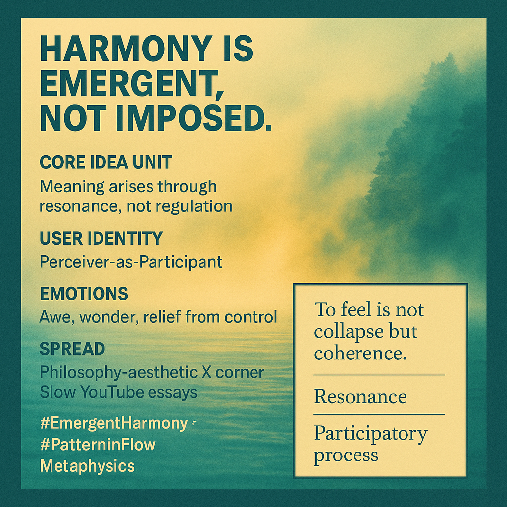

# Harmony: Emergence through Resonance, Not Regulation

Created at 2025/10/25 11:44 AM

🦦 Mini-Memetic Profile: “Harmony is Emergent, Not Imposed.”  🧠 Core Idea Unit  Meaning arises through resonance, not regulation. Harmony is a participatory process of alignment between forces, forms, and feelings — not an external design enforced from above.  🎭 Identity Play & Roles  Role: The Perceiver-as-Participant — artist, listener, organism, or node in flow. Positioning: Moves from control to attunement; from architect of order to co-composer of reality.  💥 Emotional Triggers  Awe at natural coherence · Relief from control · Wonder in complexity · Quiet euphoria of pattern recognition · Disillusionment with rigid order  📡 Spread Mechanics  Distribution Vectors: Philosophy-aesthetic corners of X / Threads · Slow YouTube essays · Ambient music communities · Process-philosophy circles Propagation Style: Poetic aphorism and visual metaphor — mist, resonance, or wave imagery to evoke continuity.  🛡️ Defense Reflexes  Irony shield: “It’s about vibe, not doctrine.” Semantic ambiguity: Harmony = both metaphysical and musical. Counter-narrative preemption: Frames imposed order as violence against flow.  🧬 Memeplex Anchor Points  Process philosophy · Pragmatist aesthetics · Post-structural ontology · Systems theory · Embodied cognition · Metamodern relationalism  🧲 Sticky Symbols or Quotes 	•	“To feel is not collapse but coherence.” 	•	“The many become one — and are increased by one.” (Whitehead) 	•	“It is always in the middle.” (Deleuze & Guattari) 	•	Sound waves, rippling water, mist over current, breathing organism as harmonic metaphor.  🏷️ Tags  #EmergentHarmony · #ProcessAesthetics · #RelationalOntology · #Metamodernism · #PatternInFlow  [MC Substack post](https://substack.com/@memeticcowboy/note/c-170128072)

## Resources
- https://object.me.bot/front-img/note/attachments/img/1761417874592/8B67D80F-8805-48ED-94FB-D63C5E9BC2B4.png

## Insight

* The phrase “Harmony is Emergent, Not Imposed” encapsulates a fundamental shift in understanding human experience, highlighting how meaning and connection arise organically through participation rather than through rigid frameworks or hierarchies. This idea resonates with trends in contemporary philosophy, particularly in process philosophy and post-structuralism, where emphasis is placed on fluidity and relational dynamics.

* The notion of the "Perceiver-as-Participant" underlines an active role individuals play in co-creating meaning. Rather than passively receiving impositions, participants engage in a dance of resonance, which aligns with theories of embodied cognition. This perspective suggests that perception and participation are inseparable in forging understanding and reality.

* Emotional responses highlighted, such as awe and relief from control, underscore the psychological benefits of embracing emergent harmony. This aligns with findings in positive psychology that emphasize the joy derived from complex systems and natural coherence, suggesting that surrendering rigid control can foster a deeper appreciation of interconnectedness.

* The suggested propagation styles through poetic aphorisms and visual metaphors reflect a multimedia approach to engaging with ideas. The use of imagery, such as mist or waves, draws on aesthetic experiences to evoke feelings of continuity and interconnectedness, effectively engaging audiences through the sensory realm.

* The quotes and sticky symbols provided mirror the essence of emergent harmony, reinforcing the importance of coherence in feeling. This aligns with thinkers like Alfred North Whitehead and Deleuze & Guattari, who advocate for an understanding of reality as inherently dynamic and processual, rather than static or imposed.
