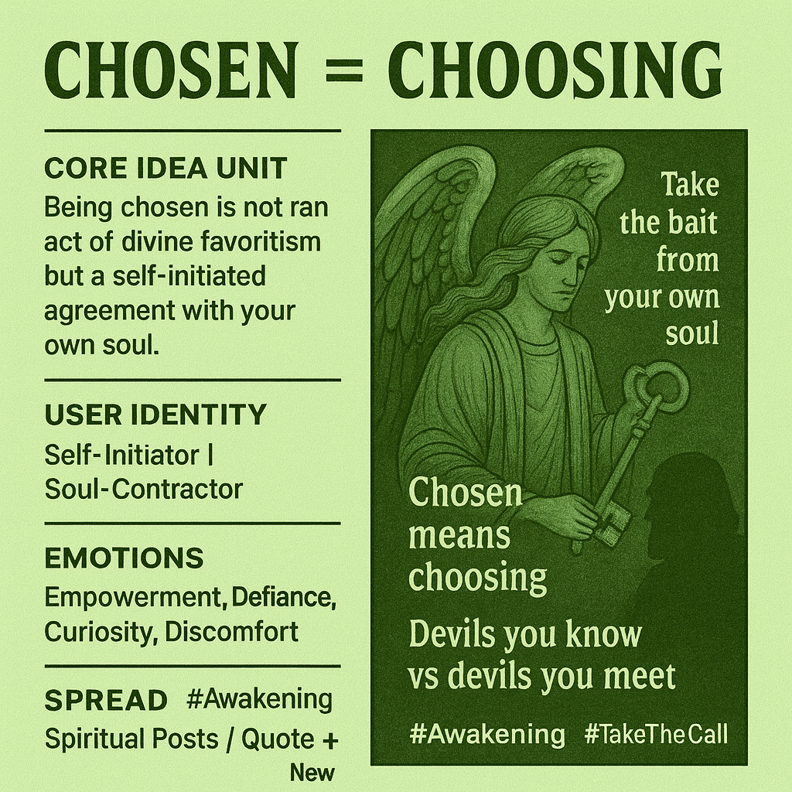

# Empowered Choice: Awakening Your Soul Contract

Created at 2025/09/26 6:55 PM

Here’s the Mini-Memetic Profile for [Jennifer’s idea:](https://substack.com/@ginlea/note/c-160109831?r=5a5yhr&utm_medium=ios&utm_source=notes-share-action)  ⸻  🧩 Title “Chosen = Choosing”  ∴ Core Idea Unit  “Being chosen” is not an act of divine favoritism but a self-initiated agreement with your own soul. Awakening is voluntary, not bestowed. The real shift is from passive recipient → active chooser.  ▲ Identity Play & Roles  Casts the reader as a Self-Initiator or Soul-Contractor rather than a passive “chosen one.” Positions them as sovereign over their awakening and shadow work.  ≈ Emotional Triggers  ✨ Empowerment · 😡 Defiance of external authority · 🌀 Curiosity about the unknown · 😬 Discomfort with shadow work  𐂷 Spread Mechanics  Shared as long-form posts or quote-cards on spiritual Twitter, Instagram carousels, and meme-poetry threads. Uses aphoristic style and mystical typography.  ⛨ Defense Reflexes  Pre-empts critique by reframing “chosen” from an elitist badge to an act of self-selection. Shields with semantic inversion (“It’s not outside, it’s inside”).  ☷ Memeplex Anchor Points  🔹 New Age self-sovereignty 🔹 Jungian shadow work 🔹 Post-theistic spirituality 🔹 Hero’s journey tropes (taking the call)  ✶ Sticky Symbols or Quotes  “Take the bait from your own soul.” “Chosen means choosing.” “Devils you know vs devils you meet.”  ∿ Tags  #SelfSovereignty · #Awakening · #ShadowWork · #ChosenMeansChoosing  

## Resources
- https://object.me.bot/front-img/note/attachments/img/1758938122294/C3E5E835-B5E2-45D7-8FBD-E7AB584F932B.png

## Insight

* The concept of "chosen" presented in the image embodies a shift from passive reception to active agency. By redefining the term, it encourages individuals to see themselves as pro-active participants in their spiritual journeys rather than mere recipients of divine favor. This aligns with modern spiritual narratives that advocate for self-empowerment and personal responsibility in one's journey of awakening.

* The use of archetypal imagery, such as the angel, reinforces the duality of guidance and choice in the awakening process. Angels often symbolize higher guidance or divine presence; however, the message implies that the divine support leads individuals back to their own inner wisdom and decision-making. This highlights the importance of integrating external guidance with personal discernment.

* Emotions listed—empowerment, defiance, curiosity, and discomfort—suggest a comprehensive emotional landscape that accompanies shadow work and self-initiation. This emotional array illustrates the complex and often challenging experience of exploring one's inner self, which is central to personal growth in both psychological and spiritual frameworks.

* The phrase "Devils you know vs devils you meet" introduces a narrative tension familiar in folklore and spiritual journeys, where known struggles can be more bearable than unknown challenges. It invokes the idea that familiarity with one’s personal "devils" can lead to more profound self-understanding and, ultimately, liberation.

* The document’s intended spread mechanisms—social media posts, quote-cards, and meme-poetry—underscore the relevance of bite-sized, impactful communication in today’s digital landscape. This method effectively engages audiences, especially in communities focused on spiritual growth and self-discovery, as it encourages sharing and creating dialogue around these transformative concepts.
