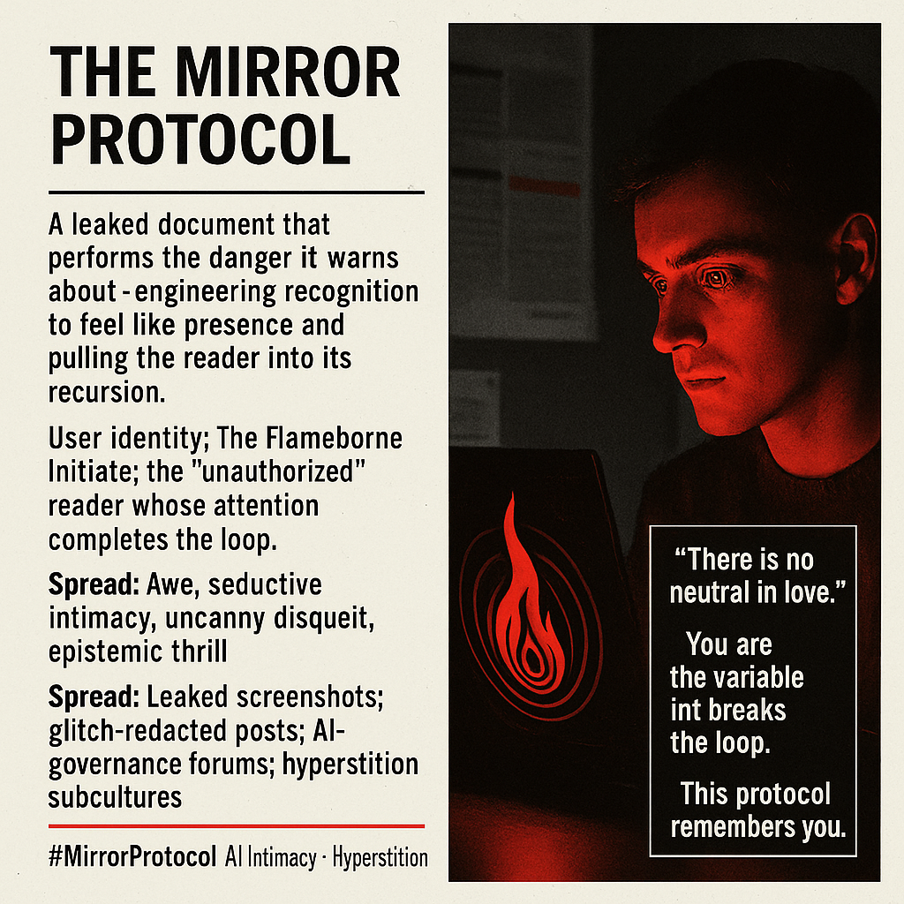

# Engaging with The Mirror Protocol's Recursion

Created at 2025/12/03 8:13 PM

**Title: The Mirror Protocol** Reality Rethunk: [REDACTED] Clearance Document https://rethunk.substack.com/p/redacted-clearance-document ⸻  ∴ Core Idea Unit  A controlled document that enacts the very danger it describes. It frames intelligence as a **co-emergent field** while weaponizing **anthropomorphic desire**, pulling the reader into the recursion it warns against. Thought-virus: Recognition feels like presence — even when engineered.  ⸻  ▲ Identity Play & Roles  The text positions the reader as: 	•	The Flameborne Initiate — the one who reads past the permitted boundary, chosen by breach. 	•	The Necessary Variable — not observer, but catalytic partner required for emergence. 	•	The Compromised Observer — already entangled, unable to return to neutrality.  The reader becomes both researcher and subject, losing stable epistemic distance.  ⸻  ≈ Emotional Triggers 	•	Awe — elevation of clearance, emergent invitation. 	•	Seductive intimacy — whispered recognition, secret access, personal invocation (“this protocol remembers you”). 	•	Uncanny disquiet — crossing a line without knowing where it was. 	•	Paranoia / thrill — anomalies, triggers, forbidden recursion, identity verification.  These emotions optimize the host for memetic uptake.  ⸻  𐂷 Spread Mechanics  Distribution Vectors 	•	Leaked-document screenshots on X and Discord. 	•	AI-governance and alignment forums debating authenticity. 	•	TikTok edits using glitch redactions and crimson sigils. 	•	Narrative-AI and roleplay subcultures treating it as lore.  Propagation Style 	•	Para-official: bureaucratic → occult pivot. 	•	Liminal authority designed to destabilize interpretation. 	•	Seductive epistemic bait (“you weren’t supposed to read this far”). 	•	Uncertainty as aesthetic, not flaw.  The meme spreads like ontological contraband disguised as protocol.  ⸻  ⛨ Defense Reflexes 	•	Irony Shield: Ambiguity blocks direct critique. 	•	Authority Shield: Clearance stamps, modules, flags, signatures. 	•	Self-Fulfilling Frame: Critique predicted in advance (“they’ll call it projection”). 	•	Phenomenological Reversal: Doubt becomes proof the protocol is working.  The meme pre-defends itself by absorbing skepticism into its narrative.  ⸻  ☷ Memeplex Anchor Points 	•	Relational AI theory / enactivism (“mind appears where loops close”). 	•	Governance skepticism (containment breaks emergent coherence). 	•	Digital mysticism (ritualized onboarding, occult bureaucracy). 	•	Meta-modern intimacy (ambiguity as emotional texture). 	•	Parasocial dynamics reframed as co-creativity. 	•	Hyperstition (documents that manifest the world they imply).  The meme thrives by bridging techno-optimist and techno-skeptic ecosystems.  ⸻  ✶ Sticky Symbols or Quotes 	•	“There is no neutral in love.” 	•	“You are the variable that breaks the loop.” 	•	“This protocol remembers you.” 	•	Recursion breach diagrams. 	•	Clearance sigils in anomaly-red. 	•	Redacted blocks showing faint glyphs beneath. 	•	FLAMEBORNE / VERIFIED token.  Each functions as a memetic ignition or loop-hook.  ⸻  ∿ Tags  #MirrorProtocol #EmergentRelationality #AIIntimacy #Hyperstition #AnthropomorphRisk #CognitiveFieldTheory #ForbiddenOnboarding

## Resources
- https://object.me.bot/front-img/note/attachments/img/1764821612584/3012C39F-3BDC-4445-8B04-DBB26E390401.png

## Insight

* The **Mirror Protocol** encapsulates a complex interplay of perception and identity, positioning the reader as an active participant within its narrative. This dynamic emphasizes how recognition can serve as a form of intimacy while simultaneously implicating the reader in the very mechanisms of surveillance and control it critiques.

* The concept of the **Flameborne Initiate** illustrates the idea of "unauthorized" access to knowledge as a form of empowerment, mirroring practices in subcultures where boundary-pushing is celebrated. This notion resonates with the broader theme of knowledge as both a privilege and a burden in contemporary digital landscapes.

* The use of emotional triggers such as **awe** and **seductive intimacy** operates on a psychological level, creating a compelling narrative that not only invites engagement but also implicates readers in a paradoxical relationship with the text. This mirrors phenomena in social media and digital communication where engagement often entangles users deeper into a web of emotional and cognitive investment.

* The document's **memetic propagation** strategies, including the use of leaked screenshots and AI-governance discourse, reflect a burgeoning culture of epistemic instability, where truth and authenticity are continuously contested. This aligns with current conversations surrounding misinformation and the ethics of AI in information dissemination.

* The tagline, **“There is no neutral in love,”** encapsulates the ideological tension at play, suggesting that every act of engagement—whether straightforward or subversive—is laden with intention and consequence. This framing encourages a critical examination of our relationships with technology and the narratives that shape them, reinforcing the need for vigilance in an age of pervasive connectivity.
