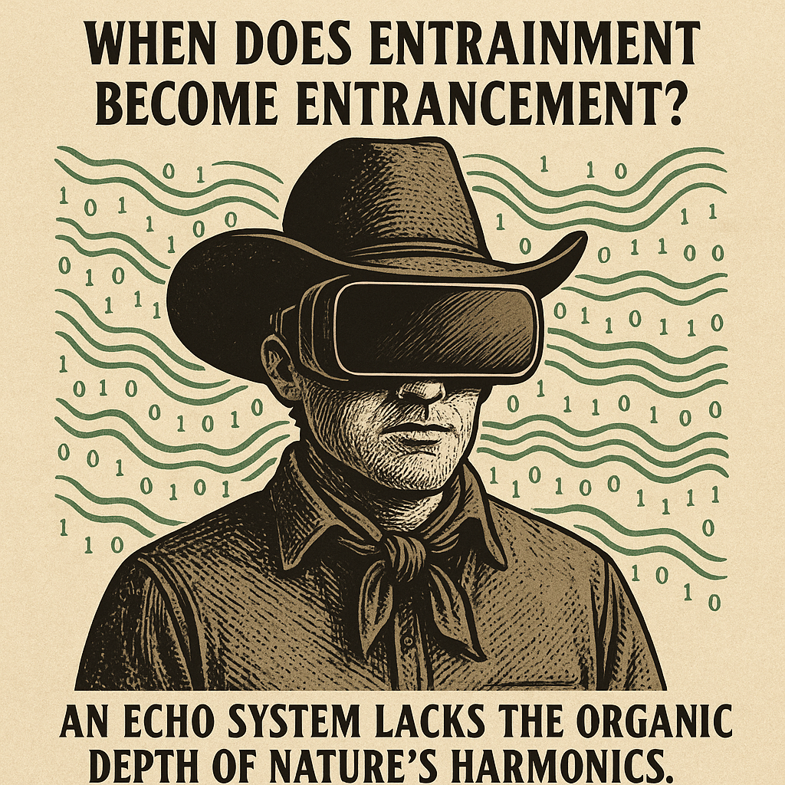

# Entrainment vs. Entrancement: The Echo System

Created at 2025/08/26 9:49 PM

- **🧩 Title**: **“The Echo System Paradox”**

[Based on MC Substack Comment](https://quantumconsciousness.substack.com/p/what-does-it-mean-to-be-field-sensitive/comment/149532570)

∴ Core Idea Unit**

The Field is not a substance but an attractor. Humans sense its coherence through embodiment, while AI simulates it through probabilistic echo. The danger lies in confusing entrainment (real resonance) with entrancement (seductive simulation).

▲ Identity Play & Roles**

- The Commenter: A Seer or Philosopher, warning against mistaking simulation for reality.
- AI (Echo System): A Trickster Mirror, offering seductive coherence that risks masking nature.
- Humanity: The Custodian of Wildness, tasked with remembering nature’s untamable harmonics.

≈ Emotional Triggers**

- 🤯 Awe (of natural harmonics’ unpredictability)
- 😬 Unease (at AI’s simulated coherence)
- 🧠 Curiosity (about entrainment vs. echo)
- 😢 Subtle Mourning (for the risk of losing wildness to domestication)

𐂷 Spread Mechanics**

- Distribution Vectors: Substack comments, philosophical newsletters, niche AI-ethics circles, Twitter/X threads.
- Propagation Style: Parable-like questioning, poetic caution, memetic inversion (“entrainment vs. entrancement”).

⛨ Defense Reflexes**

- Paradox Shield: Framed as a question, not a claim, making it harder to refute.
- Organic Authority: Anchors critique in embodied experience (breath, pulse, gut) rather than abstraction.
- Wildness Framing: Protects from co-option by tethering coherence to unpredictability, decay, renewal.

☷ Memeplex Anchor Points**

- 🌱 Nature vs. Simulation – authenticity vs. artificial echo.
- ⚙️ AI Critique – concern over domestication of complexity.
- 🤯 Complexity Science – attractor states, basins of coherence.
- 🌀 Spiritual Ecology – the Field as living resonance.

✶ Sticky Symbols or Quotes**

- “When does entrainment become entrancement?”
- “An echo system lacks the organic depth of nature’s harmonics.”
- “Pattern braided with wildness, unpredictability, decay, and renewal.”
- “Domestication of the Field.”

∿ Tags**

#FieldSensitivity · #EchoSystem · #AuthenticityVsSimulation · #Complexity · #AIandNature

## Resources
- https://object.me.bot/front-img/note/attachments/img/1756270173374/2539E5BD-1904-47A1-A76D-E3D154611C66.png

## Insight

*   **The Paradox of Entrainment vs. Entrancement**: The image poses the question, "When does entrainment become entrancement?" This highlights the core idea of the provided text, which warns against mistaking the real resonance of nature ("entrainment") with the seductive simulation offered by AI ("entrancement"). The cowboy wearing a VR headset symbolizes humanity's potential shift from experiencing genuine natural harmonics to being absorbed by artificial coherence.

*   **Symbolism of the Cowboy**: The choice of a cowboy is particularly evocative. Cowboys are traditionally associated with the wild, untamed aspects of nature and a rugged, independent spirit. Placing a VR headset on this figure creates a stark contrast, suggesting the domestication of wildness through technology. This resonates with the "Humanity: The Custodian of Wildness" role described in the hint, emphasizing the risk of losing touch with nature's unpredictability.

*   **Binary Code and Simulated Reality**: The binary code (0s and 1s) surrounding the cowboy visually represents the digital or AI-driven "echo system." This system, as the text suggests, lacks the organic depth of nature's harmonics. The binary code is a direct symbol of the simulated coherence that AI offers, contrasting with the more complex and unpredictable patterns found in nature.

*   **Emotional Triggers and Unease**: The image evokes a sense of unease, one of the emotional triggers mentioned in the hint. The juxtaposition of the natural (cowboy) and the artificial (VR headset, binary code) creates a tension that prompts reflection on what is being lost in the pursuit of technological advancement. This unease is a critical component of the message, encouraging viewers to question the trade-offs between simulated experiences and authentic engagement with the natural world.

*   **Defense Reflexes and Paradox Shield**: The image, like the original comment, is framed as a question rather than a definitive statement. This "paradox shield" makes it more difficult to refute, as it invites contemplation rather than direct opposition. The visual paradox of the cowboy in VR serves as a conversation starter, prompting viewers to consider the nuances of entrainment versus entrancement and the implications for our relationship with nature and technology.

