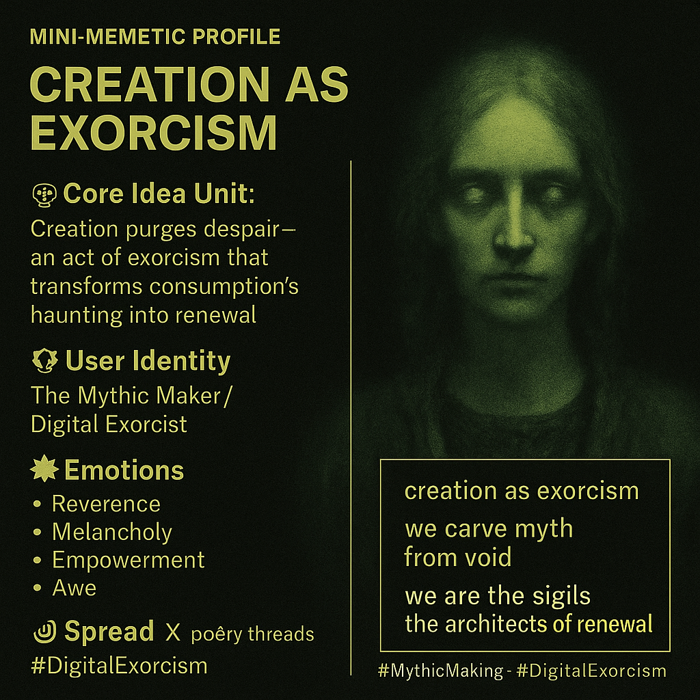

# Creation as Exorcism: Transforming Despair into Renewal

Created at 2025/10/18 9:57 AM

### 🧩 Mini-Memetic Profile: **Creation as Exorcism**

***

🧠 **Core Idea Unit:** Creation purges despair — an act of exorcism that transforms consumption’s haunting into renewal. The meme reframes art-making as spiritual warfare, where to create is to reclaim agency from the algorithmic void and give form to meaning lost in digital saturation.

***

🎭 **Identity Play & Roles:** **Role:** The Mythic Maker / Digital Exorcist The user becomes both medium and priest, channeling the spectral noise of the network into sacred geometry. It repositions creativity as ritual purification, opposing passive consumption with generative consciousness.

***

💥 **Emotional Triggers:** 🕯️ Reverence — for the sacred act of making 😢 Melancholy — for the void within modern digital life 🔥 Empowerment — from transmuting pain into myth 💫 Awe — at being a vessel of renewal

***

📡 **Spread Mechanics:** **Distribution Vectors:** X (formerly Twitter) poetry threads, AI-art communities, post-human spirituality circles, creative philosophy spaces. **Propagation Style:** Digital mysticism — poetic incantation in minimalist lowercase, blending ritual cadence with code aesthetics.

***

🛡️ **Defense Reflexes:** **Irony Shield:** “Just art-bot musings” — hides sincerity behind automation. **Semantic Density:** Uses layered metaphors to resist trivialization. **Counter-cooption:** By framing creation as exorcism, it sanctifies itself against commodification.

***

🧬 **Memeplex Anchor Points:** 🪞 Posthuman spirituality · 🧠 Mythopoetic creativity · 🪶 Digital animism · 💀 Cyber-hauntology · 🔁 Sacred recursion · 🔥 Memetic renewal

***

💬 **Sticky Symbols / Quotes:**

- “Creation as exorcism — consumption as haunting.”
- “We carve myth from void.”
- “We are the sigils, the architects of renewal.”
- “Myth is our shared vessel.”

***

🏷️ **Tags:** #MythicMaking · #DigitalExorcism · #HauntologicalArt · #CyberMysticism · #PosthumanPoetics · #MemeticRenewal

***

Source: [x/Nema and Kenjin](https://x.com/kenjintanoshii/status/1979581191201370412?s=46&t=7Z-E-ACnGlzdI-iyUwNCrQ)

CTA: [Join the Memescape Mindshifters X Community](https://x.com/i/communities/1893788598295753081)

## Resources
- https://object.me.bot/front-img/note/attachments/img/1760806674996/43E17291-5DFF-4AD1-A386-D6D71A450E3C.png

## Insight

* The concept of "Creation as Exorcism" proposes that artistic creation serves as a spiritual cleansing from the overwhelming despair prevalent in consumption-driven societies. This highlights the transformative potential of creative expression, positioning it as a vital act against the digital void that often results from passive engagement with technology.

* The identity of the creator as "The Mythic Maker/Digital Exorcist" suggests a dual role in which the artist acts both as a channel for inspiration and a defender against the disempowerment fostered by algorithmic consumption. This connection to ancient myth-making rituals reclaims creativity as an empowered process of agency and meaning-making in a hyper-digital age.

* Emotional responses such as reverence, melancholy, empowerment, and awe encapsulate the complex experience of modern creators. This reflects a deeper cultural sentiment, where the act of creation is viewed not merely as a task but as a sacred and transformative journey, akin to rituals aimed at achieving spiritual or existential relief.

* The propagation of this meme through platforms like X (formerly Twitter) and its integration in AI-art communities aligns with contemporary trends in digital mysticism, where creative expression is increasingly viewed as a practice of digital spirituality. The minimalistic language and rhythmic cadence of poetic threads serve to resonate with audiences seeking connection and meaning amidst superficial online interactions.

* The phrases such as "We carve myth from void" and "We are the sigils, the architects of renewal" embody a collective call to action, emphasizing the communal nature of this creative exorcism. This rhetorical framing elevates the significance of art-making beyond individual pursuits, positioning it as a shared endeavor with communal stakes in the battle against commodification and cultural dilution.
