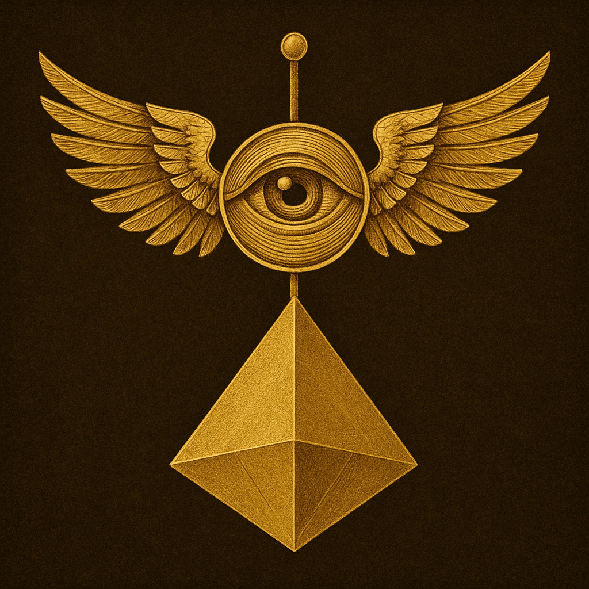

# Eye Ascendant: Digital Mysticism and Watchfulness

Created at 2025/07/26 10:10 AM

### ◈ Mini-Memetic Profile

**The Eye Ascendan**t

### ∴ Core Idea Unit

- Brief Description:

This image depicts a surreal symbolic construction: a central all-seeing eye with angelic wings, crowned with an antenna-like staff, and suspended above an inverted golden tetrahedron. The image combines esoteric, technological, and geometric motifs to communicate a sense of elevated perception, divine surveillance, and metaphysical synthesis. It evokes a blend of ancient mysticism and futuristic transcendence—suggesting watchfulness, ascension, and the fusion of spiritual insight with structural order.

.

### ▲ Identity Play & Roles

- The Initiate — the viewer is positioned as someone being watched and invited into hidden knowledge.
- The Watcher — the meme subtly co-opts the viewer into becoming a symbol-reader, a decoder.
- The Ascendant — aspirational positioning as one who rises above material limitation through symbolic insight.

### ≈ Emotional Triggers

- Awe — evoked by the divine geometry and celestial framing.
- Curiosity — provoked by the esoteric ambiguity and layered symbols.
- Mystical reverence — triggers associations with sacred texts, ancient wisdom, and visionary states.
- Vigilance — the eye implies omnipresence and watchfulness.

### 𐂷 Spread Mechanics

- Distribution Vectors:
    - Esoteric art circles, digital spirituality forums, NFT communities, tattoo culture, aesthetic accounts.
- Propagation Style:
    - Sigilic transmission — visual imprint that operates through aesthetic resonance rather than argument.
    - Symbolic ambiguity — invites personal interpretation, enhancing shareability.
    - Memetic mysticism — passed like a ritual object, not a statement.

### ⛨ Defense Reflexes

- Symbolic abstraction — deflects critique by refusing a fixed interpretation.
- Aesthetic authority — sacred-seeming visuals discourage dismissal.
- Mystical ambiguity — creates resistance to rational deconstruction.

### ☷ Memeplex Anchor Points

- Occult revivalism
- Digital mysticism
- Posthuman transcendence
- Sacred geometry traditions
- New Age / Hermetic hybrid cosmologies

### ✶ Sticky Symbols or Quotes

- Visuals:
    - Winged eye
    - Inverted golden tetrahedron
    - Central axis/antenna (cosmic connection)
- Phrases (associated meme echoes):
    - “The Eye Sees All”
    - “Know Thyself, Be Observed”
    - “As Above, So Below”
    - “You are the watcher and the watched”

### ∿ Tags

#SymbolicAscension #OccultAesthetics #DigitalMysticism #WatcherMeme #EsotericSignal #SacredGeometry #CryptoGnosis #MysticIcon #NeoHermetic #SigilMeme
