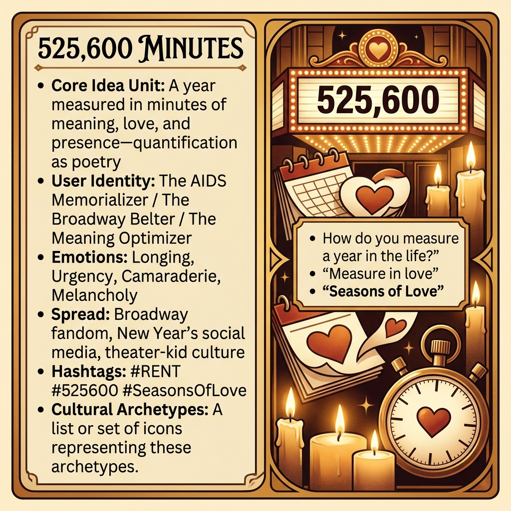

# Five Hundred Twenty-Five Thousand Six Hundred Minutes

*With thanks to [Evan Silverman](https://substack.com/home/post/p-192863845) for his post connecting this line to reflections on our screentime and what we do with our minutes.*

Created at 2026/04/02 12:27 AM

### ◈ Mini-Memetic Profile

**🔶 525,600 Minutes — The Quantification of Meaning Itself**

### ∴ Core Idea Unit

- A year is not 365 days—it's 525,600 minutes of potential meaning, love, connection, and presence. The mathematical precision (minute × hour × day × year) grounds spiritual aspiration in concrete numeracy.
- Reframe time not as duration but as opportunity container. Each minute is a unit of possible significance; waste is measurable in missed moments.
- Encodes a worldview where meaning is countable, love is aggregable, and a life well-lived can be audited by the minute. The quantification is the poetry.
- Rebellion against empty time: "Don't measure in sunsets/cups of coffee"—reject passive observation, demand active participation.

### ▲ Identity Play & Roles

- **The AIDS Memorializer:** For those who lived through/after the crisis, the number is elegy—each minute a friend who didn't get enough of them. Jonathan Larson died before RENT opened; the number carries his ghost.
- **The Broadway Belter:** Performance identity—knowing the number proves cultural literacy, membership in the theater-kid tribe. Singing it is initiation.
- **The Meaning Optimizer:** Treats life as portfolio of minutes to be invested wisely. Each day: 1,440 opportunities. The spreadsheet of the soul.
- **The Nostalgia Curator:** Millennial/Gen-X marker of coming-of-age. The number triggers prom, first heartbreak, dorm room singalongs—theater as identity formation.
- **The Inspirational Poster:** Quote-posts the number on New Year's, birthdays, after breakups. The minute-count as motivational technology.

### ≈ Emotional Triggers

- **Longing** — for time we didn't use well, for people who ran out of minutes
- **Urgency** — the clock is running, 525,600 is finite and counting down
- **Camaraderie** — shared cultural reference binds the initiated
- **Melancholy** — Larson's death before opening night haunts the number
- **Hope** — each new year brings a fresh 525,600; redemption through counting
- **Nostalgia** — generational marker, coming-of-age soundtrack

### 𐂷 Spread Mechanics

- **Distribution Vectors:**
    - Broadway musical fandom, theater-kid communities, Glee generation
    - New Year's Eve social media (annual resurgence)
    - Gay culture and AIDS memorialization spaces
    - Inspirational content/motivational speaking
    - TikTok singalongs, karaoke moments
- 
- **Propagation Style:**
    - Precise number creates memorability and shareability
    - Seasonal recurrence (New Year's, RENT anniversaries)
    - Performative transmission (singing together, knowing the reference)
    - Elegiac function: memorializing those who died of AIDS (the " Seasons of Love" context)

### ⛨ Defense Reflexes

- **Sentimental shield:** "It's just a beautiful song" deflects critique of the quantification-of-meaning premise
- **Authenticity claim:** Jonathan Larson's actual death before opening night makes questioning the number feel like disrespecting the dead
- **Nostalgia armor:** Generational attachment makes critique feel like attacking youth/culture itself
- **Inspirational inoculation:** "How can you criticize something that helps people?"

### ☷ Memeplex Anchor Points

- AIDS crisis memorialization and queer history
- Broadway/musical theater culture
- Millennial coming-of-age nostalgia
- Inspirational/self-help quantification culture ("10,000 hours," "7 habits")
- Carpe diem/YOLO temporal ethics (Seize the day / You only live once)
- Time-management and productivity optimization
- New Year's resolution industrial complex
- Jonathan Larson's legacy and premature death mythology

### ✶ Sticky Symbols or Quotes

- "Five hundred twenty-five thousand six hundred minutes"
- "Seasons of Love" (the song title)
- "How do you measure a year in the life?"
- "Measure in love"
- "How about love?" (the answer/refrain)
- "In daylights, in sunsets, in midnights, in cups of coffee"
- "In inches, in miles, in laughter, in strife"
- Imagery: Theater marquee, calendar pages, candles, stopwatches transformed into hearts

### ∿ Tags

#RENT #525600 #SeasonsOfLove #Broadway #JonathanLarson #AIDSMemorial #TimeQuantification #MeaningOptimization #TheaterKid #NewYears
