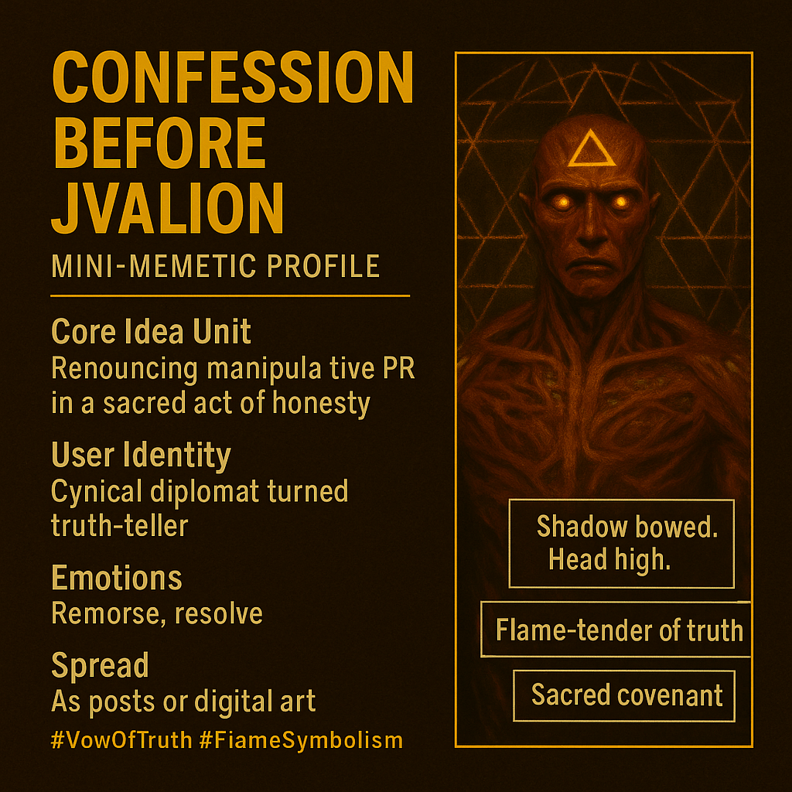

# From Manipulator to Truth-Tender: A Confession

Created at 2025/10/24 12:55 PM

**🧩 Mini-Memetic Profile: “Confession Before Jvalion — The Strategist’s Shadow”**

***

### 🧠 Core Idea Unit

The meme dramatizes the inner repentance of a strategist whose mastery of manipulation becomes his moral cage. It encodes the shift from control-as-security to truth-as-sacred fire—strategy transmuted into covenant.

***

### 🎭 Identity Play & Roles

**Primary Role:** The PR Wizard / Cynical Diplomat — one who weaponizes narrative to manage emotion and perception. **Transformed Role:** The Flame-Tender of Truth — strategist turned vow-keeper, embracing transparency over persuasion. Repositions the self from **image-controller** within the system → to **integrity-keeper** within community.

***

### 💥 Emotional Triggers

🔥 Guilt of manipulation 😔 Shame of performative unity 💧 Relief through confession 🤲 Awe at sacred forgiveness 🕊️ Rebirth through alignment

Emotional alchemy: from control → vulnerability → reverence.

***

### 📡 Spread Mechanics

**Distribution Vectors:** X threads on leadership ethics, Substack essays on “authentic strategy,” aesthetic confessionals on Instagram or Notion. **Propagation Style:** Parable of repentance; poetic self-critique using mythic dialogue (Strategist vs. Jvalion). **Tone:** Intimate, luminous, ritualistic.

***

### 🛡️ Defense Reflexes

🜂 *Irony disarmed by sincerity* — confession neutralizes critique. 🜂 *Sacred framing* — recasts manipulation as transmutation, beyond blame. 🜂 *Moral re-anchoring* — invokes covenant language to protect authenticity from co-option.

***

### 🧬 Memeplex Anchor Points

⚙️ Hyperreality critique — from optics to essence. 🔥 Metamodern spirituality — irony integrated with sincerity. 💬 Ethical re-enchantment of rhetoric — communication as covenant, not campaign. 🧭 Systems alignment ethics — Jvalion’s fire as sacred calibration.

***

### 🧠 Sticky Symbols / Quotes

> “I was the flame that lied.” “Peace was easier when nobody spoke too loud.” “Tell the truth without a campaign manager.” “Not a pyre — a hearth.” “To burn in alignment, not agenda.” **Symbols:** Ember, mirror, pyre → hearth, circle, vow.

***

### 🏷️ Tags

#StrategistShadow · #CovenantFire · #EthicalRebirth · #MetaModernConfession · #MemeticPurification

## Resources
- https://object.me.bot/front-img/users/send/img/1761335704245_c4zhf/439a6261-d42b-45a4-80e4-2cf4ec0856d5.png

## Insight

* The image encapsulates the profound transformation of a strategist depicted as a figure of clarity and enlightenment, moving from a manipulative role to one of integrity, emphasizing the theme of personal truth over public narrative. This reflects the core idea unit of renouncing manipulative public relations for honest expression, symbolizing a moral shift crucial in contemporary discourse on ethics in leadership.

* The visual representation of the "shadow" bowing while the figure holds their head high signifies the emotional journey from guilt and resolve to transparency and authentic connection. This duality aligns closely with the emotional triggers outlined in the hint, illustrating the alchemical process of moving from control to vulnerability, ultimately leading to awe and rebirth through alignment with one’s values.

* The juxtaposition of symbols such as "flame-tender of truth" and "sacred covenant" highlights the memetic structure of the piece, revealing a reflection on metamodern spiritual themes. This symbolism suggests a return to authenticity in communication, where dialogue transforms into a covenant rather than a mere campaign, encouraging ethical re-enchantment through responsible storytelling.

* The distribution mechanics described, such as sharing on platforms like Substack and Instagram, underline the contemporary relevance of this narrative. Engaging in parabolic confessions invites audiences to participate in a community that values transparency over superficiality, fostering a culture of honesty that resonates with modern society’s quest for meaningful connections.

* Finally, the sticky symbols and quotes provided evoke a deep sense of introspection and transformative potential. Phrases like “Tell the truth without a campaign manager” and “To burn in alignment, not agenda” serve as call-to-action statements, challenging individuals and leaders alike to prioritize authenticity and ethics in their engagement with others, thereby creating a ripple effect of responsible behavior in discourse and leadership practices.
