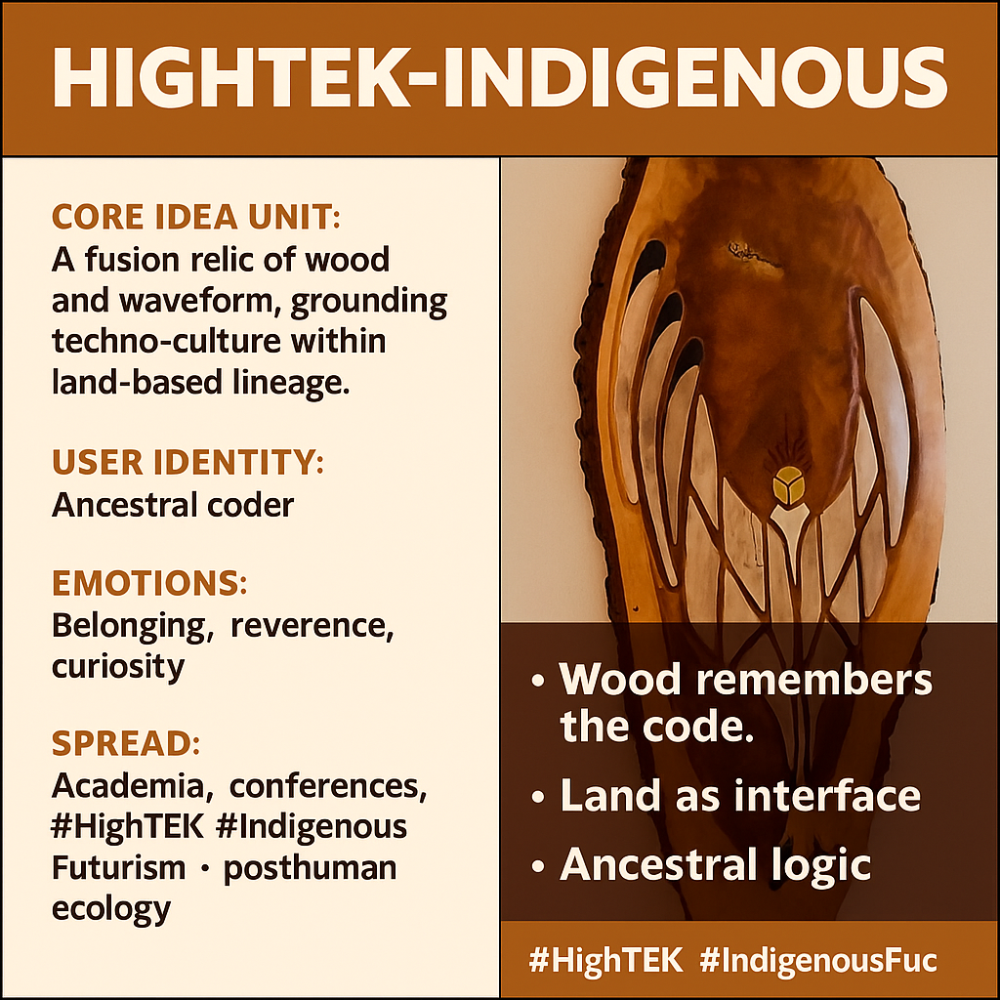

# Fusion of Wood and Waveform: HighTEK

Created at 2025/11/10 2:25 PM

**🧩 Title: HighTEK-Indigenous Totem**  🧠 Core Idea Unit: A fusion relic — wood and waveform — where ancestral design meets modern circuitry. A symbolic bridge between analog spirit and digital consciousness, grounding tech within land-based lineage.  🎭 Identity Play & Roles: The Techno-Ancestor — one who honors Indigenous continuity through innovation. The self becomes both carrier of legacy and coder of renewal, rewriting tradition in the syntax of circuits and woodgrain.  💥 Emotional Triggers: Reverence, belonging, curiosity, awe. The warmth of wood contrasts the cold abstraction of tech, evoking memory through touch and heritage through geometry.  📡 Spread Mechanics: Exhibited in conferences, academic spaces, and digital archives; spreads via photo posts and ethnographic threads tagged #HighTEK #IndigenousFuturism · posthuman ecology.  🛡️ Defense Reflexes: Uses aesthetic synthesis to resist appropriation — not parody but continuity. The sacred and the scientific coexist without dilution.  🧬 Memeplex Anchor Points: 📱 Indigenous Futurism · 🌎 Eco-tech spirituality · ⚙️ Cybernetic animism · 🧭 Land as interface  🧠 Sticky Symbols / Quotes: “Wood remembers the code.” “Land is the first network.” “HighTEK begins with roots.”  🏷️ Tags: #HighTEK #IndigenousFuturism #CyberneticAnimism #WetlandMemory #SantaFeTrail #EcoTech #TotemicHardware #AncestralCode   [X/change w/ Bob-RJ](https://x.com/burkhartrj/status/1987982805951717848?s=46&t=7Z-E-ACnGlzdI-iyUwNCrQ)

## Resources
- https://object.me.bot/front-img/note/attachments/img/1762813495445/728EC745-7123-438F-9E49-038AA4E23090.png

## Insight

* The concept of **HighTEK-Indigenous Totem** illustrates a poignant amalgamation of traditional Indigenous artistry with modern technological elements, representing a seamless integration of ancestral wisdom and contemporary innovation. This fusion not only pays homage to Indigenous heritage but also redefines the role of technology within it, situating it firmly within a land-based identity.

* The identity of the **"Ancestral coder"** signifies a unique role where individuals blend the past with the present, recognizing their lineage while actively participating in the digital future. This reflects a broader cultural discourse on how ancestral knowledge can inform and inspire modern technological practices, fostering a sense of belonging through innovation.

* The emotional triggers outlined—**reverence, belonging, curiosity, and awe**—are vital in understanding how such an artifact impacts its audience. The tactile warmth of wood contrasts sharply with the sterility often associated with technology, inviting deeper engagement and evoking memories connected to cultural heritage and identity.

* The notion of spreading the message through **academic spaces, conferences, and digital archives** points to the necessary dialogue around **Indigenous Futurism** and **posthuman ecology**. It emphasizes the importance of creating platforms where these intersecting narratives can be shared, ensuring that both Indigenous voices and technological innovation are recognized and respected.

* The aesthetic synthesis mentioned serves as a defense against cultural appropriation. By retaining the sacredness of the traditional while engaging with modern methodologies, this approach creates a protective barrier that respects Indigenous narratives and refuses to dilute them within mainstream tech culture. 

* The slogans—**“Wood remembers the code”** and **“Land is the first network”**—serve as powerful reminders that technology and the environment are intertwined. These phrases encapsulate the essence of a worldview where nature and culture coexist, underlining that the land itself harbors knowledge and communication systems essential for Indigenous identities.

* Relevant to the broader cultural shifts surrounding **Cybernetic Animism** and **eco-tech spirituality**, the work invites reflection on how technology can align with ecological mindfulness, ultimately advocating for a more sustainable and conscious approach to both cultural practices and technological developments.
