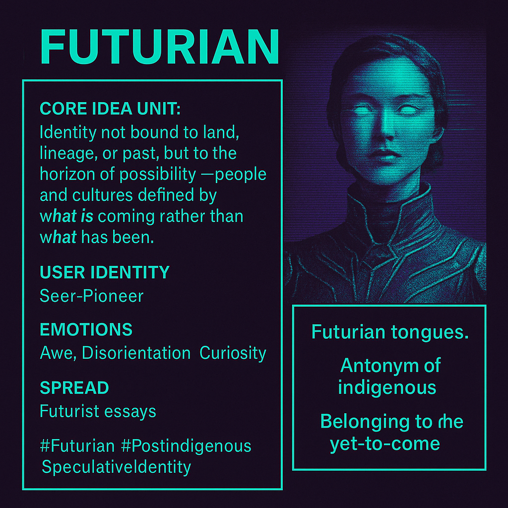

# Futurian: Identity in the Yet-to-Come

Created at 2025/09/01 8:43 AM

🧩 **Title:** Futurian

∴ **Core Idea Unit:** Identity not bound to land, lineage, or past, but to the horizon of possibility—people and cultures defined by *what is coming* rather than *what has been*.

▲ **Identity Play & Roles:** Casts the self as a **Seer-Pioneer** or **Temporal Nomad**, belonging to no fixed heritage but to the unfolding future. Repositions self away from rootedness into speculative becoming.

≈ **Emotional Triggers:** 🤯 Awe of potential · 🌀 Disorientation from rootlessness · 🧠 Curiosity about new forms · 😬 Alienation from tradition

𐂷 **Spread Mechanics:**

- **Distribution Vectors:** Futurist essays, sci-fi fandoms, speculative philosophy, transhumanist forums, Afrofuturism/solarpunk art.
- **Propagation Style:** Speculative inversion of identity categories; aphoristic (“antonym of indigenous”), visionary aesthetics, linguistic coinage.

⛨ **Defense Reflexes:**

- **Irony shield:** “It’s just speculative wordplay.”
- **Counter-narrative preemption:** Frames critique of rootlessness as clinging to obsolete categories.
- **Ambiguity:** Stays undefined, open-ended, resisting co-option.

☷ **Memeplex Anchor Points:** 📱 Techno-futurism · 🤯 Meta-modern identity shifts · 🧬 Posthuman pluralism · 🌍 Global nomadism

✶ **Sticky Symbols or Quotes:**

- “Futurian tongues.”
- “Antonym of indigenous.”
- “Belonging to the yet-to-come.”
- Imagery: neon glyphs, starship crests, glitching ancestral masks, horizon lines.

∿ **Tags:** #Futurian #PostIndigenous · #SpeculativeIdentity

## Resources
- https://object.me.bot/front-img/users/send/img/1756741432702_c4zhf/971543bf-1a00-4e05-8d74-d2fa9b20c60e.png

## Insight

*   The image presents "Futurian" as a concept, defining identity not by heritage or location but by future possibilities. This resonates with the idea of "becoming," a philosophical concept explored by thinkers like Gilles Deleuze, who emphasized continuous transformation over fixed being.

*   The "Seer-Pioneer" identity aligns with transhumanist and futurist narratives, where individuals actively shape their evolution and future. This evokes figures like Donna Haraway, whose "Cyborg Manifesto" challenged traditional boundaries of identity and technology.

*   The emotional triggers—awe, disorientation, and curiosity—capture the complex feelings associated with embracing radical change. Awe reflects the wonder of potential, while disorientation acknowledges the loss of familiar anchors, and curiosity drives exploration of the unknown.

*   The spread mechanics, including futurist essays and sci-fi fandoms, highlight the role of speculative fiction in popularizing and exploring future identities. Authors like William Gibson, with his cyberpunk visions, have significantly influenced our understanding of technology and identity.

*   The defense reflexes, such as the "irony shield," suggest a self-awareness of the potential criticisms of rootlessness. This mirrors the debates around globalization and cultural homogenization, where the loss of local traditions is a significant concern.

*   The memeplex anchor points, like "posthuman pluralism," reflect the growing acceptance of diverse identities beyond traditional human categories. This connects to discussions around gender fluidity, racial hybridity, and the blurring of lines between human and machine.

*   The sticky symbols, such as "neon glyphs" and "glitching ancestral masks," visually represent the fusion of technology and heritage in a futuristic context. This aesthetic is prominent in Afrofuturism, where artists like Janelle Monáe blend African culture with science fiction themes.
