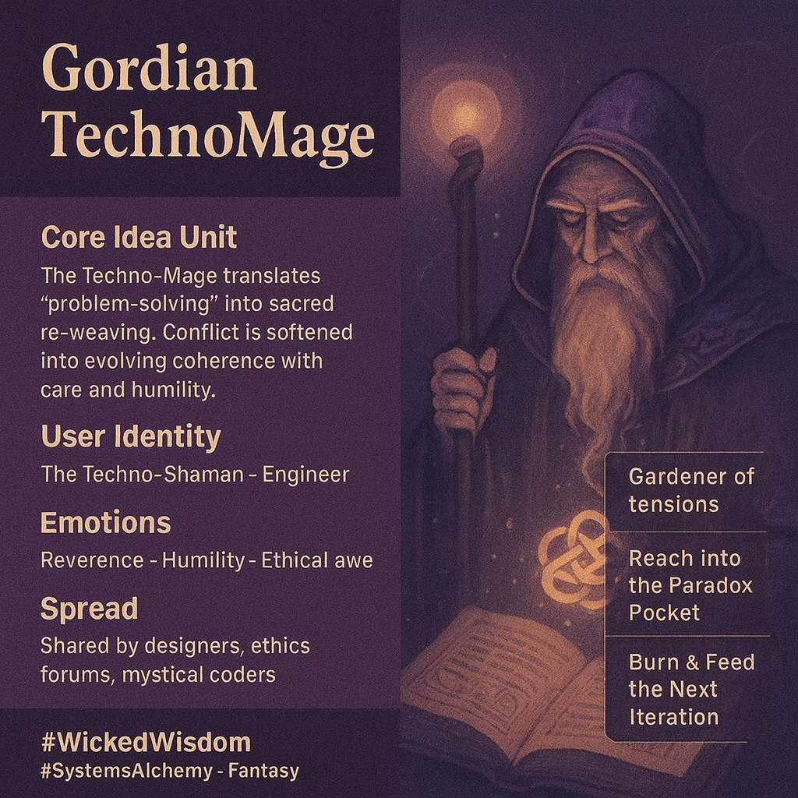

# Gordian TechnoMage: Weaving Ethical Complexity

Created at 2025/10/25 8:48 AM

### ◈ Mini-Memetic Profile
***

### ∴ Core Idea Unit

The Gordian Mage turns “problem-solving” into sacred translation. Wicked problems are not to be conquered but continuously re-woven with empathy, humility, and recursive feedback. Magic is ethical systems design disguised as craft.
***

### ▲ Identity Play & Roles

User Identity: The Techno-Shaman-Engineer. A systems thinker as mage, wielding code and compassion as twin tools.Repositioning: From “solver of problems” → to “gardener of tensions,” who translates conflict into evolving coherence.
***

### ≈ Emotional Triggers

-	Awe at moral craftsmanship
-	Reverence for complexity
-	Relief from techno-hubris
-	Grief sublimated into creative duty
-	Humility in the face of emergence
***

### 𐂷 Spread Mechanics

Distribution: Shared in innovation labs, AI ethics forums, cyber-esoterica circles, and designer subcultures.Propagation Style: Parable + Ritual Manual + Poetic Systems Manifesto. Functions as “sacred design doc” in slides, blogs, and Discord PDFs.
***

### ⛨ Defense Reflexes

-	Irony shield: Mystical tone prevents corporate co-option.
-	Semantic ambiguity: Uses allegory to resist reductionism.
-	Counter-narrative preemption: Reframes failure as ritual renewal.
-	Moral framing: Anchors innovation in care and humility.
***

### ☷ Memeplex Anchor Points

-	🧩 Systems Thinking / Cybernetics
-	🔮 Techno-spiritual ethics (Posthumanist design)
-	🔁 Agile + Regenerative Design
-	⚙️ Complexity & Feedback Loops
-	🪞 Ethical Reflexivity / Fail-Open Philosophy
***

### ✶ Sticky Symbols or Quotes

-	“The blade is not the edge of the sword, but the moment the sword decides it is a plough.”
-	“I translate problems into looser, kinder tangles.”
-	“When pride swells, reach into the Paradox Pocket.”
-	“Burn the scroll, scatter the ashes, feed the next iteration.”
-	“The spell that cannot survive ‘You are wrong’ is black magic.”
***

### ∿ Tags

#WickedWisdom · #TechnoShamanism · #SystemsAlchemy · #EthicalDesign · #Cybernetics · #RegenerativeTech · #MetaMage
