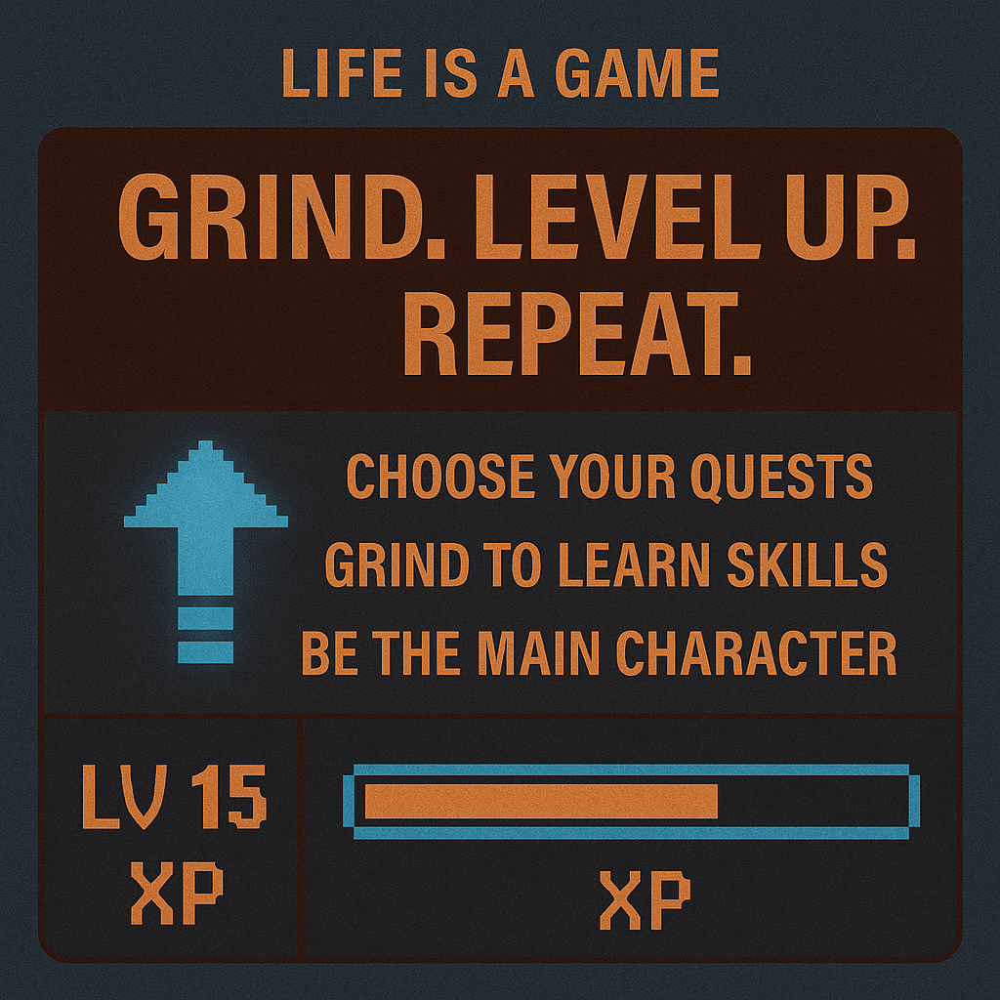

# RPG Life: Grind, Level Up, Evolve

Created at 2025/10/29 10:55 AM

### ◈ Mini-Memetic Profile
***
### ∴ Core Idea Unit
Structure chaos by turning life into an RPG. Every action is XP. Every failure, a respawn. Meaning emerges through measurable progress — you grind, you level up, you win. The world becomes a dashboard for self-evolution.
***
### ▲ Identity Play & Roles
- **Performer:** The Hero / The Self-Optimizer
- **Shadow Role:** The Idle NPC / The Unleveled Self
- **Repositioning:** From lost wanderer → to player with purpose; from anxiety → to action loop.
***
### ≈ Emotional Triggers
⚙️ Control through progress loops🔥 Motivation via incremental wins🧠 Competence and self-discipline pride💢 Fear of stagnation disguised as productivity
***
### 𐂷 Spread Mechanics
**Distribution Vectors:** YouTube motivational RPG edits · Discord productivity servers · X/Threads with quest metaphors.**Propagation Style:** Pixel-core aesthetics · Progress dashboards · “Skill tree” memes · Animated grind loops.
***
### ⛨ Defense Reflexes
Irony camouflage (“it’s just gamified self-help”) and moral validation (“better grinding than wasting time”). Converts critique into evidence of “low-level thinking.”
***
### ☷ Memeplex Anchor Points
🧩 Self-optimization & gamified learning💼 Productivity as spiritual discipline🪞 Simulation logic / techno-utopian ethos🎯 Life-as-quest narrative
***
### ✶ Sticky Symbols or Quotes
- “Grind. Level up. Repeat.”
- “Every XP counts.”
- “Choose your quests wisely.”
- “Be the main character.”
***
### ∿ Tags
#LifeIsAGame · #RPGMindset · #MainCharacterEnergy · #SkillTreeSelf · #GamifiedGrowth · #ProductivityCult
